

  

<strong>Universidad Peruana de Ciencias Aplicadas</strong>

Ingeniería de Software

 

1ASI0728 Arquitecturas de Software Emergentes

202620

 

NRC: 9046

Docente: Royer Edelwer Rojas Malasquez

 

<strong>Informe de Trabajo Final</strong>

 

Startup: RescueBridge

Producto: Lifeline

 

  <strong style="font-size:1.15em;">Integrantes</strong>

<table align="center" style="border-collapse:collapse; border:none;">
  <tr>
    <th align="left" style="border:none; padding:0.3em 1.5em 0.3em 0;">
      <strong style="font-size:1.1em;">Código</strong>
    </th>
    <th align="left" style="border:none; padding:0.3em 0;">
      <strong style="font-size:1.1em;">Apellidos y Nombres</strong>
    </th>
  </tr>
  <tr>
    <td style="border:none; padding:0.3em 1.5em 0.3em 0;">U202310148</td>
    <td style="border:none; padding:0.3em 0;">Roman Cruz, Natalia Bertha</td>
  </tr>
  <tr>
    <td style="border:none; padding:0.3em 1.5em 0.3em 0;">U202223990</td>
    <td style="border:none; padding:0.3em 0;">Cacho Seminario, Diego Alonso</td>
  </tr>
  <tr>
    <td style="border:none; padding:0.3em 1.5em 0.3em 0;">U20211d760</td>
    <td style="border:none; padding:0.3em 0;">Paico Calderon, July Zelmira</td>
  </tr>
  <tr>
    <td style="border:none; padding:0.3em 1.5em 0.3em 0;">U20231b775</td>
    <td style="border:none; padding:0.3em 0;">Solano Armas, Angelo Héctor</td>
  </tr>
</table>

 

Setiembre 2026

&nbsp;

# Registro de versiones del informe

| Versión | Fecha | Autor | Descripción de modificación |
|---|---|---|---|
|  |  |  |  |

&nbsp;

# Project Report Collaboration Insights

## URL del repositorio del informe

## Evidencias y comentarios por entrega

| Integrante | Descripción de actividades | Evidencias |
|---|---|---|
|  |  |  |

&nbsp;

# Contenido

- [Student Outcome](#student-outcome)
- [Capítulo I: Introducción](#capítulo-i-introducción)
  - [1.1. Startup Profile](#11-startup-profile)
    - [1.1.1. Descripción de la Startup](#111-descripción-de-la-startup)
    - [1.1.2. Perfiles de integrantes del equipo](#112-perfiles-de-integrantes-del-equipo)
  - [1.2. Solution Profile](#12-solution-profile)
    - [1.2.1 Nombre del Producto](#121-nombre-del-producto)
    - [1.2.2 Lean UX Process.](#122-lean-ux-process)
    - [1.2.3. Antecedentes y problemática](#123-antecedentes-y-problemática)
      - [1.2.3.1. Lean UX Problem Statements.](#1231-lean-ux-problem-statements)
      - [1.2.3.2. Lean UX Assumptions.](#1232-lean-ux-assumptions)
      - [1.2.3.3. Lean UX Hypothesis Statements.](#1233-lean-ux-hypothesis-statements)
      - [1.2.3.4. Lean UX Canvas.](#1234-lean-ux-canvas)
  - [1.3. Segmentos objetivo.](#13-segmentos-objetivo)
- [Capítulo II: Requirements Elicitation & Analysis](#capítulo-ii-requirements-elicitation--analysis)
  - [2.1. Competidores](#21-competidores)
    - [2.1.1. Análisis competitivo](#211-análisis-competitivo)
    - [2.1.2. Estrategias y tácticas frente a competidores](#212-estrategias-y-tácticas-frente-a-competidores)
  - [2.2. Entrevistas](#22-entrevistas)
    - [2.2.1. Diseño de entrevistas](#221-diseño-de-entrevistas)
    - [2.2.2. Registro de entrevistas](#222-registro-de-entrevistas)
    - [2.2.3. Análisis de entrevistas](#223-análisis-de-entrevistas)
  - [2.3. Needfinding](#23-needfinding)
    - [2.3.1. User Personas](#231-user-personas)
    - [2.3.2. User Task Matrix](#232-user-task-matrix)
    - [2.3.3. Empathy Mapping](#233-empathy-mapping)
    - [2.3.4. As-is Scenario Mapping](#234-as-is-scenario-mapping)
  - [2.4. Ubiquitous Language](#24-ubiquitous-language)
- [Capítulo III: Requirements Specification](#capítulo-iii-requirements-specification)
  - [3.1. To-Be Scenario Mapping](#31-to-be-scenario-mapping)
  - [3.2. User Stories](#32-user-stories)
  - [3.3. Impact Mapping](#33-impact-mapping)
  - [3.4. Product Backlog](#34-product-backlog)
- [Capítulo IV: Strategic-Level Software Design](#capítulo-iv-strategic-level-software-design)
  - [4.1. Strategic-Level Attribute-Driven Design](#41-strategic-level-attribute-driven-design)
    - [4.1.1. Design Purpose](#411-design-purpose)
    - [4.1.2. Attribute-Driven Design Inputs](#412-attribute-driven-design-inputs)
      - [4.1.2.1. Primary Functionality (Primary User Stories)](#4121-primary-functionality-primary-user-stories)
      - [4.1.2.2. Quality Attribute Scenarios](#4122-quality-attribute-scenarios)
      - [4.1.2.3. Constraints](#4123-constraints)
    - [4.1.3. Architectural Drivers Backlog](#413-architectural-drivers-backlog)
    - [4.1.4. Architectural Design Decisions](#414-architectural-design-decisions)
    - [4.1.5. Quality Attribute Scenario Refinements](#415-quality-attribute-scenario-refinements)
  - [4.2. Strategic-Level Domain-Driven Design](#42-strategic-level-domain-driven-design)
    - [4.2.1. EventStorming](#421-eventstorming)
    - [4.2.2. Candidate Context Discovery](#422-candidate-context-discovery)
    - [4.2.3. Domain Message Flows Modeling](#423-domain-message-flows-modeling)
    - [4.2.4. Bounded Context Canvases](#424-bounded-context-canvases)
    - [4.2.5. Context Mapping](#425-context-mapping)
  - [4.3. Software Architecture](#43-software-architecture)
    - [4.3.1. Software Architecture System Landscape Diagram](#431-software-architecture-system-landscape-diagram)
    - [4.3.2. Software Architecture Context Level Diagrams](#432-software-architecture-context-level-diagrams)
    - [4.3.3. Software Architecture Container Level Diagrams](#433-software-architecture-container-level-diagrams)
    - [4.3.4. Software Architecture Deployment Diagrams](#434-software-architecture-deployment-diagrams)
- [Capítulo V: Tactical-Level Software Design](#capítulo-v-tactical-level-software-design)
  - [5.X. Bounded Context: Nombre del Bounded Context](#5x-bounded-context-nombre-del-bounded-context)
    - [5.X.1. Domain Layer](#5x1-domain-layer)
    - [5.X.2. Interface Layer](#5x2-interface-layer)
    - [5.X.3. Application Layer](#5x3-application-layer)
    - [5.X.4. Infrastructure Layer](#5x4-infrastructure-layer)
    - [5.X.5. Bounded Context Software Architecture Component Level Diagrams](#5x5-bounded-context-software-architecture-component-level-diagrams)
    - [5.X.6. Bounded Context Software Architecture Code Level Diagrams](#5x6-bounded-context-software-architecture-code-level-diagrams)
      - [5.X.6.1. Bounded Context Domain Layer Class Diagrams](#5x61-bounded-context-domain-layer-class-diagrams)
      - [5.X.6.2. Bounded Context Database Design Diagram](#5x62-bounded-context-database-design-diagram)
- [Capítulo VI: Solution UX Design](#capítulo-vi-solution-ux-design)
  - [6.1. Style Guidelines](#61-style-guidelines)
    - [6.1.1. General Style Guidelines](#611-general-style-guidelines)
    - [6.1.2. Web, Mobile & Devices Style Guidelines](#612-web-mobile--devices-style-guidelines)
  - [6.2. Information Architecture](#62-information-architecture)
    - [6.2.1. Organization Systems](#621-organization-systems)
    - [6.2.2. Labeling Systems](#622-labeling-systems)
    - [6.2.3. Searching Systems](#623-searching-systems)
    - [6.2.4. SEO Tags and Meta Tags](#624-seo-tags-and-meta-tags)
    - [6.2.5. Navigation Systems](#625-navigation-systems)
  - [6.3. Landing Page UI Design](#63-landing-page-ui-design)
    - [6.3.1. Landing Page Wireframe](#631-landing-page-wireframe)
    - [6.3.2. Landing Page Mock-up](#632-landing-page-mock-up)
  - [6.4. Applications UX/UI Design](#64-applications-uxui-design)
    - [6.4.1. Applications Wireframes](#641-applications-wireframes)
    - [6.4.2. Applications Wireflow Diagrams](#642-applications-wireflow-diagrams)
    - [6.4.3. Applications Mock-ups](#643-applications-mock-ups)
    - [6.4.4. Applications User Flow Diagrams](#644-applications-user-flow-diagrams)
  - [6.5. Applications Prototyping](#65-applications-prototyping)
- [Capítulo VII: Product Implementation, Validation & Deployment](#capítulo-vii-product-implementation-validation--deployment)
  - [7.1. Software Configuration Management](#71-software-configuration-management)
    - [7.1.1. Software Development Environment Configuration](#711-software-development-environment-configuration)
    - [7.1.2. Source Code Management](#712-source-code-management)
    - [7.1.3. Source Code Style Guide & Conventions](#713-source-code-style-guide--conventions)
    - [7.1.4. Software Deployment Configuration](#714-software-deployment-configuration)
  - [7.2. Solution Implementation](#72-solution-implementation)
    - [7.2.X. Sprint n](#72x-sprint-n)
      - [7.2.X.1. Sprint Planning n](#72x1-sprint-planning-n)
      - [7.2.X.2. Sprint Backlog n](#72x2-sprint-backlog-n)
      - [7.2.X.3. Development Evidence for Sprint Review](#72x3-development-evidence-for-sprint-review)
      - [7.2.X.4. Testing Suite Evidence for Sprint Review](#72x4-testing-suite-evidence-for-sprint-review)
      - [7.2.X.5. Execution Evidence for Sprint Review](#72x5-execution-evidence-for-sprint-review)
      - [7.2.X.6. Services Documentation Evidence for Sprint Review](#72x6-services-documentation-evidence-for-sprint-review)
      - [7.2.X.7. Software Deployment Evidence for Sprint Review](#72x7-software-deployment-evidence-for-sprint-review)
      - [7.2.X.8. Team Collaboration Insights during Sprint](#72x8-team-collaboration-insights-during-sprint)
  - [7.3. Validation Interviews](#73-validation-interviews)
    - [7.3.1. Diseño de Entrevistas](#731-diseño-de-entrevistas)
    - [7.3.2. Registro de Entrevistas](#732-registro-de-entrevistas)
    - [7.3.3. Evaluaciones según heurísticas](#733-evaluaciones-según-heurísticas)
  - [7.4. Video About-the-Product](#74-video-about-the-product)
- [Conclusiones y recomendaciones](#conclusiones-y-recomendaciones)
- [Video About-the-Team](#video-about-the-team)
- [Bibliografía](#bibliografía)
- [Anexos](#anexos)

&nbsp;

# Student Outcome

<table>
  <tr>
    <td><strong>Criterio específico</strong></td>
    <td><strong>Acciones realizadas</strong></td>
    <td><strong>Conclusiones</strong></td>
  </tr>
  <tr>
    <td>Comunica oralmente ideas y/o resultados con objetividad a público de diferentes especialidades y niveles jerárquicos, en el marco del desarrollo de un proyecto de ingeniería.</td>
    <td></td>
    <td></td>
  </tr>
  <tr>
    <td>Comunica de forma escrita ideas y/o resultados con objetividad a público de diferentes especialidades y niveles jerárquicos, en el marco del desarrollo de un proyecto de ingeniería.</td>
    <td></td>
    <td></td>
  </tr>
</table>

# Capítulo I: Introducción

## 1.1. Startup Profile

### 1.1.1. Descripción de la Startup

La startup RescueBridge nace con la idea de usar las herramientas tecnológicas para brindar apoyo y asistencia a las personas después de desastres naturales de forma en que se puedan evitar las pérdidas humanas incluso si los servicios de emergencia no han logrado llegar al lugar. Asimismo, esta startup tiene el objetivo de colaborar con los servicios de emergencia ya sea mediante aplicativos o brindandoles la información recolectada para que puedan desarrollar su labor con mayor efectividad.

En este caso, RescueBridge presenta su producto Lifeline, el cual es una aplicación móvil cuyo propósito consiste en ofrecer indicaciones médicas a la población después de un evento sísmico mediante el uso de un modelo de inteligencia artificial que basa su respuesta en una base de conocimientos médicos para asegurar que las indicaciones brindadas sean confiables y seguras. Adicionalmente, se usarán algunas estrategias para asegurar llegar al desempeño esperado. 

En primer lugar, se usará la técnica de la generación aumentada por recuperación (RAG) para vincular al modelo de lenguaje empleado con fuentes de datos de primeros auxilios y procedimientos médicos previamente seleccionados. En segundo lugar, se contará con un prompt prediseñado con indicaciones claras sobre como debe ser expresada la respuesta brindada al usuario de forma en que esta sea comprensible evitando el uso excesivo de términos médicos, precisa mencionando el paso a paso a seguir y adaptada al contexto post-sismo.

Otro aspecto a resaltar de la aplicación es que esta puede funcionar sin necesidad de Internet al utilizar IA on-device, de manera que la falta de señal después de un terremoto no será un impedimento para que la aplicación sea de ayuda en el momento crítico. Además, las consultas pueden ser realizadas en la aplicación tanto por texto como por medio de audio y cámara para poder ingresar imágenes de las heridas sobre las que se consulta. Por último, al contar con conexión a internet, se enviará una notificación a los rescatistas, así como la información de las consultas realizadas para que puedan ubicar a las personas que aún necesitan asistencia médica.

__Misión__

Brindar orientación confiable, accesible y oportuna a las personas afectadas por desastres naturales mediante soluciones tecnológicas capaces de funcionar incluso sin conexión a internet, y facilitar información relevante a los servicios de emergencia para contribuir a una atención y respuesta más efectiva.

__Visión__

Convertirnos en una organización referente en el uso responsable de la inteligencia artificial para la respuesta ante desastres, construyendo comunidades más preparadas y conectadas con los servicios de emergencia.

### 1.1.2. Perfiles de integrantes del equipo

<table>
  <tr>
    <th>Nombre</th>
    <th>Código</th>
    <th>Descripción</th>
    <th>Foto</th>
  </tr>
  <tr>
    <td>Roman Cruz, Natalia Bertha</td>
    <td>U202310148</td>
    <td>Mi nombre es Natalia Roman y actualmente me encuentro cursando el octavo ciclo de la carrera de ingeniería de software en la UPC. Anteriormente ya he colaborado en proyectos que utilizan tecnologías emergentes como IoT e inteligencia artificial. Siento que puedo aportarle al equipo a través de mis habilidades de desarrollo y al desarrollar el event storming y arquitectura de la aplicación.</td>
    <td></td>
  </tr>
  <tr>
    <td>Cacho Seminario, Diego Alonso</td>
    <td>U202223990</td>
    <td>Mi nombre es Diego Alonso Cacho Seminario y me encuentro cursando por el octavo ciclo de la carrera de Ingeniería de Software en la UPC. Al tener experiencia realizando proyectos de calibre similar en cursos pasados, me siento cómodo trabajando con las herramientas de desarrollo gestión grupal. Me considero como una persona responsable y lista para el cambio en cuanto se necesite. Espero lograr un buen desempeño junto a mis compañeros a lo largo de las actividades.</td>
    <td></td>
  </tr>
  <tr>
    <td>Paico Calderon, July Zelmira</td>
    <td>U20211d760</td>
    <td>Mi nombre es July Paico y actualmente estudio Ingeniería de Software en la UPC. Me considero una persona colaborativa, con interés en el análisis de datos y el diseño centrado en el usuario. Me motiva resolver problemas mediante la tecnología. Siento que puedo aportar al equipo a través de mi interés por la gestión de proyectos y mi capacidad de organización, además de mis ganas constantes de aprender cosas nuevas.</td>
    <td></td>
  </tr>
  <tr>
    <td>Solano Armas, Angelo Héctor</td>
    <td>U20231b775</td>
    <td>Mi nombre es Angelo Solano y actualmente curso el octavo ciclo de Ingeniería de Software en la UPC. Me motiva crear soluciones que realmente ayuden a las personas en situaciones difíciles. Siento que puedo aportar al equipo con dedicación y ganas de desarrollar una aplicación simple, confiable y fácil de usar.</td>
    <td></td>
  </tr>
</table>

## 1.2. Solution Profile

### 1.2.1 Nombre del Producto

El producto se llama __Lifeline__, y es una aplicación móvil que funciona con IA on-device para proporcionar indicaciones médicas en un escenario post-sismo.

### 1.2.2 Lean UX Process.

### 1.2.3. Antecedentes y problemática

Actualmente, en escenarios post-sismo en el Perú, los ciudadanos en peligro enfrentan un problema crítico: la falta de indicaciones médicas confiables de primeros auxilios en el momento inmediato de la emergencia, sumada a la dificultad de recibir ayuda profesional a tiempo. De acuerdo con el Instituto Geofísico del Perú (2020) y el Instituto Nacional de Defensa Civil (2023), eventos sísmicos como el de Pisco 2007 evidenciaron un alto impacto humano, con cientos de fallecidos, miles de heridos y cientos de miles de damnificados, lo que demuestra que la capacidad de respuesta puede verse rápidamente sobrepasada. En la misma línea, el Banco Mundial (2021) señala que el Perú presenta una alta vulnerabilidad frente a desastres naturales y que el riesgo sísmico constituye una de las principales amenazas del país.

Por otro lado, la Organización Mundial de la Salud (2022) reconoce que, en emergencias médicas y de trauma, la respuesta rápida es determinante para reducir muertes y complicaciones, lo que se relaciona con el concepto de “golden hour”. Asimismo, la Organización Mundial de la Salud (s. f.) destaca que la comunidad tiene un rol esencial en el reconocimiento temprano de signos de peligro y en la aplicación de primeros auxilios mientras llega la asistencia formal. Sin embargo, estudios locales en el Perú evidencian que el conocimiento de primeros auxilios en la población suele ser insuficiente o irregular, lo que aumenta el riesgo de una respuesta inadecuada en el momento más crítico (Llontop Llenque & Vidarte Farfan, 2018; Cerna Quispe et al., 2025).

A ello se suma un agravante tecnológico. Según la Unión Internacional de Telecomunicaciones (2020), las telecomunicaciones son un componente vital en la gestión de desastres, pero también resultan vulnerables ante fallas de infraestructura, cortes de energía y saturación de redes. Revisiones sobre telemedicina y herramientas digitales en desastres coinciden en que muchas soluciones de salud dependen de internet o de servicios en la nube, por lo que dejan de ser útiles precisamente cuando más se necesitan (Seliana et al., 2026; Salehinejad et al., 2020). En consecuencia, los ciudadanos quedan sin una guía confiable en los minutos posteriores al sismo, cuando la atención inmediata puede marcar la diferencia entre estabilizar a un herido o agravar su condición.

**Who (¿Quiénes?):**  
Nuestros principales usuarios serán ciudadanos en peligro afectados por sismos que requieren orientación médica inmediata de primeros auxilios, así como personal de asistencia médica que posteriormente pueda recibir información útil sobre la ubicación y el estado de las víctimas cuando se recupere la conectividad.

**What (¿Qué sucede?):**  
Actualmente, tras un sismo de gran magnitud, los afectados enfrentan emergencias médicas sin contar con conocimientos confiables de primeros auxilios ni con herramientas tecnológicas que funcionen sin internet. Las soluciones existentes suelen depender de conectividad en la nube, por lo que se vuelven inutilizables cuando fallan las telecomunicaciones, generando demora, desinformación y mayor riesgo para los heridos.

**When (¿Cuándo ocurre?):**  
Los problemas detectados suelen surgir en los minutos y primeras horas posteriores a un sismo, especialmente cuando los servicios de emergencia están saturados, las vías de acceso se ven afectadas y se producen cortes o congestión en las redes de comunicación. También se agrava cuando el ciudadano intenta buscar ayuda digital y no tiene señal ni acceso a internet.

**Where (¿Dónde ocurre?):**  
Esto ocurre en zonas urbanas y rurales afectadas por sismos en el Perú, incluyendo viviendas, vías públicas, zonas de colapso parcial y espacios de concentración temporal de afectados, es decir, cualquier escenario post-desastre donde exista una emergencia médica y no se cuente con asistencia inmediata ni con herramientas tecnológicas offline de apoyo.

**Why (¿Por qué es un problema?):**  
Esto es un problema porque la combinación de saturación de los servicios de emergencia, limitada preparación de la población en primeros auxilios y dependencia de soluciones que requieren internet dificulta una respuesta inmediata, reduce la capacidad de estabilizar a los heridos a tiempo y aumenta el riesgo de complicaciones o pérdidas humanas en el periodo más crítico.

**How (¿Cómo lo solucionan hoy?):**  
La solución que se utiliza hoy consiste en esperar la llegada del personal de emergencia, recurrir a conocimientos previos incompletos, consultar a otras personas cercanas o intentar usar aplicaciones y buscadores que requieren conexión a internet. En muchos casos, no existe una guía estructurada, confiable y accesible en el momento, lo que genera improvisación y aumenta la probabilidad de errores en la atención inicial.

**How much (¿Cuánto cuesta no resolverlo?):**  
Al no tomar acciones para implementar una solución, se mantiene una ventana crítica sin asistencia efectiva, se eleva el riesgo de deterioro de las víctimas antes de la llegada de ayuda profesional y se pierde la oportunidad de aprovechar los primeros minutos para estabilizar al herido. Además, en un país de alto riesgo sísmico como el Perú, no resolver este problema implica mayor vulnerabilidad poblacional, menor capacidad de respuesta comunitaria y un impacto humano potencialmente alto en futuros desastres.

#### 1.2.3.1. Lean UX Problem Statements.

En situaciones de desastre natural, como sismos de gran magnitud, los servicios de emergencia suelen colapsar o tardar en llegar a las zonas afectadas. Los **ciudadanos en peligro** enfrentan emergencias médicas y carecen de conocimientos de primeros auxilios confiables, un problema que se agrava por el corte temporal de los servicios de telecomunicaciones e internet. Hemos observado que las soluciones tecnológicas actuales dependen casi en su totalidad de conectividad en la nube, lo que las vuelve inútiles en el momento crítico. Esta falta de herramientas accesibles y offline limita la capacidad de respuesta inmediata y aumenta el riesgo de pérdidas humanas.

**¿Cómo podemos ayudar a los ciudadanos en peligro a recibir indicaciones médicas de primeros auxilios de forma inmediata, confiable y sin depender de una conexión a internet, para así estabilizar a los heridos mientras colaboramos con la llegada del personal de asistencia médica?**

#### 1.2.3.2. Lean UX Assumptions

**Business Assumptions**

1. El ciudadano necesita recibir indicaciones médicas de primeros auxilios inmediatas y confiables tras un sismo, sin depender de una conexión a internet ni de la llegada inmediata de equipos de rescate.
2. Las necesidades del ciudadano se resolverán mediante una aplicación móvil que integre IA on-device, capaz de funcionar offline, utilizando la técnica RAG para asegurar la precisión de las indicaciones médicas.
3. Nuestros usuarios iniciales son ciudadanos en zonas de alto riesgo sísmico y el personal de asistencia médica que requiere información adelantada para optimizar los rescates.
4. El principal valor que los ciudadanos esperan de Lifeline es una herramienta de supervivencia que brinde instrucciones claras, paso a paso y precisas en el momento de la emergencia.
5. El personal de asistencia médica también puede obtener beneficios adicionales al recibir notificaciones automáticas con la ubicación y triaje preliminar de las víctimas una vez que se restablezca la conexión.
6. Obtendremos nuestra base de usuarios mediante campañas de prevención de desastres, alianzas con municipalidades e instituciones de defensa civil.
7. Generaremos valor social a través de alianzas gubernamentales o de ONGs enfocadas en la respuesta a desastres naturales.
8. Nuestra principal competencia serán los manuales físicos de primeros auxilios y el conocimiento empírico de la población, dado que otras aplicaciones médicas dependen de conectividad a la nube.
9. Nuestro mayor riesgo es que el modelo de IA on-device requiera demasiados recursos de hardware (batería, memoria) y no funcione fluidamente en dispositivos de gama baja a media.
10. ¿Cuáles son las suposiciones que, si se demuestran falsas, harán que el proyecto fracase?
* Los ciudadanos no confiarán en las indicaciones de una IA durante una emergencia médica crítica.
* Los modelos on-device no logran la precisión médica necesaria, generando "alucinaciones" que ponen en riesgo la vida del usuario.
* Los dispositivos móviles se descargan rápidamente o sufren daños físicos durante el sismo, impidiendo el uso de la aplicación.

**Business Outcomes**

* Esperamos lograr que una base significativa de ciudadanos en zonas de riesgo descargue y mantenga la aplicación en sus dispositivos como medida preventiva en el primer año de lanzamiento.
* Queremos reducir el tiempo de atención inicial de heridas o emergencias estabilizables en un 50% durante simulacros, validando la efectividad del modelo de lenguaje y la arquitectura RAG.
* Proyectamos establecer alianzas estratégicas con servicios de emergencia locales para integrar nuestro sistema de notificaciones asíncronas de víctimas en sus protocolos de rescate.
* Alcanzar una precisión superior al 95% en las respuestas médicas generadas por la IA on-device, validado por profesionales de la salud.

**User Assumptions**

1. **¿Quién es el usuario?** Ciudadanos en peligro afectados por desastres naturales (sismos) que requieren asistencia médica de emergencia, así como el personal de asistencia médica que recibirá la información de las víctimas.

2. **¿Dónde encajaría nuestro producto en la vida (o trabajo) del usuario?** Lifeline se integra como una herramienta de supervivencia de primer contacto en los minutos y horas críticas tras un sismo, operando directamente desde el dispositivo móvil del ciudadano en peligro sin necesidad de señal.

3. **¿Qué problemas resuelve el producto para el usuario?**
* Riesgo de alucinaciones en la IA o indicaciones médicas erróneas: Solución mediante la técnica de Generación Aumentada por Recuperación (RAG) vinculada estrictamente a fuentes de primeros auxilios validadas.

* Dificultad de uso bajo estrés: Solución a través de un prompt prediseñado que fuerza a la IA a dar respuestas paso a paso, precisas y evitando jerga médica compleja.

* Limitación de escritura en emergencias: Solución permitiendo inputs mediante audio y cámara para evaluar heridas.

4. **¿En qué contexto utiliza el usuario el producto?** Se utiliza en el escenario inmediato post-sismo. El ciudadano en peligro consulta a la aplicación mediante texto, audio o fotos sobre una herida o síntoma. Posteriormente, de forma pasiva, la app se usa cuando el dispositivo recupera internet para notificar automáticamente la ubicación y el estado del paciente al personal de asistencia médica.

5. **¿Qué características son esenciales para el usuario? ¿Y por qué?**
* Procesamiento de IA On-Device (funcionamiento 100% offline).

* Base de conocimientos médicos curada e integrada mediante RAG.

* Soporte multimodal (texto, audio, imágenes).

* Sincronización en segundo plano para envío de notificaciones e información de consultas al personal de asistencia médica.

6. **¿Cómo debería verse y comportarse el producto?** Debe tener una interfaz sumamente limpia, de alto contraste y libre de distracciones. Su comportamiento debe ser rápido (baja latencia en la inferencia del modelo), empático y directo, transmitiendo calma al ciudadano en peligro.

**User Outcomes**

* Los ciudadanos en peligro quieren sentir seguridad y tranquilidad al saber qué pasos exactos seguir para atender una herida o estabilizar a un familiar herido en un momento de crisis.
* Los ciudadanos esperan que la interacción con la aplicación sea sumamente rápida y con la menor fricción posible (utilizando voz o fotografías) debido a la situación de alto estrés o limitaciones físicas temporales.
* El personal de asistencia médica quiere reducir el tiempo de localización de víctimas y disponer de un triaje preliminar automatizado para priorizar la atención una vez lleguen a la zona de desastre.

**Features Assumptions**

1. **Procesamiento IA On-Device (100% Offline)**
* **Suposición:** Si el modelo de inteligencia artificial se ejecuta localmente en el dispositivo, garantizamos que los ciudadanos puedan recibir asistencia inmediata incluso en un colapso total de las redes de telecomunicaciones.
* **Riesgo:** Si el modelo requiere excesivos recursos del dispositivo, la batería se agotará rápidamente o la latencia de respuesta será demasiado alta para ser útil en una emergencia.

2. **Generación Aumentada por Recuperación (RAG)**
* **Suposición:** Restringir el modelo de lenguaje a una base de datos validada de primeros auxilios pre-cargada reducirá a cero las alucinaciones peligrosas y asegurará instrucciones seguras.
* **Riesgo:** Si la base de conocimientos curada es demasiado limitada y no abarca el espectro de lesiones típicas de un sismo, el sistema no podrá ofrecer soluciones para casos complejos.

3. **Soporte Multimodal (Texto, Audio, Imágenes)**
* **Suposición:** Permitir que los usuarios ingresen síntomas o evidencien heridas mediante fotografías y mensajes de voz acelerará el flujo de triaje bajo condiciones donde escribir resulta físicamente difícil.
* **Riesgo:** Si el entorno post-sismo carece de buena iluminación o presenta altos niveles de ruido, el procesamiento de imágenes o el reconocimiento de voz podrían fallar repetidamente, causando frustración.

4. **Sincronización y Notificación en Segundo Plano**
* **Suposición:** Enviar un paquete de datos compactado con el estado del paciente, el diagnóstico preliminar de la IA y la ubicación al personal de rescate, en el instante en que se recupere la señal, optimizará radicalmente la logística de emergencia.
* **Riesgo:** Si la conexión recuperada es excesivamente débil o intermitente, el paquete de datos podría corromperse o nunca enviarse con éxito.

#### 1.2.3.3. Lean UX Hypothesis Statements.

- **Creemos que** al utilizar IA on-device para brindar indicaciones médicas, lograremos que los ciudadanos en peligro puedan atender emergencias críticas inmediatamente después de un desastre sin depender de internet. **Sabremos que hemos tenido éxito cuando** en pruebas controladas offline, el 80% de los usuarios logre completar un flujo de consulta de primeros auxilios en menos de 1 minuto.
- **Creemos que** al integrar la técnica RAG con bases de datos médicas y un prompt que evite términos complejos, lograremos que las instrucciones brindadas a los ciudadanos en peligro sean seguras, confiables y fáciles de seguir bajo presión. **Sabremos que hemos tenido éxito cuando** profesionales de la salud validen que el 95% de las respuestas generadas por el sistema son clínicamente correctas y seguras.
- **Creemos que** al habilitar la entrada de consultas mediante audio y cámara, lograremos reducir la fricción de uso para los ciudadanos en peligro que están heridos o en estado de shock. **Sabremos que hemos tenido éxito cuando** más del 50% de las consultas registradas en simulacros de uso utilicen métodos multimodales en lugar de texto escrito.
- **Creemos que** al enviar notificaciones automáticas con información de las consultas una vez recuperada la conexión, lograremos colaborar efectivamente con el personal de asistencia médica. **Sabremos que hemos tenido éxito cuando** el personal médico reciba alertas precisas de triaje y ubicación, reduciendo su tiempo de localización de víctimas simuladas en un 30% utilizando nuestros reportes.

#### 1.2.3.4. Lean UX Canvas.
[Enlace al Lean UX Canvas.](https://canva.link/a0rosb44f3zycsg)

  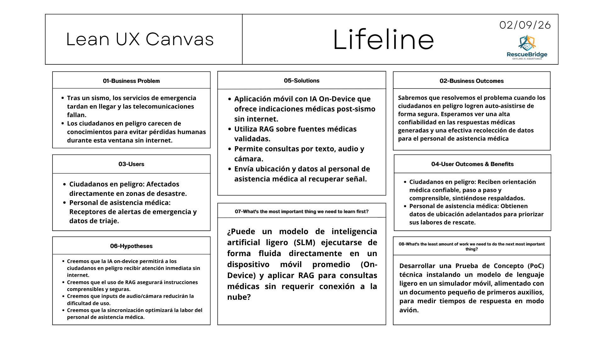

## 1.3. Segmentos objetivo.

Lifeline fue diseñada pensando en que la población en general logre contar con acceso inmediato a apoyo médico después de un sismo a través de indicaciones generadas por un modelo de inteligencia artifical que obtenga los datos de una base de conocimientos médicos provenientes de organizaciones o instituciones de renombre, de forma en que se pueda asegurar que estas indicaciones son seguras. A su vez, deseamos ayudar a que los servicios de emergencia estén informados de la situación vivida lo antes posible, así como buscamos conectar a las personas heridas con el personal médico. En ese sentido, estaremos tomando en cuenta estos dos segmentos objetivos.

__Ciudadanos__

- Rango de edad: 12 años a más
- Lugar de residencia: Lima, Perú
- Nivel educativo: Nivel primario de eduación básica a superior
- Idioma: Español
- Descripción:  
  Los ciudadanos son personas que estudian o trabajan ya sea de forma externa o en el hogar y que pueden verse afectados bajo un sismo. En este caso nos estamos centrado en Lima Metropolitana. Estas personas poseen un celular personal y, por lo general, carecen de la preparación médica necesaria para actuar en emergencias.
- Preocupaciones:  
  Los ciudadanos temen que ellos o sus familias se vean afectados físicamente después de un evento sísmico, así como al no lograr encontrar a una persona con conocimientos médicos que pueda apoyar a atender a los heridos. Les precoupa causar más daño a la víctima al intentar ayudar y desean poder encontrar un medio que los ayude a proveer primeros auxilios de forma segura, aún cuando informarse en internet no sea una opción dado en escenario.

__Personal médico__

- Rango de edad: 20 años a más
- Lugar de residencia: Lima, Perú
- Nivel educativo: Nivel universitario a superior
- Idioma: Español
- Descripción:  
  El personal médico abarca a los médicos, enfermeros, paramédicos, bomberos con entrenamientos médico, internos, residentes de medicina y demás personas entrenadas en el arte de la medicina que pueden proveer apoyo en la curación de heridas, estabilización de pacientes y atención a las víctimas en general después de un sismo o terremoto.
- Preocupaciones:  
  Al personal médico le preocupa la falta de preparación que existe en general dentro de la población para actuar frente a un sismo, en especial considerando la aplicación de primeros auxilios. Por otro lado, temen no conocer la situación de las víctimas después de un terremoto y, por ende, no llegar a ellos preparados para su atención o ni siquiera saber donde se encuentran.

# Capítulo II: Requirements Elicitation & Analysis

## 2.1. Competidores
El propósito de esta sección es reconocer a los competidores directos que operan con modelos de negocio sustentados en productos digitales similares, así como a los competidores indirectos que ofrecen soluciones que, aunque no idénticas, guardan cierta relación o cubren necesidades similares.

### 2.1.1. Análisis competitivo

<table border="1px">
    <thead>
        <th colspan="11">Competitive Analysis Landscape</th>
    </thead>
    <tbody>
        <tr>
            <td rowspan="2" colspan="2">¿Por qué realizar este análisis?</td>
            <td colspan="9">Indicar en este espacio la pregunta que se busca responder o el propósito principal del análisis.</td>
        </tr>
        <tr>
            <td colspan="9">El propósito de este análisis es entender cómo funcionan y qué características poseen los productos relacionados con la orientación médica y los primeros auxilios, con el fin de diseñar estrategias y tácticas que nos permitan potenciar las fortalezas de Lifeline y aprovechar las debilidades detectadas en la competencia, especialmente en el escenario de emergencia post-sismo.</td>
        </tr>
        <tr>
            <td colspan="3">(En la cabecera colocar nombre y logo de cada competidor)</td>
            <td colspan="2">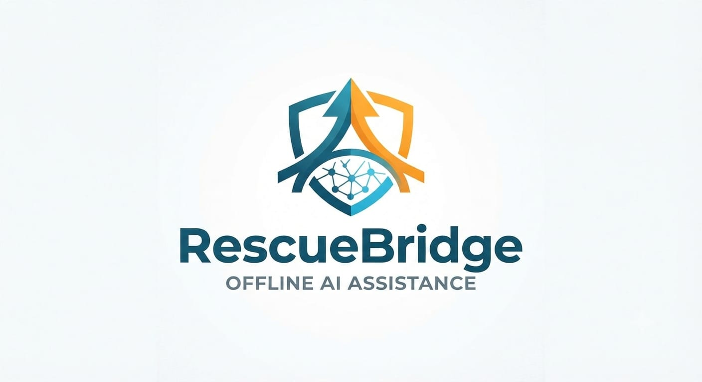 Lifeline (RescueBridge)</td>
            <td colspan="2"> Primeros Auxilios (Cruz Roja / IFRC)</td>
            <td colspan="2"> Ada Health</td>
            <td colspan="2"> Buoy Health</td>
        </tr>
        <tr>
            <td rowspan="2" colspan="1">Perfil</td>
            <td colspan="2">Descripción general</td>
            <td colspan="2">App móvil que brinda orientación médica de primeros auxilios en un escenario post-sismo, mediante un modelo de IA on-device (offline) que usa RAG sobre fuentes médicas validadas, con entrada multimodal (texto, voz, foto).</td>
            <td colspan="2">App oficial de la Cruz Roja / IFRC con guías precargadas de primeros auxilios, videos explicativos y cuestionarios interactivos para aprender y consultar en el momento.</td>
            <td colspan="2">App de evaluación de síntomas con IA conversacional que hace preguntas personalizadas y sugiere posibles causas médicas.</td>
            <td colspan="2">Plataforma de triaje con IA que analiza síntomas mediante preguntas y recomienda el nivel de atención médica a buscar.</td>
        </tr>
        <tr>
            <td colspan="2">Ventaja competitiva ¿Qué valor ofrece?</td>
            <td colspan="2">Es la única solución que combina funcionamiento 100% offline con indicaciones generadas por IA adaptadas al caso específico del usuario (no un checklist fijo), y que además notifica al personal médico la ubicación y estado del paciente al recuperar señal.</td>
            <td colspan="2">Respaldo institucional global de gran confianza, contenido validado clínicamente y disponible sin conexión.</td>
            <td colspan="2">IA conversacional validada clínicamente, con más de 10 años de desarrollo y una amplia base de datos de condiciones médicas.</td>
            <td colspan="2">Algoritmos entrenados con miles de datos clínicos reales; reporta una tasa de acierto cercana al 90% frente a diagnóstico médico.</td>
        </tr>
        <tr>
            <td rowspan="2" colspan="1">Perfil de Marketing</td>
            <td colspan="2">Mercado objetivo</td>
            <td colspan="2">Ciudadanos en zonas de alto riesgo sísmico en Lima Metropolitana y personal de asistencia médica (bomberos, paramédicos, enfermeros, personal de rescate).</td>
            <td colspan="2">Población general a nivel mundial interesada en aprender o consultar primeros auxilios.</td>
            <td colspan="2">Personas a nivel global preocupadas por síntomas de salud cotidianos, sistemas de salud y aseguradoras.</td>
            <td colspan="2">Empleados de empresas en EE.UU. con beneficios de salud contratados por sus empleadores.</td>
        </tr>
        <tr>
            <td colspan="2">Estrategia de Marketing</td>
            <td colspan="2">Alianzas con INDECI, municipalidades y Cruz Roja Peruana; distribución durante simulacros nacionales de sismo; campañas de prevención de desastres.</td>
            <td colspan="2">Distribución mediante cursos presenciales de primeros auxilios, campañas institucionales y alianzas gubernamentales.</td>
            <td colspan="2">Posicionamiento en tiendas de apps, alianzas con sistemas de salud y aseguradoras.</td>
            <td colspan="2">Alianzas B2B directas con empleadores y aseguradoras que ofrecen la herramienta como beneficio laboral.</td>
        </tr>
        <tr>
            <td rowspan="3" colspan="1">Perfil de Producto</td>
            <td colspan="2">Producto & Servicio</td>
            <td colspan="2">App móvil offline-first con IA on-device + RAG médico, entrada multimodal, sincronización bidireccional y gestión de casos para personal médico.</td>
            <td colspan="2">App con checklist estático de primeros auxilios, videos, cuestionarios y botón de llamada directa a emergencias.</td>
            <td colspan="2">Symptom checker con IA conversacional en la nube, recomendaciones de siguiente paso y opción de telemedicina paga.</td>
            <td colspan="2">Plataforma de triaje conversacional y marketplace de opciones de atención médica.</td>
        </tr>
        <tr>
            <td colspan="2">Precio & Costos</td>
            <td colspan="2">Modelo freemium: gratuito para ciudadanos; licenciamiento institucional para municipalidades/entidades de salud.</td>
            <td colspan="2">Totalmente gratuita.</td>
            <td colspan="2">Gratuita, con opción de consulta médica paga (aprox. $25).</td>
            <td colspan="2">Modelo B2B, cubierto dentro de los beneficios laborales del usuario.</td>
        </tr>
        <tr>
            <td colspan="2">Canales</td>
            <td colspan="2">Aplicación móvil (Android/iOS), funciona sin conexión a internet.</td>
            <td colspan="2">Aplicación móvil (Android/iOS), contenido precargado offline.</td>
            <td colspan="2">Aplicación móvil, requiere conexión a internet (procesamiento en la nube).</td>
            <td colspan="2">Aplicación web y móvil, requiere conexión a internet.</td>
        </tr>
        <tr>
            <td rowspan="5">Análisis SWOT</td>
            <td colspan="10">Elabore un análisis para su startup y competidores. Las fortalezas deben respaldar oportunidades y reforzar ventajas competitivas.</td>
        </tr>
        <tr>
            <td colspan="2">Fortalezas</td>
            <td colspan="2">Funciona sin conexión, indicaciones adaptadas al caso real mediante IA, entrada multimodal, conecta al ciudadano con personal médico.</td>
            <td colspan="2">Marca reconocida y confiable, contenido validado clínicamente, funciona sin internet.</td>
            <td colspan="2">IA robusta y validada, gran base de usuarios, evaluación personalizada de síntomas.</td>
            <td colspan="2">Precisión reportada alta, modelo de negocio B2B ya consolidado.</td>
        </tr>
        <tr>
            <td colspan="2">Debilidades</td>
            <td colspan="2">Startup nueva sin trayectoria; requiere validación clínica e institucional; depende de recursos de hardware del dispositivo (batería, memoria).</td>
            <td colspan="2">Contenido estático (checklist fijo); no analiza el caso específico del usuario; no admite fotos ni voz.</td>
            <td colspan="2">Depende 100% de internet; no está diseñada para emergencias agudas ni post-desastre; no permite adjuntar fotos de heridas.</td>
            <td colspan="2">No funciona offline; no orientada a emergencias físicas ni al contexto peruano; no permite intervención directa sobre heridas.</td>
        </tr>
        <tr>
            <td colspan="2">Oportunidades</td>
            <td colspan="2">Alto riesgo sísmico en Perú, alianzas gubernamentales, escaso mercado de soluciones offline + IA médica.</td>
            <td colspan="2">Podría incorporar IA en el futuro, aprovechando su respaldo institucional.</td>
            <td colspan="2">Podría expandirse a mercados de emergencia si desarrollara una versión offline.</td>
            <td colspan="2">Podría expandirse a mercados fuera de EE.UU.</td>
        </tr>
        <tr>
            <td colspan="2">Amenazas</td>
            <td colspan="2">Desconfianza de la población hacia decisiones médicas de una IA; necesidad de convencer a instituciones para validar el contenido.</td>
            <td colspan="2">Apps con IA más adaptativa (como Lifeline) podrían ofrecer mayor valor percibido en emergencias reales.</td>
            <td colspan="2">Ninguna amenaza directa en el nicho de emergencias post-desastre, dado que no compite en ese escenario.</td>
            <td colspan="2">Ninguna amenaza directa en el nicho de emergencias post-desastre, dado que no compite en ese escenario.</td>
        </tr>
    </tbody>
</table>

### 2.1.2. Estrategias y tácticas frente a competidores

Esta sección examina las acciones estratégicas y tácticas que se implementarán para contrarrestar las fortalezas de la competencia y capitalizar sus debilidades, sin dejar de considerar las oportunidades y amenazas presentes en el mercado.

* **Estrategia de diferenciación por inteligencia sin conexión:**
  * Se busca ofrecer una solución que combine lo que ninguna app existente logra simultáneamente: funcionar sin conexión a internet y razonar sobre el caso específico del usuario mediante IA. Frente a Ada Health y Buoy Health —que dependen de la nube— Lifeline mantiene su funcionalidad completa incluso cuando las telecomunicaciones colapsan tras un sismo.
    * **Tácticas:**
      * Comunicar en el onboarding y en material de difusión el mensaje "cuando ellos dejan de funcionar, Lifeline sigue".
      * Ejecutar todo el pipeline de IA (modelo + RAG + base médica) de forma local, sin llamadas externas.
* **Estrategia de confiabilidad clínica reforzada:**
  * El objetivo es que Lifeline no reemplace el contenido validado de instituciones como la Cruz Roja, sino que lo dinamice: en vez de un checklist fijo, adaptar la respuesta a la foto, el texto o el audio que describe el caso real del paciente.
    * **Tácticas:**
      * Sustentar cada indicación mediante RAG sobre fuentes médicas oficiales (MINSA, OMS, Cruz Roja Peruana).
      * Buscar alianzas de validación de contenido con estas instituciones para ganar legitimidad ante los usuarios.
* **Estrategia de accesibilidad multimodal:**
  * Ninguno de los competidores analizados permite adjuntar una fotografía de la herida o describir la emergencia por voz para que el sistema razone sobre ella; esta es la ventaja de uso bajo estrés que Lifeline explota.
    * **Tácticas:**
      * Priorizar en el diseño de UX flujos de consulta por voz y cámara antes que el ingreso por texto.
      * Optimizar el procesamiento multimodal para mantener baja latencia incluso en dispositivos de gama media.
* **Estrategia de cierre de brecha con el personal médico:**
  * Ninguna de las apps de primeros auxilios o symptom checkers analizadas conecta al ciudadano con el rescatista; todas terminan la interacción en el propio ciudadano. Lifeline convierte esa notificación en su diferenciador institucional.
    * **Tácticas:**
      * Enviar automáticamente ubicación y estado del paciente al personal médico al recuperar conexión.
      * Usar este flujo como argumento principal en conversaciones con INDECI, EsSalud y municipalidades para integraciones futuras.
* **Estrategia de entrada al mercado por prevención:**
  * Dado que un sismo corta la posibilidad de descargar cualquier app nueva en el momento, la meta es lograr que Lifeline ya esté instalada antes de que ocurra la emergencia.
    * **Tácticas:**
      * Distribuir la app durante simulacros de sismo nacionales, que ya cuentan con alta participación ciudadana en Perú.
      * Impulsar campañas de descarga junto a municipalidades y colegios en zonas de alto riesgo sísmico.

## 2.2. Entrevistas

### 2.2.1. Diseño de entrevistas

Para ambos segmentos, se estarán solicitando los datos de nombre completo, edad, nivel de estudios, distrito de residencia y opcupación antes de proceder con las preguntas específicas de segmento. A través de estas, se busca conocer la opinión de las personas respecto al usa de la inteligencia artificial en el ámbito médico y como apoyo de respuesta ante emergencias, así como su nivel de confianza hacia la misma.

**Segmento objetivo 1: Ciudadanos**

1. ¿Ha vivido alguna emergencia o urgencia médica durante o después de un sismo? Cuénteme qué ocurrió y qué hizo para ayudar a la persona.
2. Actualmente, si usted o alguien cercano resultara herido después de un sismo, ¿cuáles serían sus primeras acciones y en qué orden las realizaría?
3. ¿Qué sería lo más difícil o confuso al intentar ayudar a una persona herida sin contar inmediatamente con personal médico?
4. ¿Cómo cree que se sentiría en esa situación y cómo ello podría afectar su capacidad para seguir instrucciones?
5. ¿Qué señales tomaría en cuenta para decidir si puede atender temporalmente una herida o si debe buscar ayuda profesional de inmediato?
6. Si no tuviera internet, ¿dónde buscaría información de primeros auxilios y qué problemas podría encontrar?
7. En una emergencia, ¿cómo le resultaría más fácil explicar lo que está ocurriendo: escribiendo, hablando, tomando una fotografía o de otra manera? ¿Por qué?
8. Si usted fuera a atender a una persona herida después de un sismo, ¿cómo deberían presentarse las indicaciones médicas para que pueda comprenderlas y seguirlas sin problemas?
9. ¿Qué necesitaría ver o saber para confiar en indicaciones médicas proporcionadas por una aplicación que usa inteligencia artificial?
10. ¿Le gustaría que sea la inteligencia artificial de la aplicación la que le sugiera si solicitar o no apoyo médico profesional? ¿Por qué?
11. ¿Qué información personal, médica o de ubicación estaría dispuesto a compartir con el personal de emergencia?

**Segmento objetivo 2: Personal médico**

1. Desde su experiencia, ¿cree que son suficientes los conocimientos de primeros auxilios que posee la población en general? ¿Cuáles son los errores o desconocimientos más frecuentes?
2. En un escenario post-sismo, ¿cómo considera que una persona sin formación médica debería atender inicialmente a un familiar herido?
3. Durante una emergencia con múltiples víctimas, ¿qué dificultades encuentra para obtener información confiable y localizar a quienes necesitan ayuda?
4. ¿Cuál es la información mínima que necesita conocer para evaluar inicialmente la gravedad de un caso?
5. ¿Qué datos utiliza para decidir qué casos deben atenderse primero y cuáles pueden esperar?
6. ¿Qué opina de que, en una situación post sísmica en la que no han llegado los equipos de emergencia, un ciudadano reciba indicaciones de parte de una inteligencia artifical con conocimiento médico para atender a un familiar herido?
7. ¿Cómo influiría en su atención recibir a un paciente que antes fue atentido por otr persona que seguía indicaciones generadas por una IAcon conocimiento médico? ¿Qué beneficios o riesgos identifica?
8. ¿Qué necesitaría revisar para confiar en la información, indicaciones y recomendaciones generadas por una inteligencia artifial con conocimiento médico?
9. ¿Qué conocimientos, protocolos y procedimientos de primeros auxilios considera que debería dominar una inteligencia artificial diseñada para orientar a personas después de un sismo?
10. Antes de ofrecer una indicación, ¿qué preguntas debería realizar la IA sobre el paciente, la lesión y el entorno para comprender correctamente la situación?
11. ¿Qué síntomas, lesiones o señales de peligro debería reconocer la IA para recomendar esperar por atención profesional y evitar que el ciudadano continúe actuando por su cuenta?
12. ¿Qué acciones nunca debería recomendar una IA y qué advertencias, limitaciones o medidas de seguridad considera que tendría que comunicar al usuario?

### 2.2.2. Registro de entrevistas

**Segmento objetivo 1: Ciudadanos**

Entrevistado N°1: Barbara Eliana Seminario Leon

- Sexo: Femenino
- Edad: 52 años
- Distrito: Santiago de Surco
- Acerca de la entrevista:
  - Instante en el que inicia: 0:00
  - Duración: 4:49

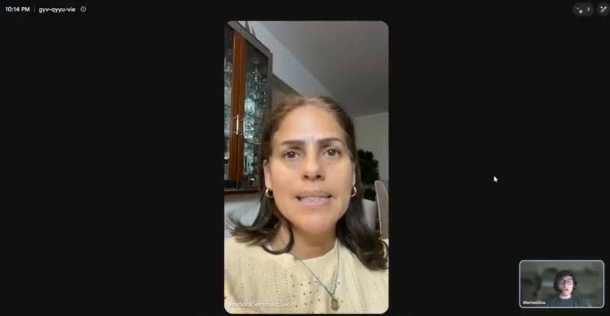

- Resumen:

  Para Barbara, enfrentar una emergencia médica post-sismo es una situación delicada y potencialmente frustrante, tal como lo experimentó al tener que evacuar cuidadosamente a una persona con el pie torcido. Su principal barrera actual es la incapacidad de comunicarse con servicios de emergencia o buscar información de primeros auxilios sin acceso a internet, lo que complica el manejo de heridas complejas o situaciones donde el paciente no puede ser movilizado. Frente a estos problemas, encuentra una gran oportunidad en una aplicación que le permita describir la emergencia combinando fotos y texto, recibiendo a cambio indicaciones médicas claras, concisas y ordenadas a modo de checklist. Para confiar plenamente en esta herramienta, recalca que la inteligencia artificial debe basarse en información verificada y no "alucinar", considerándola excelente para un triaje o descarte inicial, aunque manteniendo el deseo de una eventual interacción humana y mostrándose completamente dispuesta a compartir la información personal o de ubicación que sea necesaria para facilitar el rescate.

- Enlace a la entrevista:

  https://upcedupe-my.sharepoint.com/:v:/g/personal/u202223990_upc_edu_pe/IQCN_juWlEoLTqJhCKvZk9JhAUL5UB2olgvMbwjLDSsdFE8?nav=eyJyZWZlcnJhbEluZm8iOnsicmVmZXJyYWxBcHAiOiJPbmVEcml2ZUZvckJ1c2luZXNzIiwicmVmZXJyYWxBcHBQbGF0Zm9ybSI6IldlYiIsInJlZmVycmFsTW9kZSI6InZpZXciLCJyZWZlcnJhbFZpZXciOiJNeUZpbGVzTGlua0NvcHkifX0&e=m4hGMX

Entrevistado N°2: Roberto Mauricio Huertas Romero

- Sexo: Masculino
- Edad: 21 años
- Distrito: Ate Vitarte
- Ocupación: Estudiante
- Grado de instrucción: Universitario
- Acerca de la entrevista:
  - Instante en el que inicia: 0:00
  - Duración: 10:06

- Resumen:

  Para Roberto, su experiencia cercana con una emergencia post-sismo ocurrió cuando su primita se cayó de las escaleras al asustarse por el movimiento. Aunque las heridas fueron leves y sin mayor gravedad, el evento le dejó claro lo difícil que puede resultar actuar sin conocimientos médicos. En una situación similar, indica que primero revisaría los ojos y la cabeza, por considerarla la zona más frágil, y luego observaría el comportamiento de la persona para detectar signos de desorientación. Reconoce que lo más complicado sería determinar cómo ayudar correctamente, ya que no cuenta con preparación médica y teme realizar alguna acción inadecuada. Además, señala que los nervios y la ansiedad por querer ayudar podrían afectar su capacidad para seguir instrucciones de forma correcta. Respecto a la gravedad, considera que a veces es necesario actuar con rapidez, pero si la persona pierde el conocimiento buscaría ayuda profesional de inmediato. Sin internet, afirma que le resultaría muy difícil buscar información de primeros auxilios y preferiría acudir directamente a un profesional. En una emergencia, le resultaría más fácil explicar la situación hablando y tomando fotografías. Le gustaría que las indicaciones médicas se presenten paso a paso, con imágenes y textos precisos, y que estén avaladas para poder confiar plenamente en ellas. También considera útil que la inteligencia artificial sugiera si es necesario solicitar apoyo médico profesional, precisamente porque él no tiene formación en el área. Finalmente, estaría dispuesto a compartir información personal y médica en una emergencia, como el tipo de sangre o posibles alergias a medicamentos, porque considera que esos datos pueden facilitar una atención más segura.
- Enlace a la entrevista:

  https://upcedupe-my.sharepoint.com/:v:/g/personal/u20231b775_upc_edu_pe/IQDDWLQjGTGLTa7N3srs73xSAT-tzDIPOBWb65EZ3WDK6s4?e=gvbK6L&nav=eyJyZWZlcnJhbEluZm8iOnsicmVmZXJyYWxBcHAiOiJTdHJlYW1XZWJBcHAiLCJyZWZlcnJhbFZpZXciOiJTaGFyZURpYWxvZy1MaW5rIiwicmVmZXJyYWxBcHBQbGF0Zm9ybSI6IldlYiIsInJlZmVycmFsTW9kZSI6InZpZXcifX0%3D

Entrevistada N°3: Araceli Felicia Reyna Caicedo

- Sexo: Femenino
- Edad: 21 años
- Distrito: Chorrillos
- Ocupación: Estudiante
- Grado de instrucción: Universitario
- Acerca de la entrevista:
  - Instante en el que inicia: 0:00
  - Duración: 13:17

- Resumen:

  Araceli no ha vivido una urgencia médica durante un sismo, pero al no contar con conocimientos en primeros auxilios, siente que sin internet no tendría una fuente de información. En una situación post sismo, siente que lo más difícil es no saber cuál sería el primer paso para tratar a un paciente. Siente que para comunicar una situación de emergencia, más fácil le parece a través de un audio porque simplifica el tiempo, y considera que tomar fotos ayudaría en la descripción. Al momento de recibir indicaciones valoraría la forma escrita y numerada de pasos, con imágenes adjuntas. Siente que confiaría más en las indicaciones de la ia, si éstas referencian a portales médicos o instituciones y sí está dispuesta a compartir su información personal. 

- Enlace a la entrevista:

  https://upcedupe-my.sharepoint.com/:v:/g/personal/u20211d760_upc_edu_pe/IQDxWcXxxfLaTbVmJ0Re6ROyAVkQNEzOLj5AVEb6OsR-4u8?nav=eyJyZWZlcnJhbEluZm8iOnsicmVmZXJyYWxBcHAiOiJPbmVEcml2ZUZvckJ1c2luZXNzIiwicmVmZXJyYWxBcHBQbGF0Zm9ybSI6IldlYiIsInJlZmVycmFsTW9kZSI6InZpZXciLCJyZWZlcnJhbFZpZXciOiJNeUZpbGVzTGlua0NvcHkifX0&e=s5gC7L

**Segmento objetivo 2: Personal médico**

Entrevistado N°1: Andre Ramirez Pella

- Sexo: Masculino
- Edad: 24 años
- Distrito: San Miguel
- Grado de instrucción: Universitario
- Acerca de la entrevista:
  - Instante en el que inicia: 0:00
  - Duración: 10:13

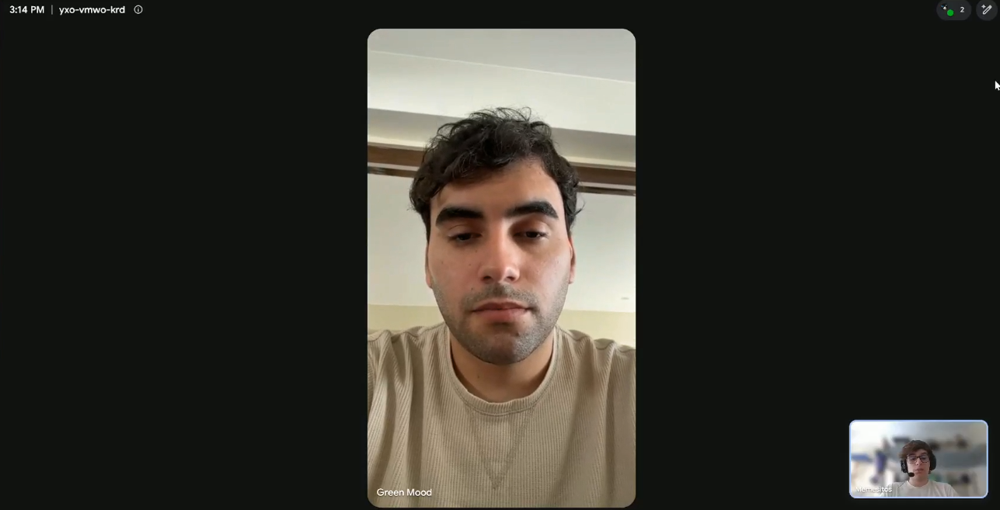

- Resumen:

  Para Andre, la alarmante falta de conocimientos en primeros auxilios por parte de la población representa un riesgo crítico, ya que la mayoría desconoce cómo realizar una evaluación inicial o aplicar maniobras básicas para salvar vidas. A esta barrera se le suma la gran dificultad que tienen los equipos médicos para localizar víctimas durante desastres con derrumbes. En este contexto, considera que recibir orientación de una inteligencia artificial sería una herramienta sumamente útil para empoderar a los ciudadanos, agilizando el proceso de atención y reduciendo riesgos antes de que llegue la ayuda. Para que el sistema sea confiable y seguro, la IA debe basarse en fuentes verificadas, realizar preguntas clave (como medir el pulso, nivel de conciencia, sangrados o fracturas) e identificar rápidamente si la situación requiere atención profesional inmediata. Finalmente, hace hincapié en que la aplicación nunca debe sugerir la automedicación ni indicar movimientos o tratamientos complejos que requieran entrenamiento previo, ya que un mal análisis o una ejecución incorrecta podrían empeorar gravemente el estado del paciente.

- Enlace a la entrevista:

  https://upcedupe-my.sharepoint.com/:v:/g/personal/u202223990_upc_edu_pe/IQCN_juWlEoLTqJhCKvZk9JhAUL5UB2olgvMbwjLDSsdFE8?nav=eyJyZWZlcnJhbEluZm8iOnsicmVmZXJyYWxBcHAiOiJPbmVEcml2ZUZvckJ1c2luZXNzIiwicmVmZXJyYWxBcHBQbGF0Zm9ybSI6IldlYiIsInJlZmVycmFsTW9kZSI6InZpZXciLCJyZWZlcnJhbFZpZXciOiJNeUZpbGVzTGlua0NvcHkifX0&e=4iY6Ds

Entrevistado N°2: Katia Milagros Saavedra Saavedra

- Sexo: Femenino
- Edad: 52 años
- Distrito: Santiago de Surco
- Grado de instrucción: Universitario
- Acerca de la entrevista:
  - Instante en el que inicia: 0:01
  - Duración: 13:36

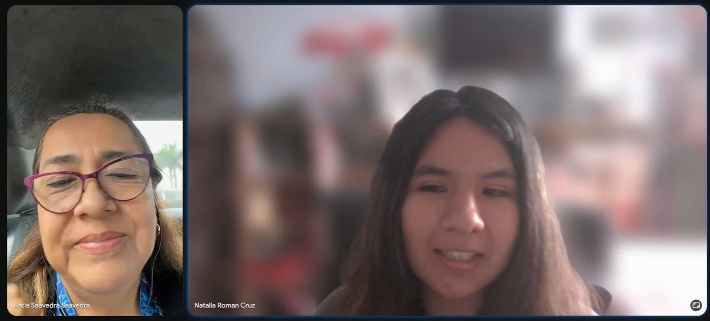

- Resumen:

  Para Katia, médica reumatóloga, la falta de una cultura de primeros auxilios y de acceso a capacitaciones representa un riesgo importante, pues muchas personas no saben reconocer señales de alarma ni actuar mientras llega la ayuda profesional. Considera que una inteligencia artificial podría ser útil para orientar a ciudadanos sin experiencia durante una emergencia posísmica, ayudándolos a evaluar la respiración y el pulso, recopilar información sobre el accidente y clasificar a las víctimas según su gravedad. Para brindar recomendaciones confiables, la IA debería preguntar por el mecanismo de la lesión, los síntomas, el tipo y la ubicación del dolor, el tiempo transcurrido y los antecedentes médicos, además de analizar signos vitales como la frecuencia cardíaca, la frecuencia respiratoria, la presión arterial y la temperatura, idealmente mediante sensores. Sin embargo, enfatiza que la IA no puede detectar con precisión problemas internos, como una hemorragia, ni reemplazar la evaluación clínica y la experiencia del personal médico. Finalmente, señala que nunca debería recomendar mover a un paciente sin la presencia de un profesional o paramédico, excepto cuando permanezca en una zona de peligro inminente, y siempre debe advertir que su función es únicamente orientar, acelerar la atención y facilitar la priorización de las personas con mayor riesgo.

- Enlace a la entrevista:

  https://upcedupe-my.sharepoint.com/:v:/g/personal/u202310148_upc_edu_pe/IQA1eeA0b6IIQru3aWtYKV1rAbdlC0QFpfN6YejWyAcPw68?nav=eyJyZWZlcnJhbEluZm8iOnsicmVmZXJyYWxBcHAiOiJPbmVEcml2ZUZvckJ1c2luZXNzIiwicmVmZXJyYWxBcHBQbGF0Zm9ybSI6IldlYiIsInJlZmVycmFsTW9kZSI6InZpZXciLCJyZWZlcnJhbFZpZXciOiJNeUZpbGVzTGlua0NvcHkifX0&e=3A5JVQ

Entrevistado N°3: Kevin Franco Escobar Coca

- Sexo: Masculino
- Edad: 27 años
- Distrito: Ate
- Grado de instrucción: Universitario
- Acerca de la entrevista:
  - Instante en el que inicia: 0:01
  - Duración: 17:02

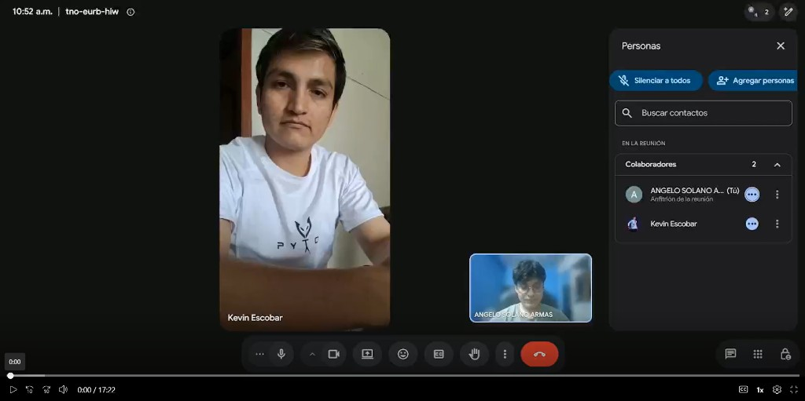

- Resumen:

  Para Kevin, enfermero especializado en el área de emergencias, la falta de conocimientos médicos en la población general representa un grave riesgo ante accidentes o desastres sísmicos, debido a que las personas suelen incurrir en prácticas perjudiciales como retirar objetos incrustados de una herida, dar agua a personas inconscientes o precipitarse a conclusiones sin una valoración previa. Señala que lo primero que debe evaluarse en una víctima es su estado neurológico y nivel de orientación (verificar si se encuentra desorientada o desconcertada), así como la presencia de contusiones y traumatismos. Explica además que, para gestionar la atención cuando hay múltiples heridos, se debe aplicar un triaje por colores y examinar signos visibles como hematomas para determinar con rapidez quiénes requieren auxilio inmediato. Respecto al uso de una inteligencia artificial en primeros auxilios, opina que representa tanto un beneficio como una amenaza latente: si bien puede ser de gran utilidad, indicaciones imprecisas o mal formuladas podrían complicar severamente el cuadro clínico del paciente y dificultar la labor posterior del equipo médico. Por ello, considera indispensable que la solución esté formalmente avalada y respaldada por métricas y resultados clínicos demostrables. En cuanto a las capacidades del sistema, resalta la necesidad de dominar protocolos fundamentales como RCP y soporte respiratorio, además de realizar un interrogatorio activo sobre el estado general del paciente (por ejemplo, detectar oportunamente si se encuentra en shock u otra condición crítica) para evitar equivocaciones. Finalmente, enfatiza que si un paciente se encuentra en estado grave, la aplicación debe ordenar de manera taxativa e inmediata la llamada a un profesional de la salud, recordando que la preservación de la vida es primordial.

- Enlace a la entrevista:

  https://upcedupe-my.sharepoint.com/:v:/g/personal/u20231b775_upc_edu_pe/IQBLygbC1TxOTb5NTfqPQJOjAb64A2MSoaNk_oWaEqQrRqQ?nav=eyJyZWZlcnJhbEluZm8iOnsicmVmZXJyYWxBcHAiOiJPbmVEcml2ZUZvckJ1c2luZXNzIiwicmVmZXJyYWxBcHBQbGF0Zm9ybSI6IldlYiIsInJlZmVycmFsTW9kZSI6InZpZXciLCJyZWZlcnJhbFZpZXciOiJNeUZpbGVzTGlua0NvcHkifX0&e=eTsKy4

### 2.2.3. Análisis de entrevistas

#### Análisis del segmento de ciudadanos

Los ciudadanos entrevistados evidencian un nivel limitado de conocimientos en primeros auxilios y una marcada inseguridad para actuar ante una emergencia medica presentada posterior a un sismo. Aunque algunos han presenciado accidentes de gravedad leve, coinciden en que les resultaría difícil determinar cuál debe ser el primer paso, evaluar correctamente el estado de una víctima o aplicar una maniobra sin temor a empeorar su condición. Asimismo, los nervios y la ansiedad aparecen como factores que pueden afectar su capacidad para comprender y seguir indicaciones durante una situación crítica.

La falta de conexión a internet se identifica como una barrera común en este segmento. Los tres entrevistados reconocen que, sin conectividad, tendrían dificultades para buscar información o comunicarse con los servicios de emergencia. En este contexto, perciben de forma positiva una aplicación con inteligencia artificial que funcione sin conexión y brinde orientación inmediata mientras llega la ayuda profesional. La solución es valorada principalmente como una herramienta de apoyo para realizar una evaluación inicial, reconocer señales de peligro y determinar cuándo es indispensable solicitar asistencia médica.

En cuanto a la interacción con la aplicación, los entrevistados prefieren mecanismos rápidos y sencillos para describir la emergencia, como audios, fotografías y texto. También coinciden en que las indicaciones deben presentarse de manera clara, breve y secuencial, mediante pasos numerados, listas de verificación e imágenes que faciliten su ejecución aun bajo condiciones de estrés. Estas preferencias reflejan la necesidad de una experiencia accesible que reduzca la carga cognitiva del usuario y evite instrucciones ambiguas o excesivamente técnicas.

Finalmente, la confianza en la inteligencia artificial depende de que sus recomendaciones estén respaldadas por fuentes médicas verificadas o instituciones reconocidas, y de que el sistema evite generar información incorrecta. Los entrevistados también consideran importante que la aplicación recomiende oportunamente la intervención de un profesional y mantenga la posibilidad de contacto humano. Todos manifiestan disposición a compartir información personal, médica o de ubicación durante una emergencia, siempre que ello permita agilizar el rescate y recibir una atención más segura.

#### Análisis del segmento de personal médico

Los profesionales entrevistados coinciden en que la falta de conocimientos básicos de primeros auxilios en la población representa un riesgo considerable durante una emergencia. Desde su perspectiva, muchas personas no saben evaluar inicialmente a una víctima, reconocer señales de alarma ni aplicar maniobras básicas mientras esperan la llegada de los equipos especializados. A esta dificultad se suman los problemas de organización y localización de víctimas en escenarios con múltiples afectados, por lo que resaltan la importancia del triaje y de una clasificación clara que permita priorizar a quienes presentan mayor riesgo.

En este contexto, todos los entrevistados muestran una percepción favorable hacia el uso de una inteligencia artificial como herramienta de orientación previa a la atención profesional. Consideran que podría ayudar a ciudadanos sin formación médica a recopilar información relevante, realizar comprobaciones básicas y comunicar con mayor rapidez el estado de una víctima. Para ello, la IA debería formular preguntas sobre el mecanismo del accidente, el nivel de conciencia, la respiración, el pulso, los sangrados, las fracturas, el tipo y la localización del dolor, el tiempo transcurrido y los antecedentes médicos. Esta información permitiría efectuar un descarte inicial, identificar señales de peligro y apoyar la priorización de los casos.

Sin embargo, los especialistas enfatizan que la confiabilidad del sistema dependerá de que se base en fuentes verificadas y reconozca claramente sus limitaciones. La IA no puede sustituir el examen físico ni la experiencia clínica, y podría no detectar lesiones internas o cambios en el estado de un paciente que obliguen a modificar su nivel de prioridad. Por esta razón, toda clasificación realizada por el sistema debe considerarse preliminar y ser reevaluada por personal médico.

Finalmente, los profesionales señalan que la aplicación debe incorporar restricciones de seguridad estrictas. No debería recomendar la automedicación, el traslado innecesario de una víctima ni maniobras o tratamientos complejos que requieran entrenamiento, debido a que una indicación o ejecución incorrecta podría agravar el estado del paciente. La única excepción para mover a una persona sería la existencia de un peligro inminente en el entorno. En conjunto, las entrevistas muestran que la IA es aceptada como una herramienta complementaria para orientar, agilizar el triaje y reducir el tiempo de respuesta, pero nunca como un reemplazo de la atención médica profesional.

## 2.3. Needfinding

### 2.3.1. User Personas

**Ciudadanos**

  

**Personal médico**

  

### 2.3.2. User Task Matrix

La presente matriz identifica las tareas fundamentales que realizan los segmentos objetivo en un escenario de emergencia post-sismo, independientemente del uso de cualquier solución tecnológica. Estas tareas representan el estado actual (As-Is) del dominio del problema y permiten comprender las necesidades reales y los retos de los usuarios antes de la intervención de una herramienta digital.

Se consideran los dos User Personas representativos:

* **Adriana Rojas** - Ciudadano
* **Luis Mendoza** - Personal Médico

Cada tarea ha sido evaluada en función de:

* **Frecuencia:** Baja / Media / Alta
* **Importancia:** Baja / Media / Alta

Las tareas descritas corresponden a actividades propias del contexto de supervivencia, rescate y atención médica de emergencias, no a funcionalidades de software.

| Tarea | Adriana (Frecuencia) | Adriana (Importancia) | Luis (Frecuencia) | Luis (Importancia) |
| --- | --- | --- | --- | --- |
| **Evaluar el entorno y el estado físico inicial de los heridos** | Alta | Alta | Alta | Alta |
| **Buscar o recordar información sobre primeros auxilios** | Media | Alta | Baja | Baja |
| **Brindar atención inicial o estabilizar a un paciente** | Media | Alta | Alta | Alta |
| **Localizar físicamente a las víctimas en la zona de desastre** | Baja | Media | Alta | Alta |
| **Realizar el triaje y determinar la gravedad para priorizar casos** | Baja | Alta | Alta | Alta |
| **Contactar y solicitar ayuda a los servicios de emergencia** | Alta | Alta | Media | Alta |
| **Comunicar la ubicación exacta y el estado de salud de los afectados** | Alta | Alta | Alta | Alta |
| **Tomar decisiones críticas bajo altos niveles de estrés** | Alta | Alta | Alta | Alta |
| **Coordinar acciones de rescate con otros miembros de la comunidad o equipo** | Media | Media | Alta | Alta |

El análisis de la matriz de tareas evidencia que en un escenario post-sismo, ambos segmentos comparten el objetivo crítico de salvar vidas, pero abordan las tareas desde posiciones completamente distintas. Adriana (Ciudadano) se enfrenta a la necesidad de evaluar heridos, brindar atención inicial y comunicar su ubicación con una frecuencia media/alta y una importancia vital, pero careciendo de preparación técnica, lo que genera frustración y riesgo. Por su parte, Luis (Personal Médico) ejecuta labores de triaje, localización y atención experta de manera altamente frecuente, siendo su mayor desafío la falta de información oportuna para priorizar y llegar a los pacientes. Esto confirma que la brecha principal a resolver es la orientación asertiva para el ciudadano en el primer contacto y la posterior transmisión de datos clave hacia el rescatista.

### 2.3.3. Empathy Mapping

  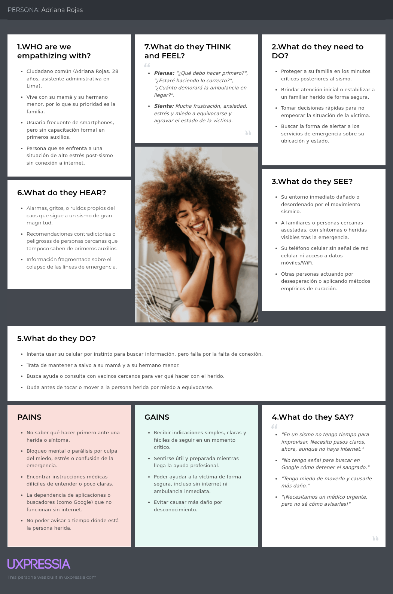

  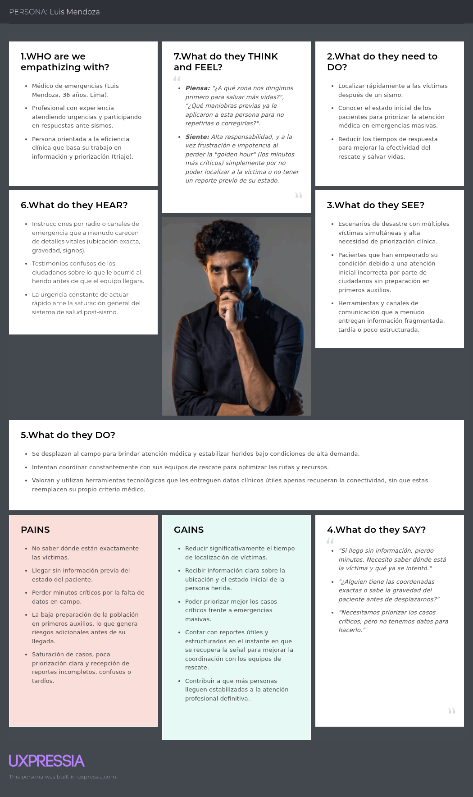

### 2.3.4. As-is Scenario Mapping

  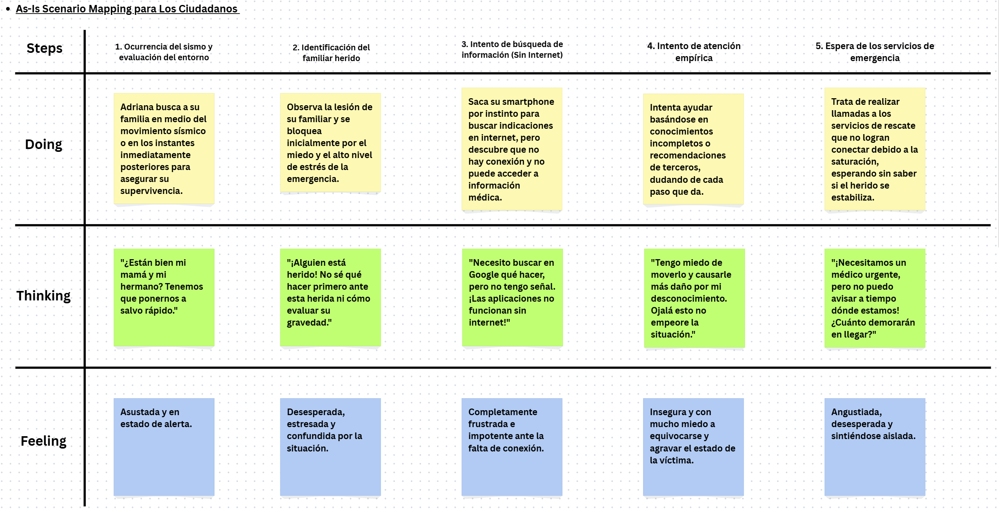

  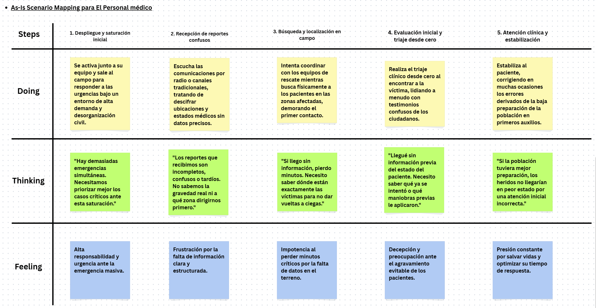

## 2.4. Ubiquitous Language

En este proyecto, el uso de Domain-Driven Design (DDD) permite alinear el desarrollo de software con la realidad del dominio de respuesta post-sismo y orientación médica asistida. Uno de los pilares de DDD es el Lenguaje Ubicuo (Ubiquitous Language), el cual es un conjunto de términos compartidos que se construyen en colaboración entre desarrolladores, diseñadores y expertos del dominio. En nuestro caso, entre el equipo de desarrollo, ciudadanos usuarios de la aplicación y personal médico vinculado a la atención de emergencias.

### Glosario de Términos

<table>
  <thead>
    <tr>
      <th>Término (Inglés)</th>
      <th>Término (Español)</th>
      <th>Definición</th>
    </tr>
  </thead>
  <tbody>
    <tr>
      <td>Citizen</td>
      <td>Ciudadano</td>
      <td>Usuario afectado por un sismo que solicita orientación de primeros auxilios desde la aplicación.</td>
    </tr>
    <tr>
      <td>Medical Staff</td>
      <td>Personal médico</td>
      <td>Profesional de salud o emergencia que visualiza, asigna, atiende y cierra casos sincronizados.</td>
    </tr>
    <tr>
      <td>Consultation</td>
      <td>Consulta</td>
      <td>Solicitud de orientación médica registrada por el ciudadano mediante texto, voz y/o fotografía.</td>
    </tr>
    <tr>
      <td>Patient</td>
      <td>Paciente</td>
      <td>Persona herida o con síntomas descrita dentro de una consulta.</td>
    </tr>
    <tr>
      <td>Medical Guidance</td>
      <td>Orientación médica</td>
      <td>Indicaciones paso a paso generadas por la IA a partir de la consulta y la base de conocimientos médicos.</td>
    </tr>
    <tr>
      <td>Medical Knowledge Base</td>
      <td>Base de conocimientos médicos</td>
      <td>Conjunto local de información de primeros auxilios utilizado para sustentar las respuestas del sistema.</td>
    </tr>
    <tr>
      <td>RAG</td>
      <td>Generación aumentada por recuperación</td>
      <td>Técnica que recupera información médica relevante antes de generar la orientación, para reducir respuestas sin respaldo.</td>
    </tr>
    <tr>
      <td>On-device AI</td>
      <td>IA on-device</td>
      <td>Modelo de inteligencia artificial que se ejecuta en el dispositivo sin depender de conexión a internet.</td>
    </tr>
    <tr>
      <td>Offline Mode</td>
      <td>Modo offline</td>
      <td>Operación de la aplicación sin conexión, permitiendo consultar y almacenar información localmente.</td>
    </tr>
    <tr>
      <td>Outbox</td>
      <td>Outbox / Cola de salida</td>
      <td>Registro local de elementos pendientes de envío hacia la nube cuando se recupere la conectividad.</td>
    </tr>
    <tr>
      <td>Synchronization</td>
      <td>Sincronización</td>
      <td>Proceso de envío y actualización de información entre el dispositivo y el backend al existir conexión.</td>
    </tr>
    <tr>
      <td>Case</td>
      <td>Caso</td>
      <td>Representación en la nube de una consulta sincronizada que puede ser gestionada por el personal médico.</td>
    </tr>
    <tr>
      <td>Case Status</td>
      <td>Estado del caso</td>
      <td>Situación actual de un caso, como pendiente, asignado, en atención o cerrado.</td>
    </tr>
    <tr>
      <td>Professional Support Request</td>
      <td>Solicitud de apoyo profesional</td>
      <td>Indicación del ciudadano para que el personal médico intervenga en la atención.</td>
    </tr>
    <tr>
      <td>Location</td>
      <td>Ubicación</td>
      <td>Referencia espacial asociada a la consulta o al paciente para facilitar su localización.</td>
    </tr>
    <tr>
      <td>Assignment</td>
      <td>Asignación</td>
      <td>Acción mediante la cual el personal médico toma responsabilidad de un caso.</td>
    </tr>
    <tr>
      <td>Care / Attention</td>
      <td>Atención</td>
      <td>Proceso en el que el personal médico inicia y desarrolla la intervención de un caso asignado.</td>
    </tr>
    <tr>
      <td>Case Closure</td>
      <td>Cierre de caso</td>
      <td>Finalización formal de un caso luego de la atención, incluyendo observaciones.</td>
    </tr>
    <tr>
      <td>History</td>
      <td>Historial</td>
      <td>Registro de consultas o casos previos asociados a un usuario.</td>
    </tr>
    <tr>
      <td>Profile</td>
      <td>Perfil</td>
      <td>Información personal y de cuenta del ciudadano o del personal médico.</td>
    </tr>
    <tr>
      <td>Role</td>
      <td>Rol</td>
      <td>Tipo de usuario en la aplicación que determina permisos y funcionalidades disponibles.</td>
    </tr>
    <tr>
      <td>Evidence</td>
      <td>Evidencia</td>
      <td>Fotografía u otro insumo adjunto que complementa la descripción de una consulta.</td>
    </tr>
    <tr>
      <td>Lifeline</td>
      <td>Lifeline</td>
      <td>Aplicación móvil de RescueBridge orientada a brindar primeros auxilios post-sismo y sincronizar casos.</td>
    </tr>
  </tbody>
</table>

# Capítulo III: Requirements Specification

## 3.1. To-Be Scenario Mapping

  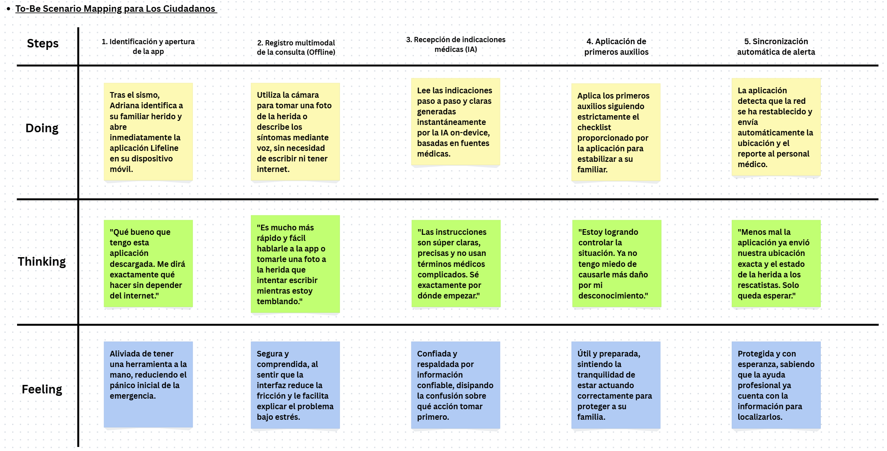

  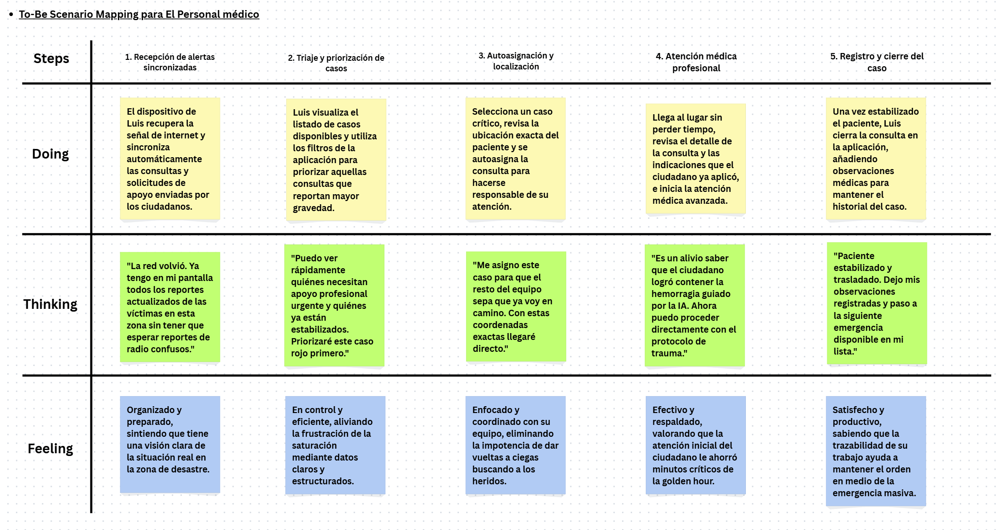

## 3.2. User Stories

__Epics__

| N.º | Título | Descripción |
|---|---|---|
| **EP-01** | **Gestión de identidad, acceso y perfiles** | Como ciudadano o personal médico, quiero ingresar a la aplicación y a mi perfil personal para utilizar las funcionalidades de la aplicación. |
| **EP-02** | **Registro de consultas médicas** | Como ciudadano, quiero registrar una consulta médica para recibir orientación de atención por medio de la inteligencia artificial. |
| **EP-03** | **Orientación médica mediante IA y bases médicas** | Como ciudadano, quiero recibir orientación médica basada en información confiable para poder ayudar a los heridos sin ponerlos en peligro. |
| **EP-04** | **Operación sin conexión y sincronización bidireccional** | Como ciudadano o personal médico, quiero utilizar la aplicación sin conexión y que mi información se sincronice al recibir señal para seguir empleando las funcionalidades de la aplicación sin internet. |
| **EP-05** | **Gestión e historial de consultas** | Como ciudadano o personal médico, quiero gestionar y dar seguimiento a las consultas para conocer el progreso de su atención. |

__User Stories__

<table>
<thead>
<tr>
<th>User Story ID</th>
<th>Título</th>
<th>Descripción</th>
<th>Criterios de Aceptación</th>
<th>Relacionado con (Epic ID)</th>
</tr>
</thead>
<tbody>
<tr>
<td>US01</td>
<td>Registro de una cuenta como ciudadano</td>
<td>Como ciudadano, quiero registrar una cuenta para ingresar a la aplicación y utilizar sus funcionalidades.</td>
<td><strong>Escenario 1:</strong> Registro exitoso del ciudadano. <strong>Dado que</strong> el ciudadano no cuenta con una cuenta registrada <strong>Cuando</strong> el ciudadano completa los datos obligatorios y confirma el registro <strong>Entonces</strong> el sistema crea la cuenta con el rol de ciudadano y permite su ingreso a la aplicación.  <strong>Escenario 2:</strong> Datos de registro incompletos. <strong>Dado que</strong> el ciudadano no ha completado todos los datos obligatorios <strong>Cuando</strong> el ciudadano intenta registrar la cuenta <strong>Entonces</strong> el sistema no permite el registro.</td>
<td>EP-01</td>
</tr>
<tr>
<td>US02</td>
<td>Registro de una cuenta como personal médico</td>
<td>Como personal médico, quiero registrar una cuenta validando mi identificación profesional para acceder a las funcionalidades correspondientes a mi rol.</td>
<td><strong>Escenario 1:</strong> Registro válido del personal médico. <strong>Dado que</strong> la persona completa sus datos e ingresa una identificación profesional válida <strong>Cuando</strong> la persona confirma el registro <strong>Entonces</strong> el sistema crea la cuenta con el rol de personal médico.  <strong>Escenario 2:</strong> Identificación profesional no válida. <strong>Dado que</strong> la identificación profesional ingresada no puede ser validada <strong>Cuando</strong> la persona intenta registrarse como personal médico <strong>Entonces</strong> el sistema no permite el registro con dicho rol.</td>
<td>EP-01</td>
</tr>
<tr>
<td>US03</td>
<td>Inicio de sesión</td>
<td>Como ciudadano o personal médico, quiero iniciar sesión para acceder a las funcionalidades disponibles para mi rol.</td>
<td><strong>Escenario 1:</strong> Inicio de sesión exitoso. <strong>Dado que</strong> la persona posee una cuenta registrada <strong>Cuando</strong> la persona ingresa credenciales válidas <strong>Entonces</strong> el sistema inicia su sesión y muestra las funcionalidades correspondientes a su rol.  <strong>Escenario 2:</strong> Credenciales incorrectas. <strong>Dado que</strong> la persona ingresa credenciales que no coinciden con una cuenta registrada <strong>Cuando</strong> la persona intenta iniciar sesión <strong>Entonces</strong> el sistema rechaza el acceso y muestra un mensaje informativo.</td>
<td>EP-01</td>
</tr>
<tr>
<td>US04</td>
<td>Consulta del perfil personal</td>
<td>Como ciudadano o personal médico, quiero consultar mi perfil para revisar los datos asociados a mi cuenta.</td>
<td><strong>Escenario 1:</strong> Visualización del perfil. <strong>Dado que</strong> la persona ha iniciado sesión <strong>Cuando</strong> la persona accede a la sección de su perfil <strong>Entonces</strong> el sistema muestra los datos personales registrados en su cuenta.  <strong>Escenario 2:</strong> Sesión no válida al consultar el perfil. <strong>Dado que</strong> la sesión de la persona ya no se encuentra activa <strong>Cuando</strong> la persona intenta acceder a su perfil <strong>Entonces</strong> el sistema solicita que vuelva a iniciar sesión antes de mostrar los datos personales.</td>
<td>EP-01</td>
</tr>
<tr>
<td>US05</td>
<td>Actualización de datos personales</td>
<td>Como ciudadano o personal médico, quiero actualizar mis datos personales para mantener vigente la información de mi perfil.</td>
<td><strong>Escenario 1:</strong> Actualización exitosa del perfil. <strong>Dado que</strong> la persona se encuentra en su perfil <strong>Cuando</strong> la persona modifica sus datos con valores válidos y guarda los cambios <strong>Entonces</strong> el sistema actualiza la información y muestra los nuevos datos.  <strong>Escenario 2:</strong> Datos actualizados no válidos. <strong>Dado que</strong> la persona ha ingresado información que no cumple con el formato requerido <strong>Cuando</strong> la persona intenta guardar los cambios <strong>Entonces</strong> el sistema conserva la información anterior.</td>
<td>EP-01</td>
</tr>
<tr>
<td>US06</td>
<td>Cierre de sesión</td>
<td>Como ciudadano o personal médico, quiero cerrar mi sesión para impedir que otras personas accedan a mi cuenta desde el dispositivo.</td>
<td><strong>Escenario 1:</strong> Cierre de sesión exitoso. <strong>Dado que</strong> la persona mantiene una sesión activa <strong>Cuando</strong> la persona selecciona la opción de cerrar sesión <strong>Entonces</strong> el sistema finaliza la sesión y solicita autenticación para volver a ingresar.  <strong>Escenario 2:</strong> Acceso posterior al cierre de sesión. <strong>Dado que</strong> la persona ha cerrado su sesión <strong>Cuando</strong> la persona intenta ingresar nuevamente a una funcionalidad restringida <strong>Entonces</strong> el sistema impide el acceso y muestra la pantalla de inicio de sesión.</td>
<td>EP-01</td>
</tr>
<tr>
<td>US07</td>
<td>Registro de una consulta mediante texto</td>
<td>Como ciudadano, quiero describir una consulta médica mediante texto para comunicar la situación del paciente.</td>
<td><strong>Escenario 1:</strong> Ingreso de una consulta escrita. <strong>Dado que</strong> el ciudadano se encuentra en el registro de una consulta <strong>Cuando</strong> el ciudadano escribe la situación médica del paciente <strong>Entonces</strong> el sistema incorpora el texto como parte de la consulta que será procesada.  <strong>Escenario 2:</strong> Descripción vacía. <strong>Dado que</strong> el ciudadano no ha ingresado una descripción por texto ni por voz <strong>Cuando</strong> el ciudadano intenta procesar la consulta <strong>Entonces</strong> el sistema solicita que describa la situación antes de continuar.</td>
<td>EP-02</td>
</tr>
<tr>
<td>US08</td>
<td>Registro de una consulta mediante voz</td>
<td>Como ciudadano, quiero describir una consulta médica mediante voz para registrar la situación cuando no pueda escribirla con facilidad.</td>
<td><strong>Escenario 1:</strong> Registro de la descripción por voz. <strong>Dado que</strong> el ciudadano se encuentra en el registro de una consulta <strong>Cuando</strong> el ciudadano graba una descripción por voz <strong>Entonces</strong> el sistema convierte el audio en texto y lo incorpora a la consulta.  <strong>Escenario 2:</strong> Audio que no logra ser transcrito. <strong>Dado que</strong> la grabación no tiene la calidad suficiente para ser transcrita <strong>Cuando</strong> la aplicación intenta convertirla en texto <strong>Entonces</strong> informa que no pudo completar la transcripción y permite volver a grabar o escribir la consulta.</td>
<td>EP-02</td>
</tr>
<tr>
<td>US09</td>
<td>Adjunto de fotografías a una consulta</td>
<td>Como ciudadano, quiero adjuntar fotografías a una consulta para complementar la descripción de la situación del paciente.</td>
<td><strong>Escenario 1:</strong> Fotografía agregada correctamente. <strong>Dado que</strong> el ciudadano está registrando una consulta <strong>Cuando</strong> el ciudadano selecciona o captura una fotografía compatible <strong>Entonces</strong> el sistema adjunta la imagen y la muestra como parte de la consulta.  <strong>Escenario 2:</strong> Fotografía no compatible. <strong>Dado que</strong> el ciudadano selecciona una imagen con un formato no admitido o que no puede ser procesada <strong>Cuando</strong> el ciudadano intenta adjuntarla <strong>Entonces</strong> el sistema rechaza el archivo e informa que debe seleccionar otra fotografía.</td>
<td>EP-02</td>
</tr>
<tr>
<td>US10</td>
<td>Ingreso de datos del paciente</td>
<td>Como ciudadano, quiero ingresar los datos del paciente cuando solicite apoyo profesional para facilitar la atención del caso.</td>
<td><strong>Escenario 1:</strong> Solicitud de datos del paciente. <strong>Dado que</strong> el ciudadano está registrando una consulta <strong>Cuando</strong> el ciudadano selecciona la opción de solicitar apoyo profesional <strong>Entonces</strong> el sistema solicita los datos del paciente.  <strong>Escenario 2:</strong> Consulta sin solicitud de apoyo profesional. <strong>Dado que</strong> el ciudadano está registrando una consulta <strong>Cuando</strong> el ciudadano continúa sin seleccionar la opción de solicitar apoyo profesional <strong>Entonces</strong> el sistema permite continuar con el registro de la consulta sin pedir información del paciente.  <strong>Escenario 3:</strong> Datos obligatorios del paciente incompletos. <strong>Dado que</strong> el ciudadano seleccionó la opción de solicitar apoyo profesional y que no completó todos los datos del paciente <strong>Cuando</strong> el ciudadano intenta registrar la solicitud de apoyo <strong>Entonces</strong> el sistema solicita completar la información del paciente antes de continuar.</td>
<td>EP-02</td>
</tr>
<tr>
<td>US11</td>
<td>Registro de la ubicación de la consulta</td>
<td>Como ciudadano, quiero registrar la ubicación del paciente para que el personal médico pueda conocer dónde se encuentra.</td>
<td><strong>Escenario 1:</strong> Ubicación obtenida correctamente. <strong>Dado que</strong> el dispositivo puede acceder a la ubicación actual <strong>Cuando</strong> el ciudadano registra la consulta <strong>Entonces</strong> el sistema guarda las coordenadas y las asocia con la consulta.  <strong>Escenario 2:</strong> Ubicación no disponible. <strong>Dado que</strong> el dispositivo no puede obtener la ubicación actual <strong>Cuando</strong> el ciudadano registra la consulta <strong>Entonces</strong> el sistema guarda la consulta sin ubicación.</td>
<td>EP-02</td>
</tr>
<tr>
<td>US12</td>
<td>Elección de solicitud de apoyo profesional</td>
<td>Como ciudadano, quiero indicar si necesito apoyo profesional para que el personal médico llegue en mi apoyo si lo requiero.</td>
<td><strong>Escenario 1:</strong> Solicitud de apoyo profesional. <strong>Dado que</strong> el ciudadano ha recibido las indicaciones médicas <strong>Cuando</strong> el ciudadano selecciona la opción de solicitar apoyo profesional <strong>Entonces</strong> el sistema registra la solicitud dentro de la consulta.  <strong>Escenario 2:</strong> Consulta sin solicitud de apoyo. <strong>Dado que</strong> el ciudadano ha recibido las indicaciones médicas <strong>Cuando</strong> el ciudadano continúa sin seleccionar la opción de apoyo profesional <strong>Entonces</strong> el sistema registra la consulta sin solicitar la intervención del personal médico.</td>
<td>EP-02</td>
</tr>
<tr>
<td>US13</td>
<td>Incorporación de fuentes médicas autorizadas</td>
<td>Como desarrollador, quiero incorporar y validar fuentes autorizadas para sustentar la orientación generada por la aplicación.</td>
<td><strong>Escenario 1:</strong> Incorporación de una fuente autorizada. <strong>Dado que</strong> se dispone de un documento proveniente de una fuente médica autorizada <strong>Cuando</strong> el responsable confirma su validez y lo incorpora <strong>Entonces</strong> el contenido queda disponible para su procesamiento en la base médica.  <strong>Escenario 2:</strong> Fuente no validada. <strong>Dado que</strong> no se puede comprobar la procedencia o validez de una fuente <strong>Cuando</strong> el responsable intenta incorporarla <strong>Entonces</strong> el contenido no queda habilitado para sustentar las orientaciones médicas.</td>
<td>EP-03</td>
</tr>
<tr>
<td>US14</td>
<td>Obtención de indicaciones médicas sin conexión</td>
<td>Como ciudadano, quiero obtener indicaciones médicas basadas en mi consulta sin conexión a internet para actuar ante la emergencia.</td>
<td><strong>Escenario 1:</strong> Orientación generada sin conexión. <strong>Dado que</strong> el dispositivo no tiene acceso a internet <strong>Y que</strong> se cuenta con los componentes locales necesarios <strong>Cuando</strong> el ciudadano envía una consulta <strong>Entonces</strong> la aplicación procesa la información localmente <strong>Y</strong> muestra indicaciones basadas en la base médica disponible.  <strong>Escenario 2:</strong> Componentes locales no disponibles. <strong>Dado que</strong> el dispositivo no tiene conexión <strong>Y que</strong> no puede cargar el modelo o la base médica local <strong>Cuando</strong> el ciudadano intenta procesar la consulta <strong>Entonces</strong> la aplicación informa que no puede generar la orientación<strong> Y</strong> evita mostrar indicaciones incompletas. </td>
<td>EP-03</td>
</tr>
<tr>
<td>US15</td>
<td>Indicaciones médicas claras y ordenadas</td>
<td>Como ciudadano, quiero recibir indicaciones claras y ordenadas para comprender las acciones que debo realizar.</td>
<td><strong>Escenario 1:</strong> Presentación comprensible de las indicaciones. <strong>Dado que</strong> la aplicación ha procesado la consulta <strong>Cuando</strong> la aplicación muestra la orientación médica <strong>Entonces</strong> presenta las acciones en un orden lógico, con lenguaje claro y sin términos técnicos innecesarios.  <strong>Escenario 2:</strong> Procedimiento compuesto por varios pasos. <strong>Dado que</strong> la orientación requiere realizar más de una acción <strong>Cuando</strong> la aplicación presenta la respuesta <strong>Entonces</strong> enumera los pasos en la secuencia en la que deben realizarse.</td>
<td>EP-03</td>
</tr>
<tr>
<td>US16</td>
<td>Respuesta segura ante información insuficiente</td>
<td>Como ciudadano, quiero ser informado cuando no exista información suficiente para recibir una orientación confiable y evitar realizar acciones inseguras.</td>
<td><strong>Escenario 1:</strong> Información insuficiente para orientar. <strong>Dado que</strong> la consulta no contiene datos suficientes o la base médica no permite sustentar una respuesta <strong>Cuando</strong> la aplicación procesa la solicitud <strong>Entonces</strong> informa que no puede brindar una orientación confiable y evita generar instrucciones no sustentadas.  <strong>Escenario 2:</strong> Consulta fuera del contenido disponible. <strong>Dado que</strong> la situación descrita no está cubierta por la base médica local <strong>Cuando</strong> la aplicación busca información para responder <strong>Entonces</strong> comunica la limitación y recomienda solicitar apoyo profesional.</td>
<td>EP-03</td>
</tr>
<tr>
<td>US17</td>
<td>Recomendación de atención profesional</td>
<td>Como ciudadano, quiero recibir una recomendación de atención profesional cuando se identifiquen señales de gravedad para buscar ayuda especializada.</td>
<td><strong>Escenario 1:</strong> Consulta con señales de gravedad. <strong>Dado que</strong> la información de la consulta presenta señales configuradas como graves <strong>Cuando</strong> la aplicación genera las indicaciones <strong>Entonces</strong> incluye al final la recomendación de solicitar atención de un profesional.  <strong>Escenario 2:</strong> Consulta sin señales de gravedad identificadas. <strong>Dado que</strong> la información registrada no coincide con las reglas de gravedad configuradas <strong>Cuando</strong> la aplicación genera las indicaciones <strong>Entonces</strong> presenta las indicaciones médicas sin indicar solicitar apoyo profesional.</td>
<td>EP-03</td>
</tr>
<tr>
<td>US18</td>
<td>Guardado de una consulta pendiente de sincronización</td>
<td>Como ciudadano, quiero que mi consulta se guarde cuando no exista conexión para que pueda enviarse posteriormente.</td>
<td><strong>Escenario 1:</strong> Consulta guardada sin conexión. <strong>Dado que</strong> el dispositivo no tiene acceso a internet <strong>Cuando</strong> el ciudadano completa el registro de la consulta <strong>Entonces</strong> la aplicación la almacena localmente con el estado pendiente de sincronización.  <strong>Escenario 2:</strong> Persistencia de la consulta pendiente. <strong>Dado que</strong> una consulta fue guardada localmente y aún no se ha sincronizado <strong>Cuando</strong> el ciudadano cierra y vuelve a abrir la aplicación <strong>Entonces</strong> la consulta continúa disponible con el estado pendiente de sincronización.</td>
<td>EP-04</td>
</tr>
<tr>
<td>US19</td>
<td>Visualización de consultas almacenadas localmente</td>
<td>Como ciudadano, quiero visualizar las consultas almacenadas en mi dispositivo para conocer cuáles están pendientes de sincronización.</td>
<td><strong>Escenario 1:</strong> Consulta de registros locales. <strong>Dado que</strong> existen consultas guardadas en el dispositivo <strong>Cuando</strong> el ciudadano accede a sus consultas locales <strong>Entonces</strong> la aplicación muestra cada consulta con su estado de sincronización.  <strong>Escenario 2:</strong> Ausencia de consultas locales. <strong>Dado que</strong> el dispositivo no contiene consultas almacenadas localmente <strong>Cuando</strong> el ciudadano accede a esta sección <strong>Entonces</strong> la aplicación informa que no existen consultas pendientes en el dispositivo.</td>
<td>EP-04</td>
</tr>
<tr>
<td>US20</td>
<td>Sincronización automática de consultas y actualizaciones</td>
<td>Como ciudadano o personal médico, quiero que las consultas y sus actualizaciones se sincronicen automáticamente para mantener la información disponible y actualizada.</td>
<td><strong>Escenario 1:</strong> Envío de consultas pendientes. <strong>Dado que</strong> existen consultas guardadas localmente <strong>Cuando</strong> la aplicación recupera la conexión a internet <strong>Entonces</strong> envía automáticamente las consultas pendientes al backend.  <strong>Escenario 2:</strong> Recepción de actualizaciones de las consultas. <strong>Dado que</strong> una consulta sincronizada cambió de estado o fue tomada por personal médico <strong>Cuando</strong> la aplicación se conecta con el backend <strong>Entonces</strong> actualiza la copia local con el nuevo estado y la información del profesional asignado.</td>
<td>EP-04</td>
</tr>
<tr>
<td>US21</td>
<td>Notificaciones sobre la sincronización y atención del caso</td>
<td>Como ciudadano, quiero recibir notificaciones sobre la sincronización y atención de mi consulta para mantenerme informado sobre su progreso.</td>
<td><strong>Escenario 1:</strong> Consulta tomada por personal médico. <strong>Dado que</strong> una consulta sincronizada ha sido autoasignada por personal médico <strong>Cuando</strong> la aplicación recibe la actualización <strong>Entonces</strong> notifica al ciudadano sobre la atención de su caso.  <strong>Escenario 2:</strong> Sincronización no completada. <strong>Dado que</strong> la aplicación intentó sincronizar una consulta y el proceso falló <strong>Cuando</strong> la aplicación registra el resultado del intento <strong>Entonces</strong> informa al ciudadano que la consulta continúa pendiente de sincronización.</td>
<td>EP-04</td>
</tr>
<tr>
<td>US22</td>
<td>Consulta del historial de consultas realizadas</td>
<td>Como ciudadano, quiero consultar mi historial para revisar las consultas médicas que he realizado.</td>
<td><strong>Escenario 1:</strong> Historial disponible. <strong>Dado que</strong> el ciudadano ha registrado consultas anteriormente <strong>Cuando</strong> el ciudadano accede a su historial <strong>Entonces</strong> la aplicación muestra las consultas asociadas con su cuenta.  <strong>Escenario 2:</strong> Historial sin consultas. <strong>Dado que</strong> el ciudadano todavía no ha registrado consultas <strong>Cuando</strong> el ciudadano accede a su historial <strong>Entonces</strong> la aplicación informa que aún no existen consultas para mostrar.</td>
<td>EP-05</td>
</tr>
<tr>
<td>US23</td>
<td>Visualización del detalle actualizado de una consulta</td>
<td>Como ciudadano, quiero visualizar el detalle actualizado de una consulta para conocer su información y el progreso de la atención.</td>
<td><strong>Escenario 1:</strong> Detalle de una consulta asignada. <strong>Dado que</strong> el ciudadano selecciona una consulta tomada por personal médico <strong>Cuando</strong> el ciudadano abre su detalle <strong>Entonces</strong> la aplicación muestra la información ingresada, las indicaciones generadas, el estado de sincronización, el estado de atención y el nombre del profesional asignado.  <strong>Escenario 2:</strong> Detalle de una consulta sin asignación. <strong>Dado que</strong> el ciudadano selecciona una consulta que todavía no ha sido tomada <strong>Cuando</strong> el ciudadano abre su detalle <strong>Entonces</strong> la aplicación muestra la información disponible e indica que aún no existe personal médico asignado.</td>
<td>EP-05</td>
</tr>
<tr>
<td>US24</td>
<td>Visualización de consultas que solicitan apoyo profesional</td>
<td>Como personal médico, quiero visualizar las consultas que solicitan apoyo profesional para identificar casos que puedo atender.</td>
<td><strong>Escenario 1:</strong> Listado de consultas disponibles. <strong>Dado que</strong> existen consultas sincronizadas con solicitud de apoyo profesional <strong>Cuando</strong> el personal médico accede al listado de casos <strong>Entonces</strong> la aplicación muestra las consultas que pueden ser revisadas para su atención.  <strong>Escenario 2:</strong> Ausencia de consultas disponibles. <strong>Dado que</strong> no existen consultas disponibles que soliciten apoyo profesional <strong>Cuando</strong> el personal médico accede al listado de casos <strong>Entonces</strong> la aplicación informa que no hay consultas disponibles para atender.</td>
<td>EP-05</td>
</tr>
<tr>
<td>US25</td>
<td>Filtrado de consultas por estado</td>
<td>Como personal médico, quiero filtrar las consultas por estado para encontrar los casos que necesito revisar.</td>
<td><strong>Escenario 1:</strong> Aplicación del filtro de estado. <strong>Dado que</strong> el personal médico visualiza el listado de consultas <strong>Cuando</strong> el personal médico selecciona un estado como criterio de filtrado <strong>Entonces</strong> la aplicación muestra únicamente las consultas que poseen dicho estado.  <strong>Escenario 2:</strong> Retiro del filtro aplicado. <strong>Dado que</strong> el listado se encuentra filtrado por un estado <strong>Cuando</strong> el personal médico elimina el filtro <strong>Entonces</strong> la aplicación vuelve a mostrar todas las consultas disponibles.</td>
<td>EP-05</td>
</tr>
<tr>
<td>US26</td>
<td>Visualización de consultas autoasignadas</td>
<td>Como personal médico, quiero visualizar las consultas que me he autoasignado para organizar los casos bajo mi atención.</td>
<td><strong>Escenario 1:</strong> Listado de casos autoasignados. <strong>Dado que</strong> el personal médico se ha autoasignado una o más consultas <strong>Cuando</strong> el personal médico accede a sus consultas asignadas <strong>Entonces</strong> la aplicación muestra únicamente los casos asociados con su cuenta.  <strong>Escenario 2:</strong> Ausencia de casos autoasignados. <strong>Dado que</strong> el personal médico no tiene consultas bajo su responsabilidad <strong>Cuando</strong> el personal médico accede a sus consultas asignadas <strong>Entonces</strong> la aplicación informa que todavía no posee casos asignados.</td>
<td>EP-05</td>
</tr>
<tr>
<td>US27</td>
<td>Consulta del detalle completo de un caso</td>
<td>Como personal médico, quiero consultar el detalle completo de un caso para evaluar la información registrada y la orientación proporcionada.</td>
<td><strong>Escenario 1:</strong> Visualización del caso seleccionado. <strong>Dado que</strong> el personal médico tiene acceso a una consulta <strong>Cuando</strong> el personal médico selecciona el caso <strong>Entonces</strong> la aplicación muestra los datos del paciente, la descripción, las fotografías, la orientación generada y el estado actual.  <strong>Escenario 2:</strong> Consulta sin fotografía adjunta. <strong>Dado que</strong> el ciudadano registró una consulta sin fotografía <strong>Cuando</strong> el personal médico revisa el detalle del caso <strong>Entonces</strong> la aplicación muestra la información restante e indica que no se adjuntaron imágenes.</td>
<td>EP-05</td>
</tr>
<tr>
<td>US28</td>
<td>Visualización de la ubicación del paciente</td>
<td>Como personal médico, quiero visualizar la ubicación registrada del paciente para conocer dónde se encuentra el caso.</td>
<td><strong>Escenario 1:</strong> Ubicación disponible en la consulta. <strong>Dado que</strong> la consulta posee coordenadas registradas <strong>Cuando</strong> el personal médico revisa la ubicación del caso <strong>Entonces</strong> la aplicación muestra la posición asociada con la consulta.  <strong>Escenario 2:</strong> Ubicación no registrada. <strong>Dado que</strong> la consulta no contiene coordenadas disponibles <strong>Cuando</strong> el personal médico revisa su detalle <strong>Entonces</strong> la aplicación informa que no se pudo registrar la ubicación del paciente.</td>
<td>EP-05</td>
</tr>
<tr>
<td>US29</td>
<td>Autoasignación de una consulta disponible</td>
<td>Como personal médico, quiero autoasignarme una consulta disponible para hacerme responsable de su atención.</td>
<td><strong>Escenario 1:</strong> Autoasignación exitosa. <strong>Dado que</strong> la consulta se encuentra disponible y no tiene personal médico asignado <strong>Cuando</strong> el profesional confirma la autoasignación <strong>Entonces</strong> la aplicación lo registra como responsable y actualiza el estado del caso.  <strong>Escenario 2:</strong> Consulta asignada previamente. <strong>Dado que</strong> otro profesional ya tomó la consulta <strong>Cuando</strong> otro integrante del personal médico intenta autoasignarse esa consulta <strong>Entonces</strong> la aplicación no muestra la opción disponible.</td>
<td>EP-05</td>
</tr>
<tr>
<td>US30</td>
<td>Inicio de la atención de una consulta</td>
<td>Como personal médico, quiero iniciar la atención de una consulta autoasignada para registrar que el caso se encuentra en progreso.</td>
<td><strong>Escenario 1:</strong> Atención iniciada. <strong>Dado que</strong> la consulta está asignada al personal médico y permanece pendiente de atención <strong>Cuando</strong> el profesional inicia la atención <strong>Entonces</strong> la aplicación actualiza el caso al estado en progreso.  <strong>Escenario 2:</strong> Inicio solicitado por otro profesional. <strong>Dado que</strong> la consulta está asignada a una persona diferente <strong>Cuando</strong> otro integrante del personal médico intenta iniciar la atención <strong>Entonces</strong> la aplicación no muestra la opción disponible.</td>
<td>EP-05</td>
</tr>
<tr>
<td>US31</td>
<td>Cierre de una consulta con observaciones</td>
<td>Como personal médico, quiero cerrar una consulta y registrar observaciones para dejar constancia de la atención realizada.</td>
<td><strong>Escenario 1:</strong> Cierre exitoso del caso. <strong>Dado que</strong> la consulta se encuentra en atención por el personal médico <strong>Cuando</strong> el personal médico asignado registra sus observaciones y confirma el cierre <strong>Entonces</strong> la aplicación guarda las observaciones y actualiza la consulta al estado cerrado.  <strong>Escenario 2:</strong> Cierre solicitado por personal no asignado. <strong>Dado que</strong> la consulta está bajo la responsabilidad de otro profesional <strong>Cuando</strong> una persona diferente intenta cerrarla <strong>Entonces</strong> la aplicación rechaza la operación y conserva el estado actual del caso.</td>
<td>EP-05</td>
</tr>
<tr>
<td>US32</td>
<td>Consulta del historial de casos atendidos</td>
<td>Como personal médico, quiero consultar el historial de casos que he atendido para revisar las atenciones realizadas.</td>
<td><strong>Escenario 1:</strong> Historial de atenciones disponible. <strong>Dado que</strong> el personal médico ha atendido consultas anteriormente <strong>Cuando</strong> el personal médico accede a su historial <strong>Entonces</strong> la aplicación muestra los casos atendidos asociados con su cuenta.  <strong>Escenario 2:</strong> Historial sin casos atendidos. <strong>Dado que</strong> el personal médico todavía no ha cerrado ninguna consulta <strong>Cuando</strong> el personal médico accede a su historial <strong>Entonces</strong> la aplicación informa que aún no posee casos atendidos.</td>
<td>EP-05</td>
</tr>
<tr>
</tr>
<tr>
<td>TS01</td>
<td>Protección de la sesión almacenada en el dispositivo</td>
<td>Como desarrollador, quiero proteger la sesión almacenada en el dispositivo para evitar el acceso no autorizado a la cuenta.</td>
<td><strong>Escenario 1:</strong> Almacenamiento seguro de la sesión. <strong>Dado que</strong> una persona ha iniciado sesión correctamente <strong>Cuando</strong> la aplicación conserva la información necesaria para mantenerla activa <strong>Entonces</strong> los datos de sesión se almacenan mediante un mecanismo seguro y dejan de ser válidos al cerrar la sesión.  <strong>Escenario 2:</strong> Sesión expirada. <strong>Dado que</strong> la información de sesión superó su período de validez <strong>Cuando</strong> la aplicación intenta utilizarla para acceder a una función restringida <strong>Entonces</strong> rechaza la sesión almacenada y solicita una nueva autenticación.</td>
<td>EP-01</td>
</tr>
<tr>
<td>TS02</td>
<td>Conversión local de voz a texto</td>
<td>Como desarrollador, quiero implementar la conversión local de voz a texto para registrar consultas habladas sin depender de internet.</td>
<td><strong>Escenario 1:</strong> Transcripción sin conexión. <strong>Dado que</strong> el dispositivo no tiene acceso a internet y el ciudadano ha grabado una descripción <strong>Cuando</strong> la aplicación procesa el audio <strong>Entonces</strong> genera localmente el texto correspondiente y lo incorpora a la consulta.  <strong>Escenario 2:</strong> Fallo del motor de transcripción. <strong>Dado que</strong> el componente local no puede procesar el audio recibido <strong>Cuando</strong> intenta generar la transcripción <strong>Entonces</strong> devuelve un resultado controlado, no incorpora texto incompleto y permite realizar un nuevo intento.</td>
<td>EP-02</td>
</tr>
<tr>
<td>TS03</td>
<td>Compresión y optimización de fotografías adjuntas</td>
<td>Como desarrollador, quiero comprimir las fotografías adjuntas para reducir el almacenamiento y la transferencia sin impedir su revisión.</td>
<td><strong>Escenario 1:</strong> Optimización de una fotografía. <strong>Dado que</strong> el ciudadano ha seleccionado una imagen compatible <strong>Cuando</strong> la aplicación la incorpora a la consulta <strong>Entonces</strong> genera una versión optimizada que respeta el límite configurado y mantiene una calidad suficiente para su visualización.  <strong>Escenario 2:</strong> Fallo durante la compresión. <strong>Dado que</strong> la aplicación no puede generar la versión optimizada de una fotografía <strong>Cuando</strong> finaliza el intento de procesamiento <strong>Entonces</strong> no marca la imagen como lista para enviar y devuelve un error controlado.</td>
<td>EP-02</td>
</tr>
<tr>
<td>TS04</td>
<td>Optimización del procesamiento de entradas multimodales</td>
<td>Como desarrollador, quiero optimizar el procesamiento de texto, voz y fotografías para mantener una respuesta fluida durante el registro de la consulta.</td>
<td><strong>Escenario 1:</strong> Procesamiento conjunto de las entradas. <strong>Dado que</strong> una consulta contiene texto transcrito y fotografías <strong>Cuando</strong> la aplicación prepara la información para su análisis <strong>Entonces</strong> procesa las entradas dentro de los objetivos de tiempo y uso de recursos definidos para el producto.  <strong>Escenario 2:</strong> Recursos limitados en el dispositivo. <strong>Dado que</strong> el dispositivo posee recursos disponibles cercanos al límite permitido <strong>Cuando</strong> la aplicación procesa las entradas multimodales <strong>Entonces</strong> controla el uso de memoria y evita el cierre inesperado de la aplicación.</td>
<td>EP-02</td>
</tr>
<tr>
<td>TS05</td>
<td>Procesamiento e indexación de documentos médicos por tipo de procedimiento</td>
<td>Como desarrollador, quiero procesar e indexar los documentos médicos por tipo de procedimiento para facilitar la recuperación de información relevante.</td>
<td><strong>Escenario 1:</strong> Indexación de un documento médico. <strong>Dado que</strong> una fuente médica fue autorizada para su incorporación <strong>Cuando</strong> se ejecuta el proceso de preparación de la base <strong>Entonces</strong> el contenido se divide, clasifica por tipo de procedimiento e incorpora al índice de búsqueda.  <strong>Escenario 2:</strong> Documento que no puede ser procesado. <strong>Dado que</strong> el contenido de una fuente autorizada está vacío o posee un formato no compatible <strong>Cuando</strong> se ejecuta la indexación <strong>Entonces</strong> el documento no se incorpora al índice y el proceso registra el motivo del rechazo.</td>
<td>EP-03</td>
</tr>
<tr>
<td>TS06</td>
<td>Almacenamiento local del índice médico</td>
<td>Como desarrollador, quiero implementar el almacenamiento local del índice médico para permitir su consulta sin conexión a internet.</td>
<td><strong>Escenario 1:</strong> Disponibilidad local del índice. <strong>Dado que</strong> la base médica ha sido procesada e indexada <strong>Cuando</strong> la aplicación se ejecuta sin conexión <strong>Entonces</strong> puede cargar y consultar el índice desde el almacenamiento del dispositivo.  <strong>Escenario 2:</strong> Índice local no disponible. <strong>Dado que</strong> el índice médico no existe o no puede ser leído en el dispositivo <strong>Cuando</strong> la aplicación intenta iniciar una búsqueda <strong>Entonces</strong> detiene el procesamiento y devuelve un estado controlado que impide generar una orientación sin respaldo.</td>
<td>EP-03</td>
</tr>
<tr>
<td>TS07</td>
<td>Optimización de la búsqueda de información médica</td>
<td>Como desarrollador, quiero optimizar la búsqueda en la base médica para recuperar información relevante con rapidez.</td>
<td><strong>Escenario 1:</strong> Recuperación eficiente de información. <strong>Dado que</strong> una consulta fue preparada para buscar información médica <strong>Cuando</strong> el sistema consulta el índice local <strong>Entonces</strong> recupera los contenidos relevantes dentro del objetivo de tiempo definido para la aplicación.  <strong>Escenario 2:</strong> Ausencia de resultados relevantes. <strong>Dado que</strong> ningún contenido supera el nivel mínimo de relevancia configurado <strong>Cuando</strong> el sistema completa la búsqueda <strong>Entonces</strong> devuelve un resultado vacío en lugar de seleccionar información que no corresponda con la consulta.</td>
<td>EP-03</td>
</tr>
<tr>
<td>TS08</td>
<td>Integración del modelo de IA local</td>
<td>Como desarrollador, quiero integrar un modelo de inteligencia artificial local para generar orientación sin depender de servicios en la nube.</td>
<td><strong>Escenario 1:</strong> Inferencia ejecutada localmente. <strong>Dado que</strong> el modelo se encuentra instalado y disponible en el dispositivo <strong>Cuando</strong> la aplicación procesa una consulta sin conexión <strong>Entonces</strong> ejecuta localmente la inferencia y obtiene una respuesta sin comunicarse con un servicio externo.  <strong>Escenario 2:</strong> Modelo local no disponible. <strong>Dado que</strong> la aplicación no puede cargar el modelo en el dispositivo <strong>Cuando</strong> intenta procesar una consulta <strong>Entonces</strong> detiene la inferencia y comunica el fallo mediante el mecanismo de respuesta segura.</td>
<td>EP-03</td>
</tr>
<tr>
<td>TS09</td>
<td>Implementación del flujo de recuperación aumentada por generación</td>
<td>Como desarrollador, quiero implementar el flujo RAG para generar orientación utilizando información recuperada de la base médica.</td>
<td><strong>Escenario 1:</strong> Ejecución completa del flujo RAG. <strong>Dado que</strong> el ciudadano ha registrado una consulta <strong>Cuando</strong> la aplicación inicia su procesamiento <strong>Entonces</strong> recupera información médica relacionada, la entrega al modelo local y genera una respuesta basada en dicho contexto.  <strong>Escenario 2:</strong> Contexto médico insuficiente. <strong>Dado que</strong> la búsqueda no recupera información con relevancia suficiente <strong>Cuando</strong> el flujo RAG intenta generar la orientación <strong>Entonces</strong> evita producir indicaciones no sustentadas y deriva el resultado al mecanismo de respuesta segura.</td>
<td>EP-03</td>
</tr>
<tr>
<td>TS10</td>
<td>Diseño del prompt de orientación médica</td>
<td>Como desarrollador, quiero diseñar un prompt de orientación médica para obtener respuestas claras, ordenadas y prudentes.</td>
<td><strong>Escenario 1:</strong> Aplicación del formato de orientación. <strong>Dado que</strong> el modelo cuenta con la consulta y la información médica recuperada <strong>Cuando</strong> genera la respuesta mediante el prompt diseñado <strong>Entonces</strong> presenta instrucciones ordenadas, utiliza lenguaje comprensible y evita afirmar información que no esté sustentada.  <strong>Escenario 2:</strong> Información incompleta en el contexto. <strong>Dado que</strong> el contenido recuperado no permite responder una parte de la consulta <strong>Cuando</strong> el modelo aplica el prompt <strong>Entonces</strong> expresa la limitación y no completa la respuesta con información inventada.</td>
<td>EP-03</td>
</tr>
<tr>
<td>TS11</td>
<td>Validación del sustento de las respuestas en la base médica</td>
<td>Como desarrollador, quiero validar que las respuestas se sustenten en la base médica para reducir la generación de indicaciones sin respaldo.</td>
<td><strong>Escenario 1:</strong> Respuesta respaldada por el contexto recuperado. <strong>Dado que</strong> el modelo ha generado una orientación <strong>Cuando</strong> se contrasta su contenido con la información recuperada <strong>Entonces</strong> la aplicación permite la respuesta únicamente si mantiene relación con el contexto médico proporcionado.  <strong>Escenario 2:</strong> Respuesta sin sustento suficiente. <strong>Dado que</strong> la orientación contiene indicaciones que no pueden relacionarse con el contexto recuperado <strong>Cuando</strong> se ejecuta la validación <strong>Entonces</strong> la aplicación descarta la respuesta y activa el mecanismo de respuesta segura.</td>
<td>EP-03</td>
</tr>
<tr>
<td>TS12</td>
<td>Optimización de la latencia y el consumo de recursos de la IA</td>
<td>Como desarrollador, quiero optimizar la ejecución local de la inteligencia artificial para brindar respuestas rápidas sin sobrecargar el dispositivo.</td>
<td><strong>Escenario 1:</strong> Procesamiento bajo carga esperada. <strong>Dado que</strong> la aplicación procesa una consulta con el modelo y la base médica local <strong>Cuando</strong> se ejecutan las pruebas de rendimiento <strong>Entonces</strong> la latencia, el uso de memoria y el consumo de procesamiento se mantienen dentro de los límites definidos para el producto.  <strong>Escenario 2:</strong> Incumplimiento de un límite de rendimiento. <strong>Dado que</strong> una prueba supera el tiempo o consumo máximo establecido <strong>Cuando</strong> se analizan sus resultados <strong>Entonces</strong> el caso queda registrado como no conforme y no se considera cumplido el objetivo de rendimiento.</td>
<td>EP-03</td>
</tr>
<tr>
<td>TS13</td>
<td>Mecanismos de respuesta segura ante fallos</td>
<td>Como desarrollador, quiero implementar mecanismos de respuesta segura para controlar los fallos ocurridos durante la generación de orientación.</td>
<td><strong>Escenario 1:</strong> Fallo del procesamiento de la orientación. <strong>Dado que</strong> ocurre un error en la búsqueda médica o en la ejecución del modelo <strong>Cuando</strong> la aplicación no puede completar la respuesta <strong>Entonces</strong> muestra un mensaje controlado, evita presentar indicaciones incompletas y permite que la aplicación continúe funcionando.  <strong>Escenario 2:</strong> Recuperación después del fallo. <strong>Dado que</strong> un procesamiento anterior terminó con un error controlado <strong>Cuando</strong> el ciudadano corrige la consulta o realiza un nuevo intento <strong>Entonces</strong> la aplicación permite volver a ejecutar el flujo sin conservar resultados parciales del intento fallido.</td>
<td>EP-03</td>
</tr>
<tr>
<td>TS14</td>
<td>Evaluación de la precisión y claridad de las indicaciones</td>
<td>Como desarrollador, quiero evaluar la precisión y claridad de las indicaciones generadas para comprobar la calidad de la orientación médica.</td>
<td><strong>Escenario 1:</strong> Ejecución de pruebas de calidad. <strong>Dado que</strong> se dispone de un conjunto de consultas y resultados esperados <strong>Cuando</strong> se ejecuta la evaluación del modelo <strong>Entonces</strong> se registran resultados de precisión, sustento y claridad que pueden compararse con los criterios definidos para la aplicación.  <strong>Escenario 2:</strong> Resultado inferior al criterio esperado. <strong>Dado que</strong> una evaluación no alcanza los niveles definidos de precisión o claridad <strong>Cuando</strong> se genera el reporte de resultados <strong>Entonces</strong> el caso queda identificado para ajustar el modelo, el prompt o la recuperación de información.</td>
<td>EP-03</td>
</tr>
<tr>
<td>TS15</td>
<td>Reglas de identificación de señales de gravedad</td>
<td>Como desarrollador, quiero implementar reglas para identificar señales de gravedad y añadir una recomendación de atención profesional cuando corresponda.</td>
<td><strong>Escenario 1:</strong> Identificación de una señal configurada como grave. <strong>Dado que</strong> la consulta contiene información que coincide con una regla de gravedad definida <strong>Cuando</strong> la aplicación genera la orientación <strong>Entonces</strong> incluye la recomendación de solicitar atención profesional al finalizar la respuesta.  <strong>Escenario 2:</strong> Ausencia de señales configuradas como graves. <strong>Dado que</strong> la consulta no coincide con ninguna regla de gravedad definida <strong>Cuando</strong> la aplicación evalúa la información <strong>Entonces</strong> no marca el caso como grave y continúa con el flujo normal de orientación.</td>
<td>EP-03</td>
</tr>
<tr>
<td>TS16</td>
<td>Implementación de la base de datos local</td>
<td>Como desarrollador, quiero implementar una base de datos local para conservar la información necesaria cuando no exista conexión.</td>
<td><strong>Escenario 1:</strong> Persistencia local de la información. <strong>Dado que</strong> la aplicación debe guardar una consulta en el dispositivo <strong>Cuando</strong> se ejecuta la operación de almacenamiento <strong>Entonces</strong> la información queda disponible en la base local para su posterior consulta y sincronización.  <strong>Escenario 2:</strong> Lectura posterior de la información. <strong>Dado que</strong> una consulta fue almacenada correctamente y la aplicación se ha reiniciado <strong>Cuando</strong> se consulta la base local <strong>Entonces</strong> se recuperan los datos completos y el estado previamente guardado.</td>
<td>EP-04</td>
</tr>
<tr>
<td>TS17</td>
<td>Almacenamiento seguro de fotografías y datos médicos</td>
<td>Como desarrollador, quiero almacenar de forma segura las fotografías y los datos médicos para proteger la información guardada en el dispositivo.</td>
<td><strong>Escenario 1:</strong> Protección de información local. <strong>Dado que</strong> una consulta contiene datos médicos o fotografías <strong>Cuando</strong> la aplicación los guarda localmente <strong>Entonces</strong> utiliza los mecanismos de protección definidos y restringe su acceso al contexto autorizado de la aplicación.  <strong>Escenario 2:</strong> Intento de acceso sin autorización. <strong>Dado que</strong> un proceso ajeno al contexto autorizado intenta leer la información protegida <strong>Cuando</strong> solicita acceso a los datos almacenados <strong>Entonces</strong> el mecanismo de protección impide obtener el contenido legible.</td>
<td>EP-04</td>
</tr>
<tr>
<td>TS18</td>
<td>Implementación de una cola local de consultas pendientes</td>
<td>Como desarrollador, quiero implementar una cola local para organizar las consultas que deben enviarse al recuperar la conexión.</td>
<td><strong>Escenario 1:</strong> Incorporación de una consulta a la cola. <strong>Dado que</strong> una consulta fue registrada sin conexión <strong>Cuando</strong> la aplicación finaliza su almacenamiento local <strong>Entonces</strong> agrega la consulta a la cola con el estado pendiente de sincronización.  <strong>Escenario 2:</strong> Consulta sincronizada correctamente. <strong>Dado que</strong> una consulta pendiente fue confirmada por el backend <strong>Cuando</strong> la cola procesa el resultado de la sincronización <strong>Entonces</strong> marca el elemento como enviado y evita que permanezca entre los registros pendientes.</td>
<td>EP-04</td>
</tr>
<tr>
<td>TS19</td>
<td>Transacciones atómicas para la persistencia local</td>
<td>Como desarrollador, quiero implementar transacciones atómicas para evitar que una consulta quede almacenada de forma parcial.</td>
<td><strong>Escenario 1:</strong> Escritura local completada. <strong>Dado que</strong> todos los componentes de una consulta pueden ser almacenados <strong>Cuando</strong> la transacción finaliza correctamente <strong>Entonces</strong> confirma todos los cambios como una sola operación.  <strong>Escenario 2:</strong> Escritura local interrumpida. <strong>Dado que</strong> la aplicación está guardando los componentes de una consulta <strong>Cuando</strong> una parte de la operación no puede completarse <strong>Entonces</strong> la transacción revierte los cambios incompletos y conserva un estado consistente.</td>
<td>EP-04</td>
</tr>
<tr>
<td>TS20</td>
<td>Gestión eficiente del almacenamiento del dispositivo</td>
<td>Como desarrollador, quiero gestionar eficientemente el almacenamiento local para evitar un consumo innecesario de espacio.</td>
<td><strong>Escenario 1:</strong> Control del espacio utilizado. <strong>Dado que</strong> la aplicación mantiene consultas y archivos en el dispositivo <strong>Cuando</strong> administra el almacenamiento local <strong>Entonces</strong> optimiza el tamaño de los archivos y conserva sin pérdida las consultas que continúan pendientes.  <strong>Escenario 2:</strong> Espacio disponible insuficiente. <strong>Dado que</strong> el dispositivo no posee espacio suficiente para almacenar una nueva consulta <strong>Cuando</strong> la aplicación intenta guardarla <strong>Entonces</strong> evita un registro parcial e informa que se necesita liberar espacio.</td>
<td>EP-04</td>
</tr>
<tr>
<td>TS21</td>
<td>Detección de la recuperación de la conexión a internet</td>
<td>Como desarrollador, quiero detectar la recuperación de la conexión para iniciar automáticamente la sincronización pendiente.</td>
<td><strong>Escenario 1:</strong> Conexión recuperada. <strong>Dado que</strong> la aplicación se encuentra sin conexión y existen consultas pendientes <strong>Cuando</strong> el dispositivo recupera el acceso a internet <strong>Entonces</strong> la aplicación detecta el cambio e inicia el proceso de sincronización.  <strong>Escenario 2:</strong> Conexión detectada sin acceso efectivo. <strong>Dado que</strong> el dispositivo se conecta a una red que no permite comunicarse con el backend <strong>Cuando</strong> la aplicación verifica la conectividad <strong>Entonces</strong> conserva las consultas como pendientes y no registra una sincronización exitosa.</td>
<td>EP-04</td>
</tr>
<tr>
<td>TS22</td>
<td>Sincronización bidireccional en segundo plano</td>
<td>Como desarrollador, quiero implementar la sincronización bidireccional en segundo plano para enviar consultas y recibir sus actualizaciones sin interrumpir el uso de la aplicación.</td>
<td><strong>Escenario 1:</strong> Intercambio bidireccional de información. <strong>Dado que</strong> existe conexión y hay cambios locales o remotos pendientes <strong>Cuando</strong> se ejecuta la sincronización en segundo plano <strong>Entonces</strong> la aplicación envía la información local y actualiza los datos del dispositivo con los cambios recibidos.  <strong>Escenario 2:</strong> Sincronización repetida de una consulta. <strong>Dado que</strong> una consulta ya fue recibida correctamente por el backend <strong>Cuando</strong> la aplicación vuelve a ejecutar la sincronización <strong>Entonces</strong> el sistema reconoce el registro existente y evita crear una consulta duplicada.</td>
<td>EP-04</td>
</tr>
<tr>
<td>TS23</td>
<td>Reintentos automáticos ante fallos de sincronización</td>
<td>Como desarrollador, quiero implementar reintentos automáticos para completar la sincronización después de fallos temporales.</td>
<td><strong>Escenario 1:</strong> Reintento de una consulta no enviada. <strong>Dado que</strong> un intento de sincronización no pudo completarse <strong>Cuando</strong> se cumplen las condiciones configuradas para un nuevo intento <strong>Entonces</strong> la aplicación vuelve a procesar la consulta sin requerir una acción manual.  <strong>Escenario 2:</strong> Reintentos temporalmente agotados. <strong>Dado que</strong> los intentos configurados continúan fallando <strong>Cuando</strong> finaliza el ciclo automático de reintentos <strong>Entonces</strong> la consulta permanece pendiente y puede procesarse en un ciclo posterior.</td>
<td>EP-04</td>
</tr>
<tr>
<td>TS24</td>
<td>Tolerancia a fallos del servicio de sincronización</td>
<td>Como desarrollador, quiero implementar tolerancia a fallos en el servicio de sincronización para conservar la continuidad y la fiabilidad del intercambio de información.</td>
<td><strong>Escenario 1:</strong> Servicio de sincronización temporalmente no disponible. <strong>Dado que</strong> el servicio no puede atender una solicitud <strong>Cuando</strong> la aplicación intenta sincronizar información <strong>Entonces</strong> conserva los datos pendientes, registra el fallo y permite procesarlos cuando el servicio vuelva a estar disponible.  <strong>Escenario 2:</strong> Recuperación del servicio de sincronización. <strong>Dado que</strong> existen operaciones pendientes por una interrupción anterior <strong>Cuando</strong> el servicio vuelve a estar disponible <strong>Entonces</strong> la aplicación retoma el procesamiento sin perder ni duplicar las consultas pendientes.</td>
<td>EP-04</td>
</tr>
<tr>
<td>TS25</td>
<td>Registro y monitoreo de errores de sincronización</td>
<td>Como desarrollador, quiero registrar y monitorear los errores de sincronización para detectar problemas y facilitar su corrección.</td>
<td><strong>Escenario 1:</strong> Registro de un error de sincronización. <strong>Dado que</strong> ocurre un fallo durante el envío o recepción de información <strong>Cuando</strong> el proceso de sincronización finaliza sin éxito <strong>Entonces</strong> el sistema registra el tipo de error, la operación afectada y el estado pendiente correspondiente.  <strong>Escenario 2:</strong> Detección de errores repetidos. <strong>Dado que</strong> el mismo tipo de fallo se presenta de forma reiterada <strong>Cuando</strong> el sistema analiza los registros de sincronización <strong>Entonces</strong> permite identificar la frecuencia y las operaciones afectadas para facilitar su diagnóstico.</td>
<td>EP-04</td>
</tr>
<tr>
<td>TS26</td>
<td>Mantenimiento de una copia local actualizada del historial</td>
<td>Como desarrollador, quiero mantener una copia local actualizada del historial para permitir su consulta desde el dispositivo.</td>
<td><strong>Escenario 1:</strong> Actualización de la copia local. <strong>Dado que</strong> la aplicación recibe cambios de una consulta sincronizada <strong>Cuando</strong> procesa la actualización <strong>Entonces</strong> modifica la copia local del historial con el nuevo estado y la información del personal médico asignado.  <strong>Escenario 2:</strong> Consulta del historial sin conexión. <strong>Dado que</strong> la aplicación posee una copia local del historial y pierde la conexión <strong>Cuando</strong> la persona consulta sus registros <strong>Entonces</strong> muestra la última información sincronizada disponible en el dispositivo.</td>
<td>EP-05</td>
</tr>
<tr>
<td>TS27</td>
<td>Consistencia concurrente de los casos</td>
<td>Como desarrollador, quiero mantener la consistencia concurrente de los casos para impedir asignaciones o cambios incompatibles realizados al mismo tiempo.</td>
<td><strong>Escenario 1:</strong> Autoasignaciones simultáneas. <strong>Dado que</strong> dos integrantes del personal médico intentan tomar la misma consulta disponible <strong>Cuando</strong> el backend procesa ambas solicitudes <strong>Entonces</strong> acepta solamente la primera operación válida y rechaza la otra sin generar estados contradictorios.  <strong>Escenario 2:</strong> Cambios simultáneos sobre un caso asignado. <strong>Dado que</strong> se reciben dos operaciones incompatibles para una misma consulta <strong>Cuando</strong> el backend valida su estado y responsable actual <strong>Entonces</strong> aplica únicamente la operación válida y conserva un estado consistente.</td>
<td>EP-05</td>
</tr>
<tr>
<td>TS28</td>
<td>Trazabilidad de asignaciones y cambios de estado</td>
<td>Como desarrollador, quiero registrar la trazabilidad de las asignaciones y los cambios de estado para conservar el historial de la atención de cada caso.</td>
<td><strong>Escenario 1:</strong> Registro de una transición del caso. <strong>Dado que</strong> una consulta es asignada o cambia de estado <strong>Cuando</strong> la operación se completa correctamente <strong>Entonces</strong> el sistema registra la acción, el momento en que ocurrió y el personal médico relacionado.  <strong>Escenario 2:</strong> Consulta de la trazabilidad. <strong>Dado que</strong> un caso ha tenido asignaciones o cambios de estado <strong>Cuando</strong> se revisan sus registros de trazabilidad <strong>Entonces</strong> las acciones aparecen ordenadas y vinculadas con la consulta correspondiente.</td>
<td>EP-05</td>
</tr>
<tr>
<td>TS29</td>
<td>Tolerancia a fallos en la gestión de casos</td>
<td>Como desarrollador, quiero implementar tolerancia a fallos en la gestión de casos para evitar la pérdida o corrupción de cambios durante la atención.</td>
<td><strong>Escenario 1:</strong> Fallo durante una operación del caso. <strong>Dado que</strong> ocurre una interrupción al asignar, iniciar o cerrar una consulta <strong>Cuando</strong> la operación no puede confirmarse correctamente <strong>Entonces</strong> el sistema conserva un estado consistente y permite recuperar o reintentar la operación sin duplicarla.  <strong>Escenario 2:</strong> Recuperación del servicio de gestión de casos. <strong>Dado que</strong> una operación quedó pendiente por una interrupción temporal <strong>Cuando</strong> el servicio vuelve a estar disponible <strong>Entonces</strong> valida el estado actual del caso antes de completar o rechazar la operación pendiente.</td>
<td>EP-05</td>
</tr>
</tbody>
</table>

## 3.3. Impact Mapping

## 3.4. Product Backlog

# Capítulo IV: Strategic-Level Software Design

## 4.1. Strategic-Level Attribute-Driven Design

### 4.1.1. Design Purpose

El propósito del proceso de diseño de Lifeline consiste en definir una arquitectura de software capaz de responder a la problemática identificada en escenarios post-sismo, donde los servicios de emergencia pueden saturarse o demorar, las telecomunicaciones pueden fallar y la población suele carecer de conocimientos suficientes de primeros auxilios. En ese contexto, el diseño busca asegurar que la solución brinde orientación médica inmediata, comprensible y confiable incluso sin conexión a internet, evitando la dependencia de aplicaciones basadas únicamente en la nube que dejan de ser útiles en el momento crítico. De esta manera, el proceso de diseño no se limita a organizar componentes técnicos, sino a traducir un problema real de respuesta ante desastres en decisiones arquitectónicas orientadas a preservar la continuidad del apoyo a las personas afectadas.

En coherencia con los segmentos objetivo, el diseño se orienta a satisfacer las necesidades del ciudadano en peligro, quien requiere pasos claros, usables bajo estrés y disponibles offline, así como del personal médico, quien necesita información de ubicación, estado del caso, asignación y seguimiento cuando existe conectividad. Esta doble orientación permite que Lifeline apoye tanto la estabilización inicial de víctimas como la colaboración posterior con la atención profesional. Desde la perspectiva de negocio de RescueBridge, el diseño también busca materializar la propuesta de valor de la startup, reduciendo el riesgo de pérdidas humanas mediante tecnología emergente y facilitando información útil para una respuesta de emergencia más efectiva.

Para lograrlo, el proceso de diseño se guía por Attribute-Driven Design (ADD) y Domain-Driven Design (DDD) a nivel estratégico, de modo que las decisiones arquitectónicas consideren atributos de calidad como usabilidad, disponibilidad, performance y fiabilidad, junto con la organización del dominio en bounded contexts. En particular, se adopta un enfoque offline-first con IA on-device y RAG sobre una base médica local para la orientación inmediata, complementado con un backend modular que permite sincronizar y gestionar casos de forma confiable cuando se recupera la conexión. Este propósito de diseño constituye el punto de partida para las siguientes secciones del informe, en las que se desarrollan los drivers arquitectónicos, los escenarios de calidad y las decisiones de arquitectura que concretan la solución.

### 4.1.2. Attribute-Driven Design Inputs

#### 4.1.2.1. Primary Functionality (Primary User Stories)

Dentro del sistema, si bien se contempla la implementación de numerosas user stories, se deben priorizar aquellas que cubren las funcionalidades principales de la aplicación. En este caso, se tomaran como las user stories principales aquellas centradas en el desarrollo de las respuestas con indicaciones médicas generadas por el modelo de inteligencia artifical, así como las que se centran en la gestión de los casos una vez que han sido lanzados hacia el backend.

A continuación, presentamos las user stories seleccionadas:

__US07: Registro de una consulta mediante texto__

Descripción: Como ciudadano, quiero describir una consulta médica mediante texto para comunicar la situación del paciente.

Impacto: Esta user story requiere que se logre proporcionar el registro de consultas mediante texto y que el mismo sea enviado hacia el modelo de IA empleado para su procesamiento siguiendo el flujo planteado. Así, los ciuadanos logran registrar su consulta y pasan a contar con las indicaciones médicas proporcionadas. 

__US09: Adjunto de fotografías a una consulta__

Descripción: Como ciudadano, quiero adjuntar fotografías a una consulta para complementar la descripción de la situación del paciente.

Impacto: Esta user story requiere que la imagen se almacene de forma óptima localmente hasta lograr ser sincronizada hacia el backend, así como esta debe ser integrada con el procesamiento multimodal. En cuanto a negocio, permite que los ciuadanos puedan proporcionar mayor claridad sobre la emergencia médica por la que consultan.

__US13: Incorporación de fuentes médicas autorizadas__

Descripción: Como desarrollador, quiero incorporar y validar fuentes autorizadas para sustentar la orientación generada por la aplicación.

Impacto: Requiere que las fuentes recolectadas sean validadas, segmentadas e infexadas en un formato que el modelo pueda procesar con velocidad y precisión mediante el RAG aplicado. Además, incrementa la veracidad de las indicaciones que la IA brindará a los ciudadanos.

__US14: Obtención de indicaciones médicas sin conexión__

Descripción: Como ciudadano, quiero obtener indicaciones médicas basadas en mi consulta sin conexión a internet para actuar ante la emergencia.

Impacto: Esta user story contempla que el modelo de IA pueda ejecutarse localmente junto con el RAG y contando con acceso a la base médica, mientras se controla el rendimiento y los recursos del dispositivo para evitar fallos al generar respuestas. En cuanto a negocio, permite que las indicaciones médicas brindadas se sustentes en conocimientos de organizaciones oficiales sin necesidad de conexión a internet.

__US15: Indicaciones médicas claras y ordenadas__

Descripción: Como ciudadano, quiero recibir indicaciones claras y ordenadas para comprender las acciones que debo realizar.

Impacto: Esta user story requiere que se regule la estructura y lenguaje empleado en las indicaciones médicas generadas por medio de un prompt previamente implementado y probado, así como que se cuente con mecanismos de validación de la respuesta. De esta forma, los ciudadanos no tendrán problemas para comprender las instrucciones presentadas.

__US17: Recomendación de atención profesional__

Descripción: Como ciudadano, quiero recibir una recomendación de atención profesional cuando se identifiquen señales de gravedad para buscar ayuda especializada.

Impacto: Requiere que dentro del prompt implementado se especifiquen los criterios para identificar las señales de gravedad en las consultas ingresadas, de forma en que la indicación final sugiera solicitar atención médica profesional. Esto ayuda a los ciudadanos puesto que les permite conocer con mayor seguridad las situaciones en las que es necesario buscar atención especializada.

__US20: Sincronización automática de consultas y actualizaciones__

Descripción: Como ciudadano o personal médico, quiero que las consultas y sus actualizaciones se sincronicen automáticamente para mantener la información disponible y actualizada.

Impacto: Requiere una arquitectura offline-first con almacenamiento local, sincronización bidireccional, reintentos, control de duplicados y manejo de fallos que permita ejecutar la sincronización de envío y actualización de consultas evitando la pérdida de alguna en el camino. Así, tanto los ciudadanos como el personal médico cuentan con una vista real hacia la última situación registrada.

__US29: Autoasignación de una consulta disponible__

Descripción: Como personal médico, quiero autoasignarme una consulta disponible para hacerme responsable de su atención.

Impacto: Requiere control de concurrencia y consistencia para impedir que una consulta sea asignada por dos o más profesional al mismo tiempo. En cuanto a negocio, posee un gran impacto puesto que marca el inicio de la atención profesional de la consulta y su camino hacia lograr ser cerrada.

#### 4.1.2.2. Quality Attribute Scenarios

En esta sección se incluye la especificación de la primera versión de los escenarios de atributos de calidad que tienen mayor impacto en la arquitectura de la solución, los cuales sirven de input para el proceso de diseño. Dado el contexto de Lifeline —una aplicación que debe operar sin conexión durante una emergencia, generar orientación médica confiable y sincronizar información al recuperar señal— se priorizaron los atributos de disponibilidad, rendimiento, usabilidad, confiabilidad y seguridad.

| Atributo | Fuente | Estímulo | Artefacto | Entorno | Respuesta | Medida |
|---|---|---|---|---|---|---|
| Disponibilidad | Ciudadano en peligro | Registra una consulta médica cuando el dispositivo no tiene conexión a internet | Módulo de orientación médica (IA on-device + RAG local) | Escenario post-sismo sin cobertura de red | El sistema procesa la consulta localmente y genera la orientación sin depender de servicios externos | El 100% de las consultas se procesan exitosamente sin conexión, en al menos el 95% de los intentos registrados en pruebas controladas |
| Rendimiento | Ciudadano en peligro | Envía una consulta multimodal (texto, foto o audio) al sistema | Pipeline de inferencia local (RAG + modelo de IA) | Operación offline, dispositivo de gama media | El sistema recupera el contexto médico relevante y genera la orientación | La respuesta completa se entrega en menos de 15 segundos en el 90% de los casos |
| Usabilidad | Ciudadano en peligro (bajo estrés) | Intenta registrar una consulta usando voz o cámara en lugar de texto | Interfaz de registro de consultas | Escenario de alta ansiedad, baja luminosidad o ruido ambiental | La aplicación permite completar el registro con el mínimo de pasos posibles, sin necesidad de escribir | El 80% de los usuarios completa el flujo de consulta en menos de 1 minuto en pruebas controladas |
| Confiabilidad | Módulo de orientación médica (IA + RAG) | Genera una respuesta sin contar con suficiente contexto recuperado desde la base médica | Mecanismo de respuesta segura | Operación offline durante una emergencia | El sistema descarta la respuesta no sustentada y comunica la limitación en lugar de generar una indicación inventada | 0% de respuestas sin sustento entregadas al usuario final, validado en el 95% de los casos de prueba |
| Seguridad | Proceso externo al contexto autorizado de la aplicación | Intenta acceder a fotografías o datos médicos almacenados localmente | Almacenamiento local (base de datos y archivos) | Dispositivo del ciudadano, en cualquier momento | El sistema impide el acceso mediante cifrado y restricciones del contexto autorizado | 100% de los datos sensibles almacenados cifrados; 0 accesos no autorizados exitosos en pruebas de penetración |
| Disponibilidad / Tolerancia a fallos | Ciudadano o personal médico | El dispositivo recupera la conexión a internet tras haber estado offline con consultas pendientes | Servicio de sincronización bidireccional | Post-sismo, con red intermitente o débil | El sistema sincroniza automáticamente las consultas pendientes sin duplicarlas ni perderlas, reintentando ante fallos | El 100% de las consultas pendientes se sincronizan correctamente dentro de los 2 minutos posteriores a la recuperación de conexión, en el 95% de los casos |
| Escalabilidad / Consistencia concurrente | Dos o más integrantes del personal médico | Intentan autoasignarse la misma consulta disponible al mismo tiempo | Servicio de gestión de casos (backend) | Emergencia masiva con múltiples profesionales conectados simultáneamente | El sistema acepta solo la primera solicitud válida y rechaza las demás sin generar estados inconsistentes | 0% de casos con doble asignación en pruebas de concurrencia con al menos 50 solicitudes simultáneas |

#### 4.1.2.3. Constraints

En esta sección se incluye la especificación de restricciones, es decir características que no pueden ser negociadas y son impuestas por el cliente o el propio negocio como guía para la elaboración de la solución. Para Lifeline, las restricciones principales provienen de la naturaleza offline-first del producto, la sensibilidad de la información médica y personal manejada, y el marco normativo peruano de protección de datos.

| Technical Story ID | Título | Descripción | Criterios de Aceptación | Relacionado con (Epic ID) |
|---|---|---|---|---|
| TS-C01 | Ejecución de IA sin conexión a internet | Como equipo de desarrollo, debemos garantizar que el modelo de IA y el proceso RAG se ejecuten completamente en el dispositivo, sin depender de servicios en la nube, dado que la aplicación debe operar en escenarios sin telecomunicaciones. | Dado que el dispositivo no tiene conexión, cuando el ciudadano envía una consulta, entonces la aplicación genera la orientación sin ninguna llamada a servicios externos. | EP-03 |
| TS-C02 | Compatibilidad con dispositivos de gama media | Como equipo de desarrollo, debemos asegurar que la aplicación y el modelo de IA funcionen en dispositivos Android de gama media, dado que no todos los ciudadanos poseen equipos de alta gama. | Dado un dispositivo con las especificaciones mínimas definidas por el equipo, cuando se ejecuta el modelo de IA, entonces la aplicación no supera los límites de memoria y batería establecidos. | EP-03 |
| TS-C03 | Cumplimiento de la Ley de Protección de Datos Personales (Ley N° 29733) | Como equipo de desarrollo, debemos cumplir con la normativa peruana de protección de datos personales al almacenar y transmitir información médica y de ubicación de los usuarios. | Dado que se recolectan datos personales o médicos, cuando estos se almacenan o sincronizan, entonces se cumplen los principios de consentimiento, finalidad y seguridad exigidos por la ley. | EP-01 |
| TS-C04 | Uso obligatorio de fuentes médicas validadas | Como equipo de desarrollo, debemos restringir la generación de indicaciones médicas a información proveniente exclusivamente de fuentes autorizadas y validadas mediante RAG, dado que no está permitido que el modelo invente contenido clínico. | Dado que el modelo genera una respuesta, cuando esta no puede sustentarse en el contexto recuperado de fuentes validadas, entonces el sistema no la muestra al usuario. | EP-03 |
| TS-C05 | Entrega dentro del cronograma académico del curso | Como equipo del curso, debemos entregar los incrementos funcionales de Lifeline dentro de los sprints definidos por el cronograma de Arquitecturas de Software Emergentes. | Dado el cronograma de sprints establecido, cuando finaliza cada sprint, entonces el equipo entrega los artefactos y el incremento de software correspondiente. | EP-01 |

### 4.1.3. Architectural Drivers Backlog

En esta sección se establece el conjunto de Architectural Drivers acordados por el equipo, resultado del proceso iterativo de Quality Attribute Workshop. El backlog incluye los Functional Drivers seleccionados (user stories principales), los Quality Attribute Drivers (derivados de los QAS) y todos los Constraints. Los drivers se ordenan colocando primero aquellos de alta importancia para Stakeholders y alto impacto en Architecture Technical Complexity.

| Driver ID | Título de Driver                                       | Descripción                                                                                           | Importancia para Stakeholders | Impacto en Architecture Technical Complexity |
|---|--------------------------------------------------------|-------------------------------------------------------------------------------------------------------|-------------------------------|----------------------------------------------|
| AD-01 | Orientación médica sin conexión (US14)                 | El sistema debe generar indicaciones médicas confiables ejecutando IA y RAG localmente, sin internet. | High                          | High                                         |
| AD-02 | Sincronización automática de consultas (US20)          | Las consultas y sus actualizaciones deben sincronizarse automáticamente al recuperar conexión.        | High                          | High                                         |
| AD-03 | Disponibilidad offline del sistema (QAS-01)            | La aplicación debe mantener su funcionalidad completa sin acceso a internet.                          | High                          | High                                         |
| AD-04 | Rendimiento de la inferencia local (QAS-02)            | Las respuestas de IA deben generarse con baja latencia en dispositivos de gama media.                 | High                          | High                                         |
| AD-05 | Confiabilidad de las respuestas médicas (QAS-04)       | El sistema no debe generar indicaciones sin sustento en la base médica.                               | High                          | High                                         |
| AD-06 | Tolerancia a fallos en la sincronización (QAS-06)      | El envío y recepción de datos debe ser resiliente a conexiones débiles o intermitentes.               | High                          | High                                         |
| AD-07 | Ejecución de IA sin conexión a internet (TS-C01)       | Restricción técnica: el modelo y el RAG deben correr 100% on-device.                                  | High                          | High                                         |
| AD-08 | Incorporación de fuentes médicas autorizadas (US13)    | El contenido que sustenta las respuestas debe provenir de fuentes validadas e indexadas.              | High                          | Medium                                       |
| AD-09 | Indicaciones médicas claras y ordenadas (US15)         | La orientación generada debe presentarse en pasos comprensibles y sin jerga médica.                   | High                          | Medium                                       |
| AD-10 | Compatibilidad con dispositivos de gama media (TS-C02) | Restricción de hardware: el modelo debe operar dentro de límites de memoria y batería definidos.      | High                          | Medium                                       |
| AD-11 | Uso obligatorio de fuentes médicas validadas (TS-C04)  | Restricción: prohibido generar contenido clínico no sustentado.                                       | High                          | Medium                                       |
| AD-12 | Seguridad de los datos médicos locales (QAS-05)        | Los datos médicos y fotografías deben protegerse mediante cifrado y control de acceso.                | High                          | Medium                                       |
| AD-13 | Autoasignación de una consulta disponible (US29)       | El personal médico debe poder tomar responsabilidad de un caso sin conflictos de concurrencia.        | High                          | Medium                                       |
| AD-14 | Recomendación de atención profesional (US17)           | El sistema debe identificar señales de gravedad y sugerir apoyo profesional.                          | High                          | Low                                          |
| AD-15 | Cumplimiento de la Ley N° 29733 (TS-C03)               | Restricción legal sobre el tratamiento de datos personales y médicos.                                 | High                          | Low                                          |
| AD-16 | Adjunto de fotografías a una consulta (US09)           | El ciudadano debe poder complementar su consulta con evidencia visual.                                | Medium                        | Medium                                       |
| AD-17 | Consistencia concurrente en gestión de casos (QAS-07)  | El sistema debe evitar asignaciones duplicadas de un mismo caso.                                      | Medium                        | Medium                                       |
| AD-18 | Registro de una consulta mediante texto (US07)         | Funcionalidad base para el ingreso de una consulta médica.                                            | Medium                        | Low                                          |
| AD-19 | Usabilidad bajo estrés (QAS-03)                        | La interfaz debe permitir consultas rápidas mediante voz y cámara.                                    | High                          | Medium                                       |
| AD-20 | Entrega dentro del cronograma académico (TS-C05)       | Restricción de negocio/académica sobre los tiempos de entrega del proyecto.                           | Medium                        | Low                                          |

### 4.1.4. Architectural Design Decisions

El equipo siguió el proceso iterativo del *Quality Attribute Workshop* (ADD), evaluando en cada iteración los drivers de mayor prioridad (High/High) del backlog antes de continuar con los de prioridad media. En la **Iteración 1** se abordaron los drivers relacionados con la ejecución de IA sin conexión y el rendimiento de la inferencia local (AD-01, AD-04, AD-07, AD-10), dado que estos condicionan la viabilidad completa del producto: si el modelo no puede ejecutarse eficientemente en el dispositivo, ninguna otra funcionalidad tiene sentido. Se evaluaron patrones de despliegue de IA (edge inference vs. cloud vs. híbrido) y se seleccionó una arquitectura de **IA on-device** con modelo cuantizado y motor de inferencia embebido, complementada con un índice local de RAG.

En la **Iteración 2** se trabajaron los drivers de sincronización y confiabilidad de datos (AD-02, AD-03, AD-06, AD-12), evaluando patrones de persistencia y sincronización offline-first, seleccionando el patrón **Outbox** junto con reintentos automáticos y control de idempotencia para evitar duplicados.

En la **Iteración 3** se abordó la consistencia concurrente en la gestión de casos (AD-13, AD-17), comparando mecanismos de control de concurrencia optimista y pesimista, seleccionando **control de concurrencia optimista** dado que la contención esperada (número de profesionales médicos autoasignándose simultáneamente el mismo caso) es baja-moderada.

**Candidate Pattern Evaluation Matrix**

| Driver ID     | Título de Driver             | Patrón 1                                                                                         |                                                         | Patrón 2                                               |                                                               | Patrón 3                                                                           |                                                                           |
|---------------|------------------------------|--------------------------------------------------------------------------------------------------|---------------------------------------------------------|--------------------------------------------------------|---------------------------------------------------------------|------------------------------------------------------------------------------------|---------------------------------------------------------------------------|
|               |                              | **Pro**                                                                                          | **Con**                                                 | **Pro**                                                | **Con**                                                       | **Pro**                                                                            | **Con**                                                                   |
| AD-01 / AD-07 | Ejecución de IA sin conexión | **On-device inference** (modelo cuantizado embebido): funciona 100% offline, sin latencia de red | Consumo de batería/memoria; limita el tamaño del modelo | **Cloud inference**: modelos más grandes y precisos    | Inutilizable sin conexión, viola constraint principal         | **Híbrido** (on-device + fallback cloud): balance entre precisión y disponibilidad | Mayor complejidad; el fallback no sirve en el escenario crítico sin señal |
| AD-02 / AD-06 | Sincronización de consultas  | **Offline-first + Outbox**: garantiza entrega eventual sin pérdida ni duplicados                 | Requiere lógica adicional de reconciliación             | **Sincronización síncrona directa** al recuperar señal | Bloquea la UI; falla si la conexión es intermitente           | **Event-driven vía cola de mensajes remota**                                       | Depende de infraestructura de mensajería adicional; mayor costo operativo |
| AD-13 / AD-17 | Autoasignación de casos      | **Concurrencia optimista** (compare-and-swap sobre estado del caso) — simple, bajo overhead      | Requiere reintento si hay colisión                      | **Bloqueo pesimista** (locks distribuidos)             | Mayor complejidad operativa y menor throughput                | —                                                                                  | —                                                                         |
| AD-12         | Seguridad de datos locales   | **Cifrado a nivel de SO** (Keystore/Keychain) — aprovecha mecanismos ya certificados             | Dependencia de la plataforma (Android/iOS)              | **Cifrado propio** (librería custom)                   | Mayor control, pero mayor riesgo de errores de implementación | —                                                                                  | —                                                                         |

### 4.1.5. Quality Attribute Scenario Refinements

En esta sección, el equipo especifica la relación de escenarios priorizados para atributos de calidad. Se retoman las decisiones tomadas al finalizar el proceso de Quality Attribute Workshop, colocando a continuación la versión final de los escenarios refinados en orden de prioridad.

**Scenario Refinement for Scenario N° 1**

|                                  |                                                                                                                                |
|----------------------------------|--------------------------------------------------------------------------------------------------------------------------------|
| **Scenario(s):**                 | QAS-01 — Disponibilidad offline de la orientación médica                                                                       |
| **Business Goals:**              | Garantizar que los ciudadanos reciban asistencia médica inmediata incluso cuando las telecomunicaciones colapsen tras un sismo |
| **Relevant Quality Attributes:** | Disponibilidad, Confiabilidad                                                                                                  |
|                                  | **Stimulus:** El ciudadano registra una consulta médica sin conexión a internet                                                |

**Scenario Components**

|                          |                                                                                                                           |
|--------------------------|---------------------------------------------------------------------------------------------------------------------------|
| **Stimulus Source:**     | Ciudadano en peligro                                                                                                      |
| **Environment:**         | Escenario post-sismo, sin cobertura de red móvil ni Wi-Fi                                                                 |
| **Artifact (if Known):** | Módulo de orientación médica (IA on-device + índice RAG local)                                                            |
| **Response:**            | El sistema procesa la consulta localmente y entrega indicaciones sustentadas en la base médica                            |
| **Response Measure:**    | 100% de las consultas se procesan sin conexión; éxito en al menos el 95% de los intentos en pruebas controladas           |
| **Questions:**           | ¿Qué ocurre si el modelo o el índice local no pueden cargarse por falta de espacio o corrupción de archivos?              |
| **Issues:**              | Definir el tamaño máximo aceptable del modelo cuantizado para dispositivos de gama media sin sacrificar precisión clínica |

**Scenario Refinement for Scenario N°2**

|                                  |                                                                                                                                             |
|----------------------------------|---------------------------------------------------------------------------------------------------------------------------------------------|
| **Scenario(s):**                 | QAS-02 — Rendimiento de la inferencia local                                                                                                 |
| **Business Goals:**              | Minimizar el tiempo entre el registro de la consulta y la entrega de la orientación médica, dado que cada segundo importa en una emergencia |
| **Relevant Quality Attributes:** | Rendimiento (Performance)                                                                                                                   |
|                                  | **Stimulus:** El ciudadano envía una consulta multimodal (texto, foto o audio)                                                              |

**Scenario Components**

|                          |                                                                                                |
|--------------------------|------------------------------------------------------------------------------------------------|
| **Stimulus Source:**     | Ciudadano en peligro                                                                           |
| **Environment:**         | Modo offline, dispositivo Android de gama media                                                |
| **Artifact (if Known):** | Pipeline de inferencia local (recuperación RAG + generación del modelo de IA)                  |
| **Response:**            | El sistema recupera el contexto médico relevante y genera la respuesta completa                |
| **Response Measure:**    | Respuesta entregada en menos de 15 segundos en el 90% de los casos                             |
| **Questions:**           | ¿Cómo se comporta la latencia cuando la consulta incluye una fotografía de alta resolución?    |
| **Issues:**              | Evaluar compresión de imágenes previa al procesamiento para no degradar el tiempo de respuesta |

**Scenario Refinement for Scenario N°3**

|                                  |                                                                                                                           |
|----------------------------------|---------------------------------------------------------------------------------------------------------------------------|
| **Scenario(s):**                 | QAS-06 — Sincronización tolerante a fallos                                                                                |
| **Business Goals:**              | Asegurar que el personal médico reciba información oportuna y completa de los casos apenas se restablezca la conectividad |
| **Relevant Quality Attributes:** | Disponibilidad, Tolerancia a fallos                                                                                       |
|                                  | **Stimulus:** El dispositivo recupera conexión a internet con consultas pendientes de envío                               |

**Scenario Components**

|                          |                                                                                                                                  |
|--------------------------|----------------------------------------------------------------------------------------------------------------------------------|
| **Stimulus Source:**     | Ciudadano o personal médico                                                                                                      |
| **Environment:**         | Post-sismo, red intermitente o de baja calidad                                                                                   |
| **Artifact (if Known):** | Servicio de sincronización bidireccional (cola local + backend)                                                                  |
| **Response:**            | El sistema envía las consultas pendientes y recibe actualizaciones sin duplicar ni perder información                            |
| **Response Measure:**    | 100% de las consultas pendientes sincronizadas dentro de 2 minutos, en el 95% de los casos                                       |
| **Questions:**           | ¿Qué pasa si la conexión se pierde nuevamente a mitad de una sincronización en curso?                                            |
| **Issues:**              | Definir la estrategia de reintentos (backoff exponencial) y el límite de intentos antes de marcar el caso como error persistente |

## 4.2. Strategic-Level Domain-Driven Design

### 4.2.1. EventStorming

A cotinuación, se presentará el event storming realizado por el equipo y del cual se lograron formar cuatro bounded contexts para el desarrollo.

__Step 1: Unstructured Exploration__

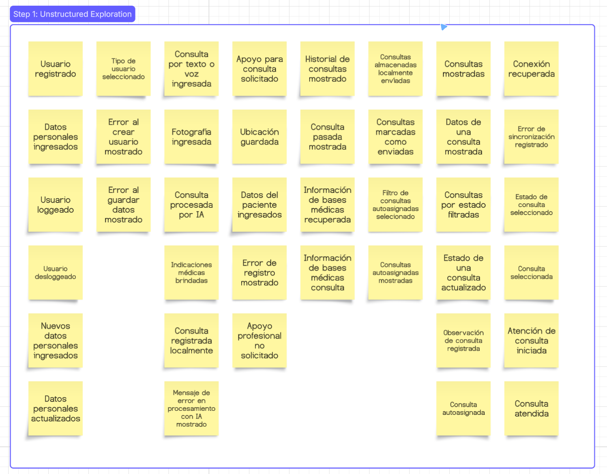

En el primer paso, colocamos todos los eventos que ocurrirían dentro de la aplicación, los cuales se centran en el proceso que sigue una consulta desde que es realizada por el ciudadano hasta que llega a ser visible y posiblementes tomada por parte del personal médico, pasando por el análisis y respuesta del modelo de inteligencia artificial local empleado.

__Step 2: Timelines__

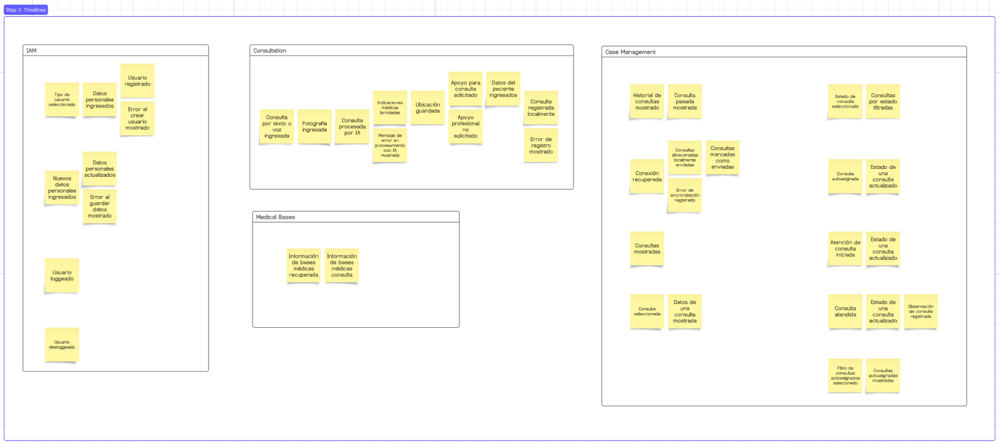

En el segundo paso, organizamos los eventos lineal para definir el orden en que ocurrirían y en que bunded context debían existir. Dentro de estos, definimos las sencuencias para el registro, configuración, ingreso y salida de los usuarios, así como el camino que seguirían las consultas para ser debidamente procesadas y mostradas con su estado al personal médico. Por otro lado, tmabién consideramos los momentos en que, al fallar algo a nivel interno, es apropiado tener listo un mensaje y caso de error.

__Step 3: Pain Points__

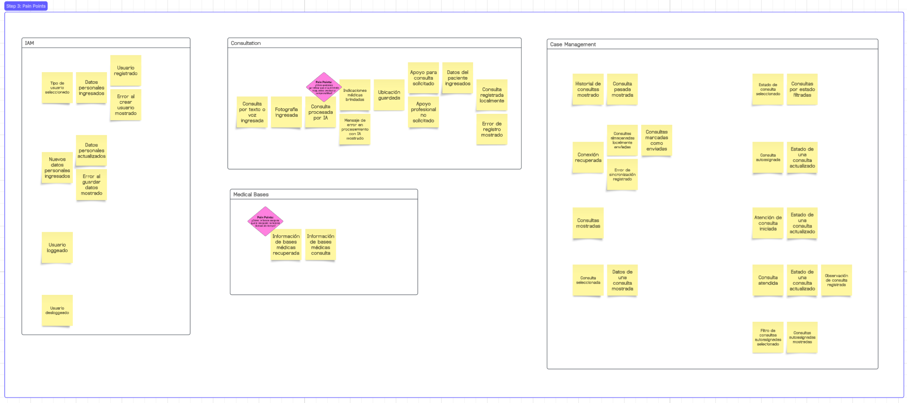

En el tercer paso, agregamos dos pain points para los casos en los que consideramos debemos hacer una mayor investigación y futuramente pruebas con la aplicación para aegurar el desempeño esperado. Estos se refieren precisamente a el cómo asegurar que el modelo brindará respuestas adecuadas que no pongan la vida de las personas en riesgo y en cómo prevenir que la consulta hacia la base de conocimientos médicos tome más tiempo del prudente durante una emergencia.

__Step 4: Pivotal Points__

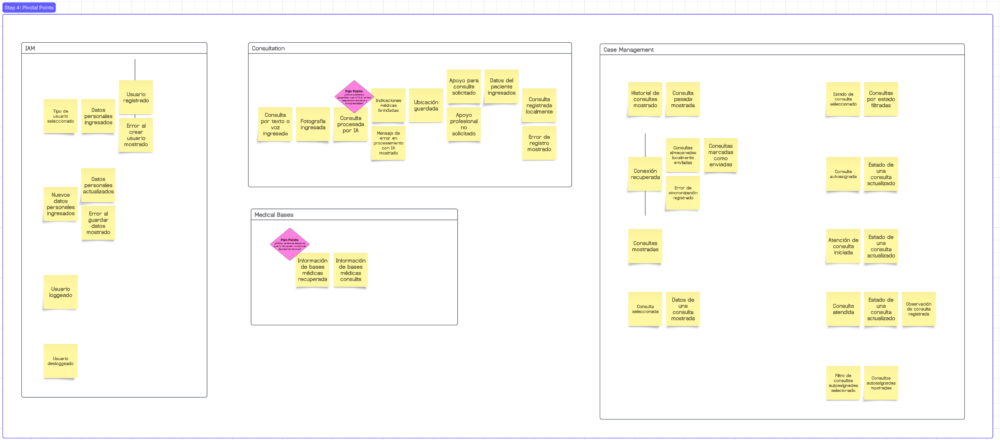

En el paso cuatro, señalamos dos pivotal points que nos parecen importantes dentro del flujo que seguirán los usuarios en la aplicación. Estos son el registro del usuario que le permite usar las funcionalidades consideradas y la entrada de conexión a internet, puesto que esta permite que las consultas guardadas localmente sean enviadas al backend y que el personal médico pueda visualizarlas y/o darles la atención debida.

__Step 5: Commands__

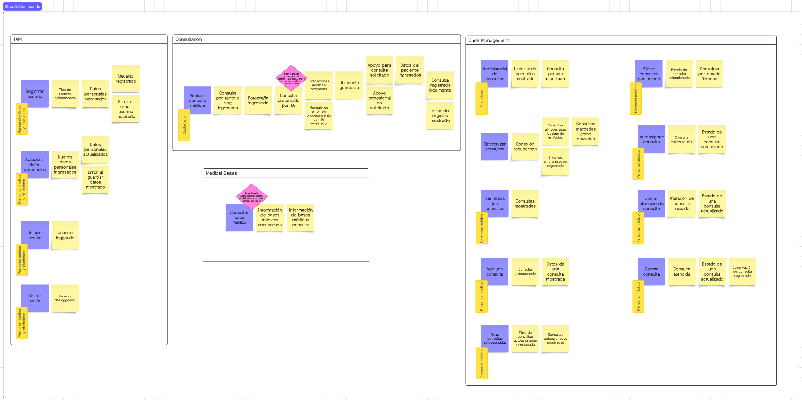

En el quinto paso, agregamos los comando que accionarían los flujos formados, así como los usuarios que tendrían permitido utilizarlos. Como se puede ver, la mayoría son activados por los usuarios, mas existen dos que se accionan como efecto de otro flujo. En el caso de la base médica, esta es consultada cuando se ha realizado una consulta Por el otro lado, la sincronización se da únicamente al percibir que el dispositivo se pudo conectar a internet y existen consultas sin enviar al backend.

__Step 6: Policies__

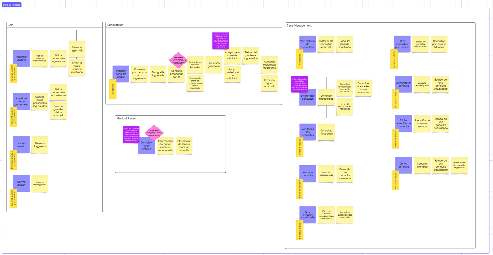

En el paso seis, agregamos tres policies que referencias perfectamenre las reglas de negocio que se han estado mencionando. Dos de estas policies especifican que el modelo de lenguaje debe consultar la base de conocimientos médicos antes de brindar las indicaciones médicas para asgurar que estas no están siendo inventadas, y que, por el otro lado, contienen un sustento, así como debe mencionar como último paso el buscar ayuda médica profesional si la situación lo amerita. Asimismo, se tiene una policy explicando que, al recibir internet, se debe dar la sincronización hacia el backend considerando todas las consultas que no han sido enviadas antes.

__Step 7: Read Models__

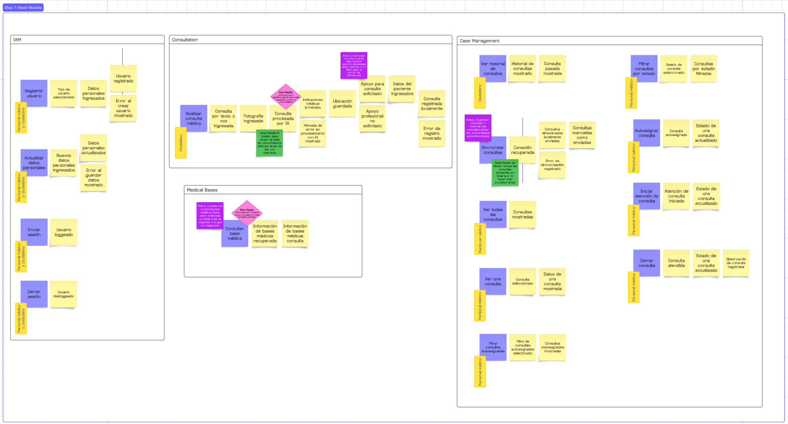

En el paso siete, los read models agregados recalcan la necesidad de leer tanto la base de conocimientos médicos antes de que la inteligencia artificial genere la respuesta, como de revisar las consultas que no han sido sincronizadas antes para garantizar que no quede ninguna sin registrar ni que se haga un doble envío.

__Step 8: External Systems__

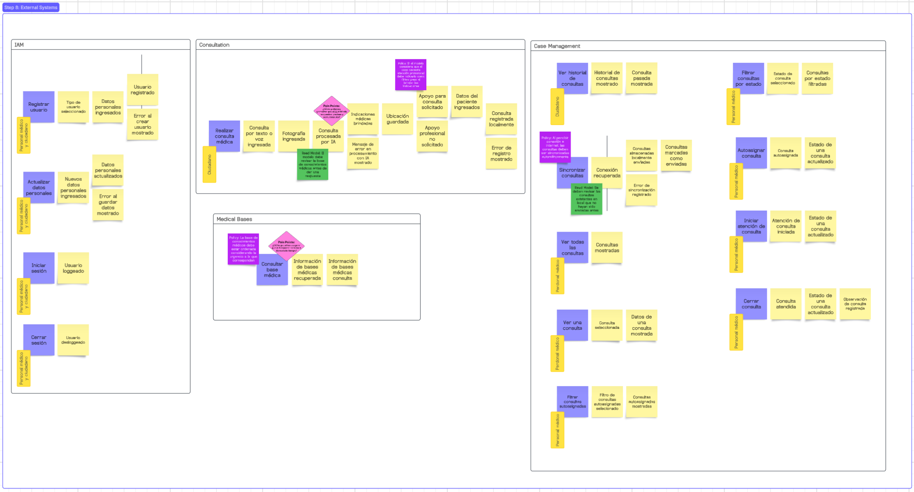

Al realizar el paso ocho, notamos que no usaríamos sistemas externos puesto que, al tener como requisito que a aplicación logre funcionar sin conexión a internet, no sería conveniente depender de una conexión externa. Los aspectos como el modelo de IA empleado y la ubicación serán trabajados localmente dentro de la aplicación móvil.

__Step 9: Aggregates__

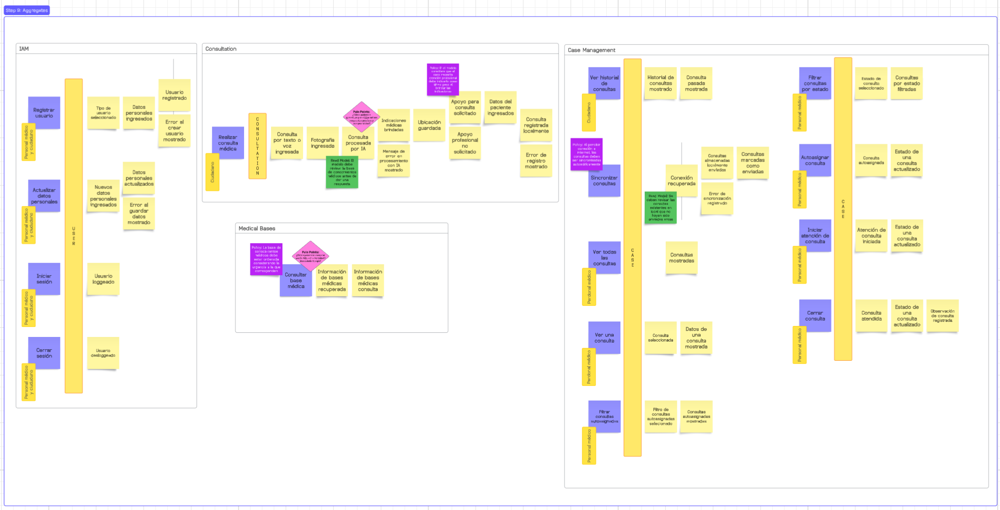

Para el paso nueve, consideramos tres aggregates centrales. Primero, tenemos user, el cual aplicará tanto para los ciudadanos como para el personal médico. Asimismo, contamos con consultation, el cual hace referencia a la consulta que se le realiza a la IA sobre la urgencia o emergencia ocurrida. Por último, el aggregate case representa aquella consulta que ya logró pasar al backend y contiene datos como estado o personal asignado.

__Step 10: Bounded Context__

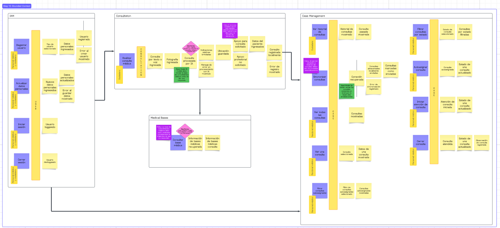

Para el último paso, conectamos nuestros Bounded Contexts formados, considerando las funcionalidades a las quw tendría acceso cada tipo de usuario, así como el flujo que se seguiría y la dependencia que existía de uno a otro. Por ejemplo, existe una conexión directa entre Consultation y Medical Bases puesto que el modelo de IA debe recuperar información de la base de conocimientos médicos cada vez que se le realice una consulta.

[Enlace al Event Storming](https://lucid.app/lucidchart/d0f602b7-11f4-48bb-a4d7-7e7e20013e43/edit?viewport_loc=-8281%2C23529%2C16955%2C8315%2C0_0&invitationId=inv_aa5a24a1-6795-41ee-beeb-4de03eed109a)

### 4.2.2. Candidate Context Discovery

__IAM Bounded Context__

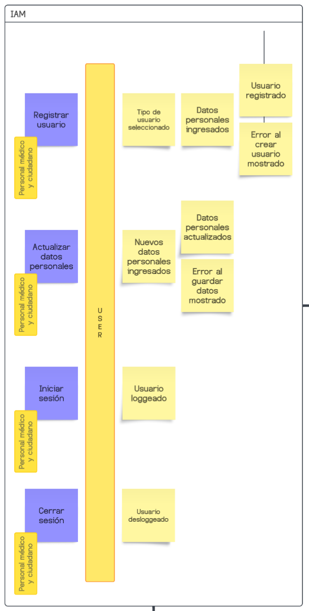  

Límite: Este bounded context se encarga de la gestión de nuestros dos tipos de usuarios y de su información personal. Además, aquí se gestiona el ingreso y autenticación, así como se registran los datos específicos necesarios para los ciudadanos y para el personal médico.  

Eventos clave: Usuario registrado, usuario loggeado, datos personales actualizados.  

Justificación: Este dominio se separa los demás ya que tiene el propósito de gestionar a los usuarios registrados, resultando aquí los roles que se tendrán. Además, si bien buscamos garantizar un ingreso sencillo para los ciudadanos puesto usarán la aplicación durante emergencias, consideramos necesario que se realice la autenticación con tokens JWT de forma obligatoria en el caso del personal médico, dado que poseerán información personal de quienes necesitan ayuda.  

__Consultation Bounded Context__

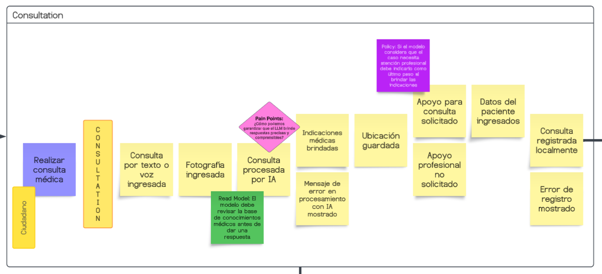  

Límite: Este bounded context se estará encargando de la parte central de la aplicación, siendo esta la referente a las consultas procesadas por el modelo de inteligencia artificial empleado. Aquí, llegará la consulta del usuario con fotografías adjuntas si las hubiera. El modelo se encargará de formar las indicaciones habiendo consultado antes la base médica y terminando por permitir el registro de la consulta ingresada en local.

Eventos clave: Consulta por texto o vox ingresada, indicaciones médicas brindadas, consulta registrada localmente.

Justificación: Este dominio viene a ser el core y se separa de los demás por motivos centrales. En primer lugar, porque representa un procesa central, por lo que debe ser desarrollado con prioridad y cuidado en cuanto a las herrmientas que integra y el flujo que sigue. En segundo lugar, porque este proceso debe darse localmente, por lo que ocurrirá dentro del dispositivo del ciudadano sin poder conectarse al backend en la nube a falta de conexión a internet.

__Medical Bases Bounded Context__

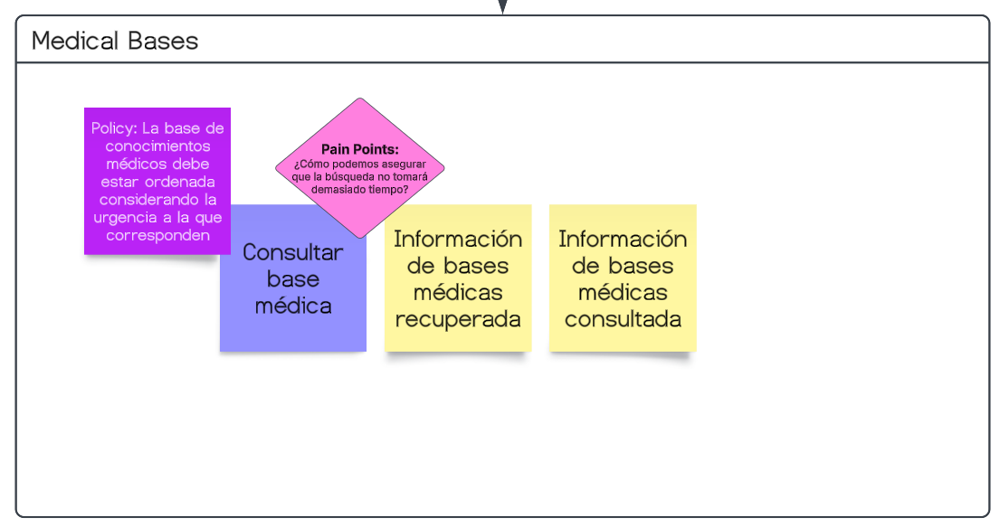  

Límite: Este bounded context se centra solo en las consultas hacia la base de conocimientos médicos, asegurando que el proceso se de con precisión y eficiencia.

Eventos clave: Información de bases médicas recuperada, información de bases médicas consultada.

Justificación: Este dominio existe por su cuenta puesto que consideramos importante poseer un espacio en el cual organizar y clasificar la información recolectada para que el modelo de inteligenia artificial logre revisar los datos que necesita de manera más directa y rápida.

__Case Management Bounded Context__

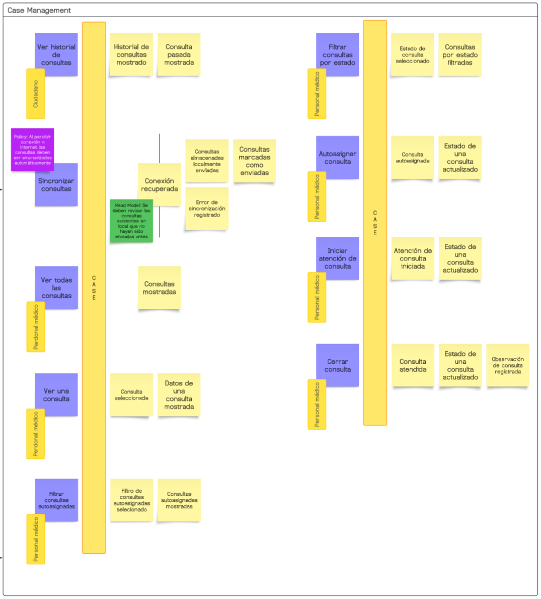  

Límite: Este bounded context abarca todo el flujo que siguen las consultas antes realizadas por los ciudadanos después de haber podido ser enviadas hacia el backend en la nube y, por ende, mostradas al personal médico. Aquí, el personal médico podrá conocer los datos de las emergencias médicas registradas, así como asignárselos en el caso de aquellos que solicitan una atención profesional. Los asos registrados irán pasando por estados hasta llegar a ser cerrados indicando que el paciente fue atendido.

Eventos clave: Conexión recuperada, consulta autoasignada, estado de consulta actualizado, consultas almacenadas localmente enviadas.

Justificación: Este dominio existe para lograr gestionar por separado el flujo de los casos registrados, así como para contar con el historial guardado en la nube y ofrecer la información y posibilidad de ayudar al personal médico.

### 4.2.3. Domain Message Flows Modeling

Para visualizar cómo deben colaborar los bounded contexts identificados (IAM, Consultation, Medical Bases y Case Management) al resolver los casos de uso principales del negocio, el equipo aplicó la técnica de **Domain Storytelling**. Esta técnica permite representar, mediante pictogramas de actores, objetos de trabajo y flechas numeradas, la secuencia de acciones que ocurre entre los usuarios (ciudadano, personal médico) y los sistemas involucrados para completar una historia concreta del dominio.

Se elaboraron dos Domain Stories, correspondientes a los flujos más críticos identificados durante el EventStorming: el registro y procesamiento de una consulta médica sin conexión, y la sincronización más atención de un caso por parte del personal médico.

#### Domain Story 1: Registro y procesamiento de una consulta médica offline

Esta historia describe cómo un ciudadano en peligro registra una consulta médica y recibe orientación de primeros auxilios sin necesidad de conexión a internet.

Secuencia narrada:
1. El **Ciudadano** abre la aplicación Lifeline en su dispositivo móvil.
2. El Ciudadano describe la emergencia médica a través de **texto, audio o una fotografía** de la herida.
3. La aplicación (bounded context **Consultation**) recibe la consulta y solicita al bounded context **Medical Bases** la información relevante de primeros auxilios según el tipo de lesión descrita.
4. **Medical Bases** recupera del índice local los fragmentos de la base de conocimientos médicos relacionados con la consulta.
5. **Consultation** entrega el contexto recuperado junto con la consulta al modelo de IA local (RAG), el cual genera la **orientación médica** paso a paso.
6. La aplicación muestra las indicaciones al Ciudadano y, de ser necesario, le recomienda solicitar apoyo profesional.
7. La consulta y sus datos (incluyendo ubicación, si está disponible) se **almacenan localmente** con el estado "pendiente de sincronización".

#### Domain Story 2: Sincronización y atención de un caso por el personal médico

Esta historia describe cómo, al recuperarse la conexión a internet, una consulta pasa a estar disponible para el personal médico y es atendida hasta su cierre.

Secuencia narrada:
1. El dispositivo del **Ciudadano** recupera la conexión a internet.
2. **Consultation** detecta la conexión recuperada y envía la consulta pendiente hacia el bounded context **Case Management** en la nube.
3. **Case Management** registra la consulta como un nuevo **Caso**, con estado "disponible".
4. El **Personal médico** visualiza el listado de casos disponibles que solicitan apoyo profesional.
5. El Personal médico **se autoasigna** el caso, y Case Management actualiza su estado a "asignado".
6. El Personal médico **inicia la atención** del caso, cambiando su estado a "en progreso".
7. Una vez estabilizado el paciente, el Personal médico **cierra el caso**, registrando sus observaciones finales.
8. **Case Management** notifica al Ciudadano (cuando su dispositivo se reconecta) que su consulta fue atendida.

Ambas historias evidencian la colaboración necesaria entre los cuatro bounded contexts: **Consultation** actúa como el núcleo que orquesta la generación de orientación médica apoyándose en **Medical Bases**, mientras que **Case Management** retoma la consulta una vez sincronizada para habilitar la colaboración con el **Personal médico**, todo ello sobre la identidad y autenticación gestionada por **IAM**.

### 4.2.4. Bounded Context Canvases

En esta sección el equipo diseña los candidate bounded contexts identificados durante el EventStorming (IAM, Consultation, Medical Bases y Case Management), siguiendo el proceso iterativo del Bounded Context Canvas: Context Overview Definition, Business Rules Distillation & Ubiquitous Language Capture, Capability Analysis, Capability Layering, Dependencies Capture y Design Critique. Se priorizó **Consultation** por ser el core domain del producto, seguido de **Case Management**, **Medical Bases** e **IAM**.

#### Bounded Context Canvas: Consultation

**1. Context Overview Definition**
- **Nombre:** Consultation
- **Propósito:** Gestionar el ciclo de vida de una consulta médica desde que el ciudadano la describe hasta que es procesada por el modelo de IA local y almacenada para su posterior sincronización.
- **Clasificación estratégica:** Core Domain — representa la propuesta de valor central de Lifeline (orientación médica offline mediante IA).

**2. Business Rules Distillation & Ubiquitous Language Capture**
- Una consulta debe contar con al menos una descripción (texto o voz) antes de ser procesada.
- Toda orientación médica generada debe sustentarse en información recuperada de Medical Bases; si no hay sustento suficiente, se activa una respuesta segura en lugar de generar indicaciones sin respaldo.
- Términos clave: *Consulta, Paciente, Orientación médica, Evidencia, Solicitud de apoyo profesional.*

**3. Capability Analysis**
- Registrar consulta (texto/voz/foto).
- Recuperar contexto médico relevante (vía Medical Bases).
- Generar orientación médica mediante IA on-device + RAG.
- Detectar señales de gravedad y recomendar apoyo profesional.
- Almacenar la consulta localmente con estado de sincronización.

**4. Capability Layering**
- *Interacción:* registro multimodal de la consulta.
- *Procesamiento:* orquestación del flujo RAG + modelo de IA.
- *Persistencia:* almacenamiento local (outbox) de la consulta.

**5. Dependencies Capture**
- **Entrante:** IAM (identidad del ciudadano autenticado).
- **Saliente:** Medical Bases (recuperación de contenido médico); Case Management (envío de la consulta sincronizada).

**6. Design Critique**
- Riesgo: acoplar demasiada lógica de negocio (reglas de gravedad, formato del prompt) dentro de este contexto podría dificultar su mantenimiento; se evalúa extraer las reglas de gravedad como un componente independiente en iteraciones futuras.

---

#### Bounded Context Canvas: Medical Bases

**1. Context Overview Definition**
- **Nombre:** Medical Bases
- **Propósito:** Organizar, indexar y servir la base de conocimientos médicos validada que sustenta las respuestas generadas por Consultation.
- **Clasificación estratégica:** Supporting Domain — es indispensable para el core, pero no es en sí mismo el diferenciador del producto.

**2. Business Rules Distillation & Ubiquitous Language Capture**
- Solo se indexa contenido proveniente de fuentes médicas autorizadas y validadas.
- El contenido debe clasificarse por tipo de procedimiento para optimizar su recuperación.
- Términos clave: *Base de conocimientos médicos, Fuente autorizada, Índice médico, Recuperación de información.*

**3. Capability Analysis**
- Incorporar y validar fuentes médicas autorizadas.
- Procesar e indexar documentos por tipo de procedimiento.
- Responder consultas de búsqueda semántica desde Consultation.

**4. Capability Layering**
- *Gestión de contenido:* incorporación y clasificación de fuentes.
- *Recuperación:* búsqueda semántica sobre el índice local.

**5. Dependencies Capture**
- **Entrante:** ninguna (contexto autocontenido, no depende de otros bounded contexts para operar).
- **Saliente:** Consultation (consumidor de la información recuperada).

**6. Design Critique**
- Pregunta abierta: ¿debería este contexto exponerse también al Personal médico para consultas educativas directas, o mantenerse exclusivamente como soporte interno de Consultation? Por ahora se mantiene como soporte interno.

---

#### Bounded Context Canvas: Case Management

**1. Context Overview Definition**
- **Nombre:** Case Management
- **Propósito:** Gestionar el ciclo de vida de los casos sincronizados en la nube, desde su disponibilidad hasta su cierre por parte del personal médico.
- **Clasificación estratégica:** Core Domain — habilita la colaboración con el personal médico, un diferenciador clave frente a la competencia.

**2. Business Rules Distillation & Ubiquitous Language Capture**
- Un caso solo puede ser autoasignado por un profesional a la vez (consistencia concurrente).
- Un caso no puede cerrarse sin observaciones del profesional responsable.
- Términos clave: *Caso, Estado del caso, Asignación, Atención, Cierre de caso, Trazabilidad.*

**3. Capability Analysis**
- Recibir y registrar consultas sincronizadas como casos.
- Permitir filtrado y autoasignación de casos disponibles.
- Gestionar el flujo de estados: disponible → asignado → en atención → cerrado.
- Registrar trazabilidad de cada cambio de estado.

**4. Capability Layering**
- *Gestión de casos:* creación, asignación y cierre.
- *Consulta y filtrado:* listados por estado o por profesional asignado.
- *Trazabilidad:* historial de acciones sobre cada caso.

**5. Dependencies Capture**
- **Entrante:** Consultation (recepción de consultas sincronizadas); IAM (identidad y rol del personal médico).
- **Saliente:** ninguna por el momento (posible integración futura con INDECI/EsSalud).

**6. Design Critique**
- Riesgo de concurrencia: dos profesionales autoasignándose el mismo caso simultáneamente; se decidió abordarlo mediante control de concurrencia optimista (ver sección 4.1.4).

---

#### Bounded Context Canvas: IAM

**1. Context Overview Definition**
- **Nombre:** IAM (Identity and Access Management)
- **Propósito:** Gestionar el registro, autenticación y datos personales de los dos tipos de usuario (ciudadano y personal médico).
- **Clasificación estratégica:** Generic Subdomain — es una capacidad común a la mayoría de sistemas, no diferenciadora del negocio.

**2. Business Rules Distillation & Ubiquitous Language Capture**
- El personal médico requiere validación de una identificación profesional para registrarse con ese rol.
- La sesión debe expirar y solicitar nueva autenticación tras superar su período de validez.
- Términos clave: *Usuario, Rol, Sesión, Perfil, Autenticación.*

**3. Capability Analysis**
- Registrar cuentas de ciudadano y de personal médico.
- Autenticar e iniciar/cerrar sesión.
- Consultar y actualizar el perfil personal.

**4. Capability Layering**
- *Identidad:* registro y validación de rol.
- *Sesión:* autenticación, expiración y cierre de sesión.

**5. Dependencies Capture**
- **Entrante:** ninguna.
- **Saliente:** Consultation y Case Management (ambos consumen la identidad y el rol del usuario autenticado).

**6. Design Critique**
- Se evaluó si IAM debía ser un Shared Kernel entre Consultation y Case Management dado que ambos dependen de su modelo de usuario; se optó por mantenerlo como contexto independiente que expone una interfaz clara (ver sección 4.2.5).

### 4.2.5. Context Mapping

En esta sección el equipo elabora el conjunto de context maps que visualizan las relaciones estructurales entre los cuatro bounded contexts identificados: IAM, Consultation, Medical Bases y Case Management. Para ello se revisó la información recolectada en el EventStorming, el Domain Message Flows Modeling y los Bounded Context Canvases, y se sometió el diseño candidato a un proceso de discusión guiado por preguntas de diseño.

### Preguntas de diseño aplicadas

- **¿Qué pasaría si movemos el capability de "recomendación de atención profesional" de Consultation a un nuevo context?** Se descartó, ya que esta capability depende directamente del resultado generado por el modelo de IA dentro de Consultation; separarla generaría una dependencia circular innecesaria.
- **¿Qué pasaría si descomponemos Medical Bases y movemos la indexación a Consultation?** Se descartó, porque acoplaría la lógica de gestión de contenido médico (incorporación y validación de fuentes) con la lógica de orquestación de consultas, dificultando el mantenimiento independiente de la base de conocimientos.
- **¿Qué pasaría si creamos un shared service para la identidad de usuario entre Consultation y Case Management?** Se evaluó como alternativa a IAM como bounded context independiente; se descartó a favor de mantener IAM autónomo, dado que ambos contextos requieren distintos niveles de detalle del perfil (el ciudadano requiere datos básicos, el personal médico requiere validación profesional adicional).
- **¿Qué pasaría si aislamos el core capability de Case Management (gestión de estados del caso) y movemos la trazabilidad a un context aparte?** Se descartó por ahora, ya que la trazabilidad es un requisito estrecho e inseparable del ciclo de vida del caso en esta primera versión del producto.
- **¿Qué pasaría si duplicamos el modelo de "Paciente" entre Consultation y Case Management para romper la dependencia directa?** Se aceptó parcialmente: ambos contextos comparten un **Shared Kernel** con los datos esenciales del paciente (nombre, edad, ubicación) para evitar que Case Management dependa de cambios internos en el modelo de Consultation.

### Context Map final y patrones aplicados

El siguiente diagrama, generado con **ContextMapper**, resume la relación estructural final entre los cuatro bounded contexts de Lifeline:

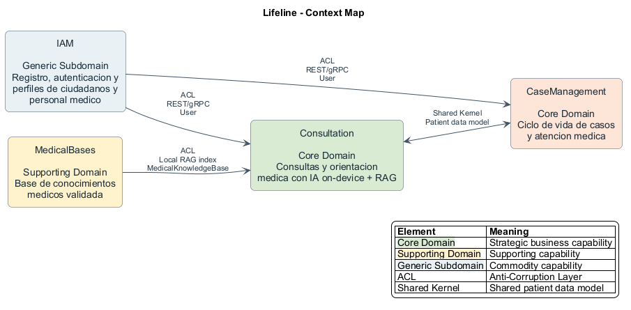

| Relación | Upstream (U) | Downstream (D) | Patrón DDD aplicado | Justificación |
|---|---|---|---|---|
| IAM → Consultation | IAM | Consultation | Customer/Supplier (OHS/ACL) | IAM provee el modelo de identidad y rol mediante un Open Host Service; Consultation lo protege con una Anti-Corruption Layer. |
| IAM → Case Management | IAM | Case Management | Customer/Supplier (OHS/ACL) | Case Management depende del rol "Personal médico" validado por IAM para habilitar la autoasignación y atención de casos. |
| Consultation → Medical Bases | Medical Bases | Consultation | Customer/Supplier (OHS/ACL) | Consultation es cliente de la capacidad de búsqueda semántica que expone Medical Bases mediante un índice RAG local. |
| Consultation ↔ Case Management | — | — | Shared Kernel | Ambos contextos comparten un modelo mínimo de datos del paciente para evitar acoplarse a cambios internos del otro. |

**Conclusión:** el diseño final privilegia bounded contexts desacoplados mediante relaciones tipo Open Host Service / Anti-Corruption Layer, reservando el patrón de Shared Kernel únicamente para el pequeño conjunto de datos del paciente que necesita viajar de forma consistente entre Consultation y Case Management.

## 4.3. Software Architecture

### 4.3.1. Software Architecture System Landscape Diagram

  

### 4.3.2. Software Architecture Context Level Diagrams

  

### 4.3.3. Software Architecture Container Level Diagrams

  

### 4.3.4. Software Architecture Deployment Diagrams

  

# Capítulo V: Tactical-Level Software Design

## 5.X. Bounded Context: Nombre del Bounded Context

### 5.X.1. Domain Layer

### 5.X.2. Interface Layer

### 5.X.3. Application Layer

### 5.X.4. Infrastructure Layer

### 5.X.5. Bounded Context Software Architecture Component Level Diagrams

### 5.X.6. Bounded Context Software Architecture Code Level Diagrams

#### 5.X.6.1. Bounded Context Domain Layer Class Diagrams

#### 5.X.6.2. Bounded Context Database Design Diagram

# Capítulo VI: Solution UX Design

## 6.1. Style Guidelines

### 6.1.1. General Style Guidelines

### 6.1.2. Web, Mobile & Devices Style Guidelines

## 6.2. Information Architecture

### 6.2.1. Organization Systems

### 6.2.2. Labeling Systems

### 6.2.3. Searching Systems

### 6.2.4. SEO Tags and Meta Tags

### 6.2.5. Navigation Systems

## 6.3. Landing Page UI Design

### 6.3.1. Landing Page Wireframe

### 6.3.2. Landing Page Mock-up

## 6.4. Applications UX/UI Design

### 6.4.1. Applications Wireframes

### 6.4.2. Applications Wireflow Diagrams

### 6.4.3. Applications Mock-ups

### 6.4.4. Applications User Flow Diagrams

## 6.5. Applications Prototyping

# Capítulo VII: Product Implementation, Validation & Deployment

## 7.1. Software Configuration Management

### 7.1.1. Software Development Environment Configuration

### 7.1.2. Source Code Management

### 7.1.3. Source Code Style Guide & Conventions

### 7.1.4. Software Deployment Configuration

## 7.2. Solution Implementation

### 7.2.X. Sprint n

#### 7.2.X.1. Sprint Planning n

#### 7.2.X.2. Sprint Backlog n

#### 7.2.X.3. Development Evidence for Sprint Review

#### 7.2.X.4. Testing Suite Evidence for Sprint Review

#### 7.2.X.5. Execution Evidence for Sprint Review

#### 7.2.X.6. Services Documentation Evidence for Sprint Review

#### 7.2.X.7. Software Deployment Evidence for Sprint Review

#### 7.2.X.8. Team Collaboration Insights during Sprint

## 7.3. Validation Interviews

### 7.3.1. Diseño de Entrevistas

### 7.3.2. Registro de Entrevistas

### 7.3.3. Evaluaciones según heurísticas

## 7.4. Video About-the-Product

# Conclusiones y recomendaciones

## Conclusiones

1. La problemática queda bastante clara con lo trabajado en el Capítulo I. Tras un sismo, la gente necesita orientación de primeros auxilios en los primeros minutos, pero muchas apps médicas dejan de servir si se cae internet. Fuentes como IGP, INDECI, OMS y UIT respaldan ese escenario: respuesta saturada, telecomunicaciones frágiles y poco conocimiento previo en la población.

2. En las entrevistas con ciudadanos salió algo más concreto que “no saben qué hacer”. Les cuesta decidir el primer paso, se ponen nerviosos y prefieren describir la emergencia con texto, audio o fotos. También piden indicaciones cortas, numeradas y con apoyo visual. Confían más si la respuesta cita fuentes médicas reales y si, ante gravedad, el sistema les dice que llamen a un profesional.

3. El personal médico no rechaza la IA, pero la pone condiciones. Sirve para orientar y para un triaje preliminar por colores o prioridad, no para reemplazar evaluación clínica. En las entrevistas alertaron sobre errores comunes de la gente (sacar objetos incrustados, dar agua a alguien inconsciente) y sobre la necesidad de cubrir protocolos básicos como RCP. También coinciden en que no debe sugerirse automedicación ni mover al herido, salvo peligro inminente.

4. El needfinding (personas, matriz de tareas, empathy maps) ayudó a separar bien los dos segmentos. El ciudadano necesita actuar offline bajo estrés. El médico necesita, cuando vuelve la red, ubicación, estado del caso y una forma ordenada de asignarse trabajo. Eso después se tradujo en user stories de consulta multimodal, orientación offline y gestión de casos.

5. En ADD priorizamos drivers High/High ligados a IA sin conexión, rendimiento local y sync confiable. De ahí salió la decisión de inferencia on-device con RAG local, patrón Outbox para no perder consultas al sincronizar, y concurrencia optimista en la autoasignación de casos. Cloud queda para cuando hay red, no como dependencia del momento crítico.

6. Con DDD quedaron cuatro bounded contexts: IAM, Consultation, Medical Bases y Case Management. El context mapping evita acoplar de más: OHS/ACL entre contextos y un Shared Kernel chico solo para datos mínimos del paciente entre Consultation y Case Management. La arquitectura C4 (landscape, context, containers, deployment) cierra esa decisión con un monolito modular offline-first y backend en la nube para la parte de sync y triaje.

## Recomendaciones

1. Armar un set cerrado de fuentes médicas autorizadas y un protocolo de actualización del índice RAG antes de ampliar el modelo. Sin eso, la confianza que pidieron en entrevistas se cae rápido.

2. Definir métricas simples de calidad de respuesta (precisión frente a casos de prueba, tasa de derivación a profesional, respuestas peligrosas bloqueadas). En las entrevistas pedían aval y resultados medibles; no alcanza con decir que la IA “está certificada”.

3. En el diseño táctico e implementación, fijar reglas duras de seguridad clínica: no sugerir automedicación, no retirar objetos incrustados, no dar líquidos a inconscientes, y forzar llamada a ayuda cuando haya shock o signos graves.

4. Probar el flujo offline en celulares de gama media-baja (batería, memoria, tiempo de respuesta). Es el riesgo de negocio que ya asumimos en Lean UX; si el modelo no corre bien en dispositivo real, el resto del diseño no sirve en sismo.

5. En UX, diseñar pantallas pensadas para estrés: pocos campos, pasos numerados, audio/foto como entrada rápida y lenguaje sin tecnicismos. Validarlo después con ciudadanos, no solo con el equipo.

6. Para personal médico, dejar el triaje y la sincronización como vista preliminar editable. El médico debe poder reclasificar el caso; la etiqueta de la app no puede quedar como verdad clínica.

7. En validación (Capítulo VII), volver a entrevistar ambos segmentos con prototipo o build temprana. Comparar si entienden las indicaciones, si confían en las fuentes mostradas y si el sync de casos ayuda de verdad en priorización. Hasta no tener eso, estas conclusiones siguen siendo parciales al cierre del diseño estratégico.

# Video About-the-Team

# Bibliografía

Banco Mundial. (2021). *Advancing policy reforms in Peru to reduce risk from natural hazards*. https://www.worldbank.org/en/results/2021/11/05/advancing-policy-reforms-in-peru-to-reduce-risk-from-natural-hazards

Cerna Quispe, G. V., Castillo Ramos, N. E., & Ñaupa Contreras, J. C. (2025). Protocolos de primeros auxilios en docentes de educación inicial del distrito de Trujillo - Perú. *European Public & Social Innovation Review, 10*. https://doi.org/10.31637/epsir-2025-1489

Instituto Geofísico del Perú. (2020). *Pisco 2007: 13 años de un sismo devastador*. Gob.pe. https://www.gob.pe/institucion/igp/noticias/294466-pisco-2007-13-anos-de-un-sismo-devastador

Instituto Nacional de Defensa Civil. (2023). *Compendio estadístico del INDECI 2023: Gestión reactiva*. https://sinia.minam.gob.pe/documentos/compendio-estadistico-indeci-2023

Llontop Llenque, J. M., & Vidarte Farfan, S. L. (2018). *Nivel de conocimiento en madres de familia sobre primeros auxilios en el hogar. Sector 6 El Pescador - distrito de San José, Lambayeque. 2017* [Tesis de bachiller, Universidad Católica Santo Toribio de Mogrovejo]. http://hdl.handle.net/20.500.12423/1960

Organización Mundial de la Salud. (2022). *Rapid reaction aiming for the golden hour of health emergency response*. https://www.who.int/about/accountability/results/who-results-report-2022-mtr/rapid-reaction-aiming-for-the-golden-hour-of-health-emergency-response

Organización Mundial de la Salud. (s. f.). *Community-based care*. https://www.who.int/teams/integrated-health-services/clinical-services-and-systems/emergency-and-critical-care/community-based-care

Salehinejad, S., Jannati, N., Ershad Sarabi, R., & Bahaadinbeigy, K. (2020). Use of telemedicine and e-health in disasters: A systematic review. *Journal of Emergency Practice and Trauma*. https://doi.org/10.34172/jept.2020.34

Seliana, I., Paripurno, E. T., Maharani, Y. N., Susanto, H., Rahmadinie, A., Agastya, W. D., Tanggono, A., & Sumardi, F. S. (2026). The role of telemedicine in healthcare response to natural disasters: A systematic review. *IOP Conference Series: Earth and Environmental Science, 1586*(1), 012054. https://doi.org/10.1088/1755-1315/1586/1/012054

Unión Internacional de Telecomunicaciones. (2020). *ITU guidelines for national emergency telecommunication plans*. https://www.itu.int/en/ITU-D/Emergency-Telecommunications/Documents/2020/NETP-guidelines.pdf

# Anexos
